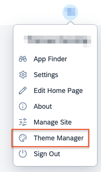
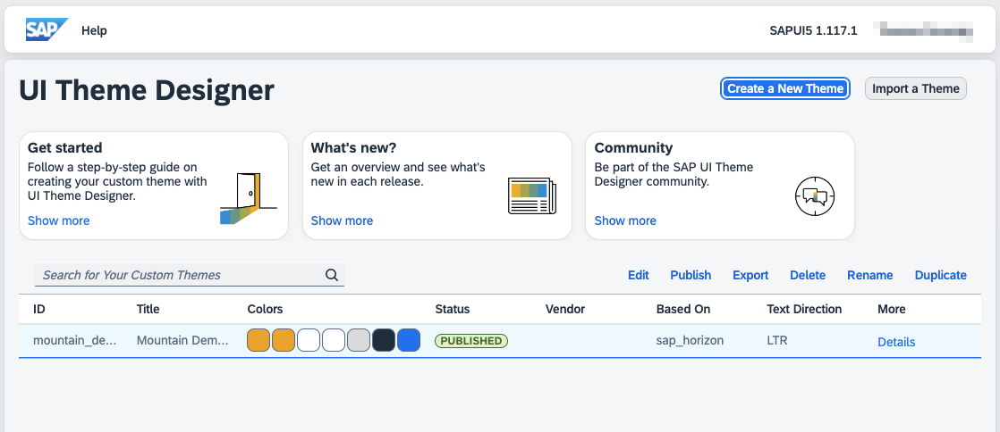
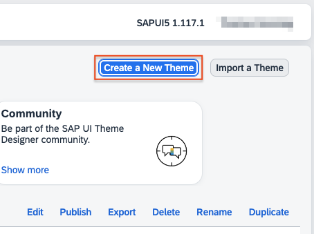
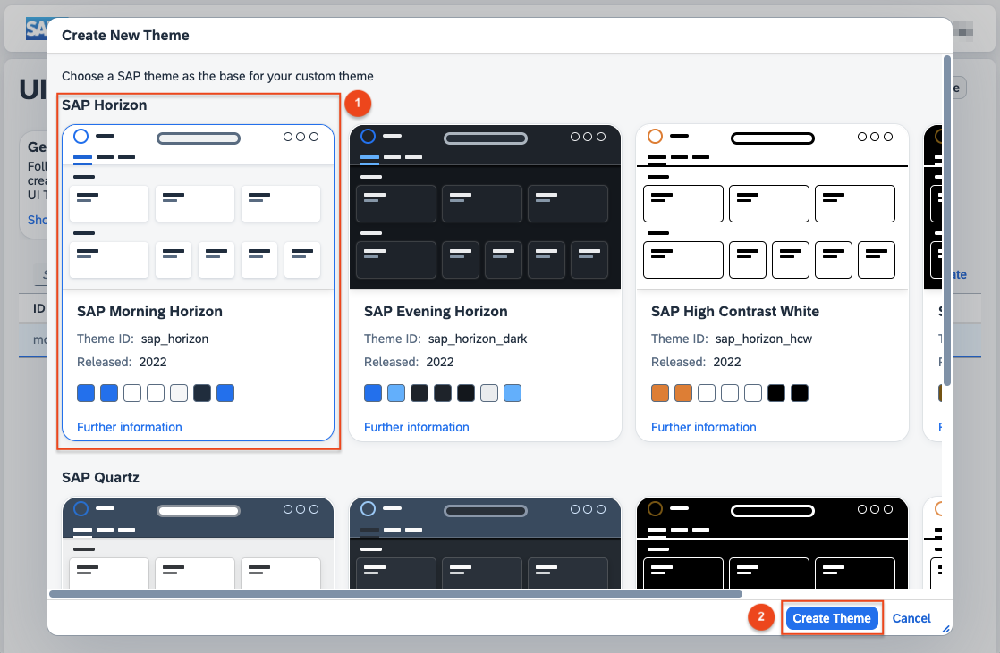

# Add a Cross Origin Preview for the UI Theme Designer
<!-- description --> Add a custom cross origin preview page for the UI theme designer to see the changes directly in your own application UIs.

## Prerequisites
  - [You have set up the SAP Launchpad Service](btp-app-work-zone-subscribe)
  - You have a user with the **Subaccount Administrator** role collection in the subaccount where you set up the SAP Launchpad Service.


## You will learn
  - How to add a custom preview page
  - How to prepare your preview page for theming

---

### Access the Theme Designer

The **UI theme designer** is a business service integrated in the launchpad service and can be accessed from your launchpad site.

1. Access any launchpad site.
2. Click on the user profile icon in the top-right corner to open the dropdown menu. Click on **Theme Manager**.

    <!-- border -->
    

3. Click on **Launch Theme Designer** in the bottom-left corner. In the **UI theme designer** you can see an overview of all available custom themes, as well as create new ones. 

    <!-- border -->
    

4. The theme designer is started and you get an overview of your already existing custom themes. 

    <!-- border -->
    

### Create a New Theme

From the overview of the UI theme designer you can now create a new custom theme (or open an existing one).

Every custom theme bases on an SAP theme (e.g. SAP Horizon or SAP Quartz)

1. Click on **Create a New Theme** in the top right. 

    <!-- border -->
    

2. You get a list of possible SAP themes as the base for your custom theme. Choose **SAP Horizon** and click on **Create Theme** 

    <!-- border -->
    

3. Now you see a screen which is divided into three main parts. On the left you see a list of available preview pages. In the middle the selected preview page is displayed. On the right you get a list of parameters you can change—mainly colors, but also images, fonts, and other values. 

    <!-- border -->
    

### Prepare your Preview Page

Before you can add your own application as a preview page, it must undergo preparation to fit for the theming process. Your application should utilize the SAP theming parameters and respond to the Post Message sent from the UI theme designer when any parameter is modified.
The theming parameters are accessible through the open-source [theming-base-content](https://www.npmjs.com/package/@sap-theming/theming-base-content), which presents them as [CSS Custom Properties](https://developer.mozilla.org/en-US/docs/Web/CSS/Using_CSS_custom_properties). For each theme there is a [css_variables.css](https://github.com/SAP/theming-base-content/blob/2a38d0156f3d53fde0301b777f8d856266e70d35/content/Base/baseLib/sap_horizon/css_variables.css) file containing all parameter definitions. 
For the purposes of this tutorial, we will leverage the unpkg.com service and enabling the direct referencing of npm packages via URL. 
<br>
Considering a minimal HTML example, we just add the following element:
```HTML
<link rel="stylesheet" href="https://unpkg.com/@sap-theming/theming-base-content/content/Base/baseLib/sap_horizon/css_variables.css">
```
As we already loaded the css_variables.css in our HTML example we can directly start using them:
<!-- <body style="background-color: var(--sapBackgroundColor)"></body> -->
```CSS
body {
    background-color: var(--sapBackgroundColor);
}
``````


Whenever a theming parameter is altered in the UI theme designer, a Post Message will be generated containing the css-variables.css, including the updated parameters.
<br>
The Post message containing an object with the following structure:
```JSON
{
    "type": "theming-ui:theme-changed",
    "cssVariables": "<ALL CSS VARIABLES WITH CURRENT VALUE AS STRING>"
}
```
Furthermore, a script must be implemented to react to the Post Message sent by the UI theme designer and overwrite the style of the loaded base theme. 
<br>
To do so we add an additional style tag with the id **cssVariablesStyleTag**:
```html
<style id="cssVariablesStyleTag"></style>
```
And the script part can look something like this:
```JavaScript
addEventListener('message', ({data}) => {
    if (data.type === 'theming-ui:theme-changed') {
        cssVariablesStyleTag.textContent = data.cssVariables;
    }
});
```
The script listens to incoming Post Mesages and check the data for the type 'theming-ui:theme-changed' and then set the text content of the style tag 'cssVariablesStyleTag' to all the cssVariables coming from the Post Message. 


### Add Your Preview Page in the UI Theme Designer

In the UI theme designer you can select between different build in preview pages to see the changes you are planning to do. Additionally you can add your own preview page to have directly the look and feel of your own applications. 

1. In the left area click on the ⊕ besides the **Preview Pages**.
2. Enter the URL of the application you want to use as a preview page
3. Optional you can enter a name for the preview page
4. Press **Add**.
4. Click now in the left area under **Applications** on your new preview page.

Your preview page is now open and you can start customising. Any modifications made will be immediately reflected on your preview page.

>**Note:** You have to host the application on your own! The UI theme designer only load the content of your application. 


