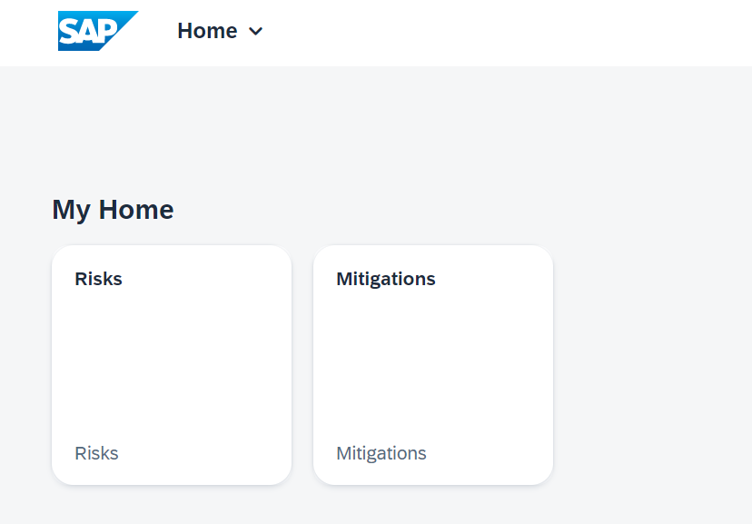

## Prerequisites
 - Before you start with this tutorial, you have two options:
    - Follow the instructions in **Step 16: Start from an example branch** of [Prepare Your Development Environment for CAP](btp-app-prepare-dev-environment-cap) to checkout the [`create-ui-freestyle-sapui5`](https://github.com/SAP-samples/cloud-cap-risk-management/tree/create-ui-freestyle-sapui5) branch.
    - Complete the previous tutorial [Create a UI Using Freestyle SAPUI5](btp-app-create-ui-freestyle-sapui5) with all its prerequisites.


## Details
### You will learn
 - How to add a launch page for local testing


---

[ACCORDION-BEGIN [Step 1: ](Introduction)]
Our `risks` and `mitigations` application have been generated by the SAP Fiori Tools Generator and can be started independently. You can add a launch page for local testing. This page looks like a real SAP Fiori launchpad, but is just a local copy of the otherwise centrally managed SAP Fiori launchpad. It comes with a limited version of the functionality of the original SAP Fiori launchpad. There's no option to add or remove apps via a configuration, user roles aren't at all taken into account, and end-user personalization is also not included. If you want these and other SAP Fiori launchpad functionalities included, you have got to set them up for your project. Find out how to do this in [Add the SAP BTP Launchpad Service](btp-app-launchpad-service). You stick with the launch page for this tutorial though.

In the current implementation, the applications are launched without a launch page. You can open the `risks` application through the file `app/risks/webapp/index.html`. If you now create a second application using the SAP Fiori elements generator within your project, it will be generated in the same way, again with its own `index.html` file. Instead, you want to use a launch page for all the applications. You can add a launch page by creating an `.html` file that uses the built-in UI5 shell in the `app` folder, which has both the `risks` and `mitigations` applications.

[DONE]
[ACCORDION-END]
---
[ACCORDION-BEGIN [Step 2: ](Implementation)]
1. Copy the file `launchpage.html` from `templates/launchpage/app` to the `app` folder of your app.

2. With `cds watch` running, open the app in your browser at <http://localhost:4004/launchpage.html#Shell-home>.

3. You now see the `Mitigations` app next to the `Risks` app on the launch page.

    !

[VALIDATE_1]
[ACCORDION-END]
---
[ACCORDION-BEGIN [Step 3: ](Check the launchpage.html file)]
Let's have a look at the `launchpage.html` file and the configuration in there. In the first script you will see:

```JavaScript[5,10,13,18]
    <script>
        window["sap-ushell-config"] = {
            defaultRenderer: "fiori2",
            applications: {
                "risks-app": {
                    title: "Risks",
                    description: "Risks",
                    additionalInformation: "SAPUI5.Component=ns.risks",
                    applicationType: "URL",
                    url: "./risks/webapp",
                    navigationMode: "embedded"
                },
                "mitigations-app": {
                    title: "Mitigations",
                    description: "Mitigations",
                    additionalInformation: "SAPUI5.Component=ns.mitigations",
                    applicationType: "URL",
                    url: "./mitigations/webapp",
                    navigationMode: "embedded"
                }
            }
        };
    </script>
```

There are two applications in the launch page with URLs that point to the respective apps. There are other properties configured here like the title and description. Similarly, another application can be added to the launch page by adding an entry here.

> Why name it `launchpage.html` instead of `index.html`?

> You are using the name `launchpage.html` because `cds watch` by default looks for an `index.html` file in the `app` folder. If `cds watch` finds such a file, it replaces the default page that also contains the links to the services with the `index.html` in the folder. While this makes sense in many cases, for development purposes we stick to the index page of CDS and give a different name to our index file.

[DONE]
The result of this tutorial can be found in the [`launchpage`](https://github.com/SAP-samples/cloud-cap-risk-management/tree/launchpage) branch.


[ACCORDION-END]
---