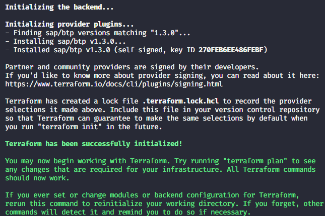
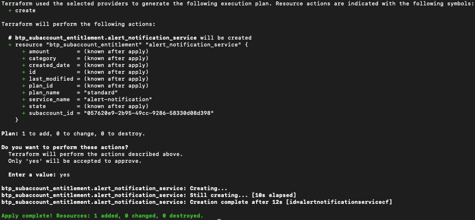

# Get Started with the Terraform Provider for BTP

<!-- description --> Learn how to use Terraform to manage resources on SAP Business Technology Platform using code.

Terraform is an open-source tool that allows you to define and provide cloud infrastructure using a declarative configuration language. It helps in building, changing, and managing resources in a safe, consistent, and efficient manner. 

By combining Terraform with [SAP Business Technology Platform (BTP)](https://www.sap.com/products/technology-platform.html), you can programmatically manage your BTP environments.

## Prerequisites

To follow along with this tutorial, ensure you have access to a [free BTP trial account](hcp-create-trial-account) and Terraform installed on your machine. You can download it from the official [Terraform website](https://developer.hashicorp.com/terraform/downloads).

## You will learn

 - How to install and configure the Terraform Provider for BTP.
 - How to manage your BTP resources as code, making them more reproducible, maintainable, and scalable.
 - How to clean up your BTP resources when they are no longer needed, helping you avoid unnecessary costs and resource consumption.

---

### Setting up the Terraform Provider for BTP

Create a new directory for the tutorial content. This directory will serve as the workspace for your Terraform configuration files. Afterwards, please open a terminal or command prompt and navigate to the newly created directory.

To install and configure the Terraform provider for BTP, add the following block to your Terraform configuration file (`provider.tf`).

```HCL
terraform {
  required_providers {
    btp = {
      source  = "SAP/btp"
      version = "~>1.0.0"
    }
  }
}

provider "btp" {
  globalaccount = "4605efebtrial-ga"
}
```

Replace `"4605efebtrial-ga"` with the subdomain of your own BTP trial account. 

After setting up the provider configuration, run the following command in the terminal to let Terraform download all necessary dependencies:

```Shell
terraform init
```



Last but not least, you need to pass credentials to the provider to authenticate and interact with your BTP environments. Please set the environment variables `BTP_USERNAME` and `BTP_PASSWORD`:

```Shell
export BTP_USERNAME=<your_username>
export BTP_PASSWORD=<your_password>
```

Replace `<your_username>` and `<your_password>` with your actual BTP username and password.

You are now ready to use the Terraform provider for BTP to manage your resources.

### Provisioning Subaccounts

With the provider set up, you can now provision resources on BTP. Let's first create a subaccount using the `btp_subaccount` resource. Create a new file `main.tf` and add the following content:

```HCL
resource "btp_subaccount" "my_project" {
  name      = "My Project"
  subdomain = "my-project"
  region    = "us10"
}
```

This code creates a subaccount named "My Project" in the "us10" region. The `name`, `region`, and `subdomain` parameters are all required. Now that you've defined your resources, you can apply the configuration using the following command:

```Shell
terraform apply
```

Terraform will prompt you to confirm the changes. Type `yes` and press **Enter** to proceed.


The subaccount has just been created for you.

### Managing Subaccount Entitlements

To set an entitlement for the subaccount, you can use the `btp_subaccount_entitlement` resource. Here's an example of how to do that, please add the following content to your `main.tf` file:

```HCL
resource "btp_subaccount_entitlement" "alert_notification_service" {
  subaccount_id = btp_subaccount.my_project.id
  service_name  = "alert-notification"
  plan_name     = "standard"
}
```

This code assigns the "standard" plan of the "alert-notification" service to the previously created subaccount. The `subaccount_id`, `service_name`, and `plan_name` parameters are required.

Once you've defined the entitlement, you can apply the changes using the following command:

```Shell
terraform apply
```

Terraform will prompt you to confirm the changes. Type `yes` and press **Enter** to proceed.



The subaccount is now entitled for the alert-notification service.

### Managing More Resources

The Terraform Provider for SAP BTP offers a wide range of resources that you can manage using Terraform. In addition to creating subaccounts and setting entitlements, you can provision and manage other resources such as service instances, service bindings, role collections, and more.

To get a better understanding of the capabilities of the provider and the available resources, check out the provider documentation at [https://registry.terraform.io/providers/SAP/btp/latest/docs](https://registry.terraform.io/providers/SAP/btp/latest/docs). It provides detailed information about each resource, including their properties and usage examples.

### Destroying Resources with Terraform

You may want to destroy the resources created in the previous examples when they are no longer needed. Terraform provides a convenient way to destroy resources using the `terraform destroy` command:

```Shell
terraform destroy
```

Terraform will prompt you to confirm the destruction of the resources. Type `yes` and press **Enter** to proceed.


Terraform will then destroy the subaccount and removing any entitlements associated with it.
