# Get Started with SAP Cloud Transport Management Service
<!-- description --> Learn how to set up SAP Cloud Transport Management Service in an SAP BTP Trial account, or in an existing SAP BTP subaccount. 

## Prerequisites
 - If you are new to SAP BTP, follow the tutorial [View the SAP BTP from 10,000 Meters](cp-explore-cloud-platform).
 - If you do not have an SAP BTP account, follow the tutorial [Get an Account on SAP BTP Trial](hcp-create-trial-account).

## You will learn
   - How to configure entitlements to SAP Cloud Transport Management service
   - How to subscribe to SAP Cloud Transport Management service
   - How to set up role collections required for SAP Cloud Transport Management service
   - How to create a service instance of SAP Cloud Transport Management service and a service key 

## Intro

>Please note that it involves a significant amount of manual work to migrate an SAP Cloud Transport Management landscape from a trial account to a standard instance (for productive use). In contrast, it is very **easy to switch a free instance** of SAP Cloud Transport Management **to a standard instance**, keeping all your configuration intact. We therefore recommend to use a subaccount in a CPEA-enabled global account if available to you. To do this, follow the steps under *Enterprise Account*. 

For more information about SAP Cloud Transport Management service, see the SAP Help Portal at [SAP Cloud Transport Management Service](https://help.sap.com/docs/cloud-transport-management).

### Open the SAP BTP cockpit

[OPTION BEGIN [Trial Account]]

1. To access BTP Cockpit of your trial account, go to your [SAP BTP Trial landing page](https://account.hanatrial.ondemand.com/trial/#/home/trial) and choose **Go To Your Trial Account**. (The name of the button may vary.)    

2. In your global trial account, navigate to your subaccount by clicking on the tile named **trial**.

    

[OPTION END]

[OPTION BEGIN [Enterprise Account]]

1. To access SAP BTP Cockpit of your enterprise account, choose [https://cockpit.btp.cloud.sap](https://cockpit.btp.cloud.sap).
   Depending on your own geo location, this URL will redirect you to the closest regional SAP BTP Cockpit URL.

2. In your global account, navigate to the subaccount in which you want to use SAP Cloud Transport Management. You might also want to create a new subaccount for this tutorial, if you have the necessary authorizations.

    

3. If Cloud Foundry is not yet configured in your subaccount, you have to do it now. For that, click on **Enable Cloud Foundry** in your subaccount overview.

    

4. In the dialog window, stay with the defaults and potentially adapt (shorten) the **Org Name**, which still has to be unique. Click on **Create**

    

5. You need to create a space in your Cloud Foundry environment. For this, click on **Create Space** in your subaccount overview.

    

6. In the dialog window, provide a **Space Name**, leave the selected roles unchanged, and click on **Create**.

    

7. Your subaccount overview should look like this:

    

> See also on SAP Help Portal: [Initial Setup](https://help.sap.com/docs/cloud-transport-management/sap-cloud-transport-management/initial-setup)

[OPTION END]

---

### Configure Entitlements to SAP Cloud Transport Management Service

In general, entitlements are required to define access of a subaccount to a service.

[OPTION BEGIN [Trial Account]]

>This step isn't necessary when you run this tutorial in a trial account. The trial account has preconfigured entitlements to SAP Cloud Transport Management service.

1. To display the existing entitlements for SAP Cloud Transport Management, select the **Entitlements** link on your subaccount's overview screen.

    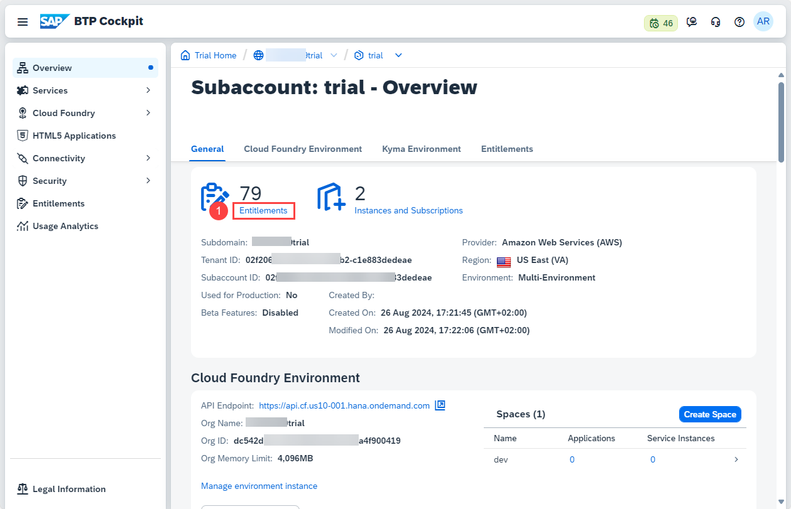

2. To filter for the entitlements for SAP Cloud Transport Management service, search for *Cloud Transport Management* (for example by entering *Transport Management* in the *Search* field).    

3. You see that the *standard* instance plan (to access the Cloud Transport Management API) and the *lite* application plan (to access the user interface of SAP Cloud Transport Management) are assigned to **Cloud Transport Management**.     

    

[OPTION END]

[OPTION BEGIN [Enterprise Account]]

1. To display the existing entitlements for SAP Cloud Transport Management, select the **Entitlements** link on your subaccount's overview screen. In a new subaccount (or in a subaccount that hasn't been used for SAP Cloud Transport Management), you will normally not find entitlements for SAP Cloud Transport Manangement.

    

2. To change the entitlement settings, click on **Edit**.

    

3. To add the missing entitlements, click on **Add Service Plans**.     

    

4. In the dialog window, search for *Cloud Transport Management* (for example by entering *trans*). Click on the entry **Cloud Transport Management**. From the **Available Plans**, select **standard** (without *Application*) and **free (Application)**. Click on **Add 2 Service Plans**.

    

5. Choose **Save**.

    

[OPTION END]

See also on SAP Help Portal: [Configuring Entitlements to SAP Cloud Transport Management](https://help.sap.com/docs/TRANSPORT_MANAGEMENT_SERVICE/7f7160ec0d8546c6b3eab72fb5ad6fd8/13894bed9e2d4b25aa34d03d002707f9.html?locale=en-US)

---

### Subscribe to SAP Cloud Transport Management Service

To enable the usage of the user interface of SAP Cloud Transport Management service, subscribe to the Cloud Transport Management application.

[OPTION BEGIN [Trial Account]]

1. In your subaccount, go to **Services > Service Marketplace**.
2. Use the *Search* field to filter for *transport management*.
3. The *Cloud Transport Management* tile is displayed.  

    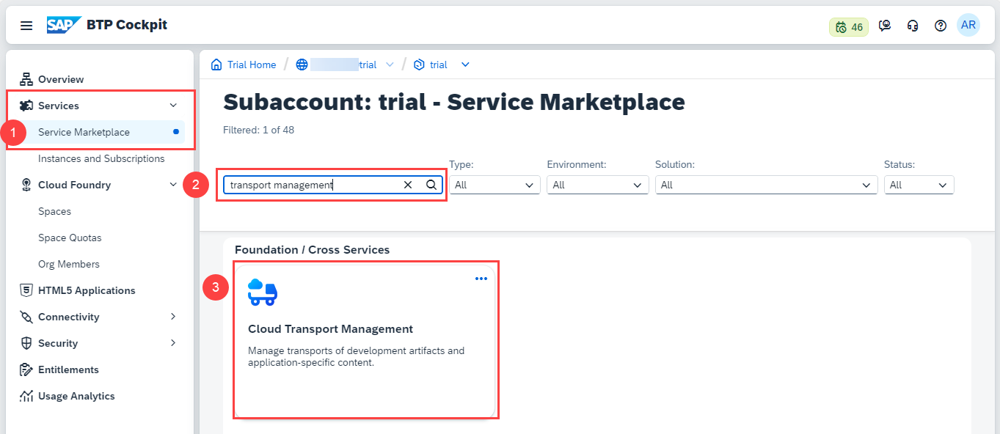

4. Select the three dots (...) on the tile, and choose **Create**.

    

5. On the **New Instance or Subscription** dialog, from the **Plan** dropdown box, select **lite** and choose **Create**.

    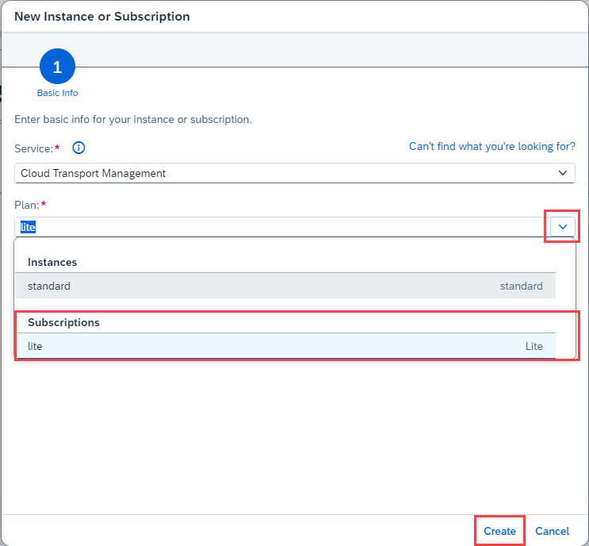

6. The subscription is in progress. Choose **View Subscription**.

    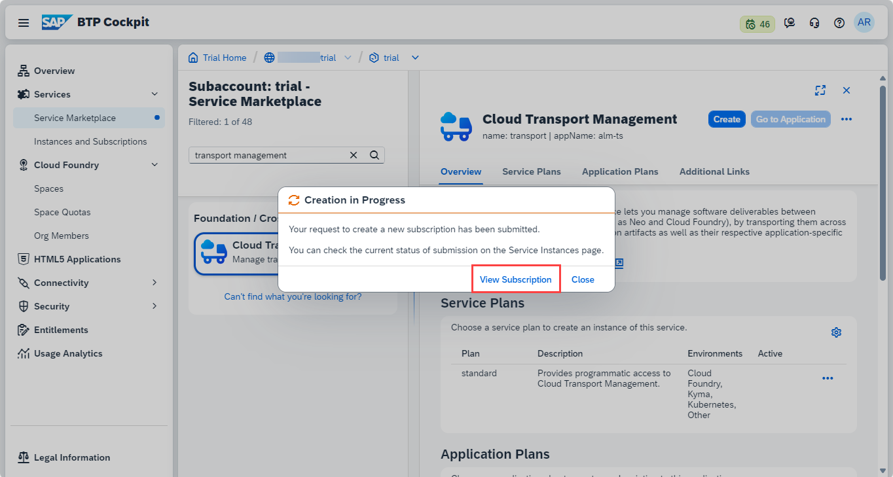

7. You've subscribed to the *Cloud Transport Management* application. 

    

[OPTION END]

[OPTION BEGIN [Enterprise Account]]

1. In your subaccount, go to **Services > Service Marketplace**. Use the *Search* field to filter for *transport management*. The *Cloud Transport Management* tile is displayed. Click on it.

    

2. To create a subscription, choose **Create**.

    

3. Select the *free* subscription plan. If you have access to a paid subscription, this would show as *standard* in the subscription plan list, in addition to the *standard* entry in the instance list.

    

4. Click on **Create**.

    

5. The subscription is in progress. Choose **View Subscription**.

    

6. You've subscribed to the *Cloud Transport Management* application.

    

[OPTION END]

See also on SAP Help Portal: [Subscribing to Cloud Transport Management](https://help.sap.com/docs/TRANSPORT_MANAGEMENT_SERVICE/7f7160ec0d8546c6b3eab72fb5ad6fd8/7fe10fc1baae444e9315579786d623b9.html?locale=en-US)

---

### Set Up Role Collections

After successful subscription, you need to configure user access to the SAP Cloud Transport Management application. You create different role collections for the different SAP Cloud Transport Management roles, and assign roles to the role collections based on the application templates. Afterwards, you assign the role collections to users or user groups. 

>Although the screenshots show the steps in the trial account, they are identical and therefore also valid for an enterprise account.

1.  The **Go to Application** link allows you to start the user interface of SAP Cloud Transport Management. However, before you can use it, you'll need to set up role collections and assign roles and permissions to your user, which you will do in this step. Choose the **Roles** tab.

    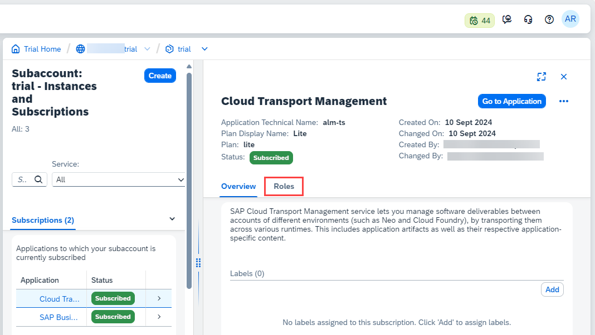

2. On the **Roles** tab, the default role templates for SAP Cloud Transport Management are displayed.

    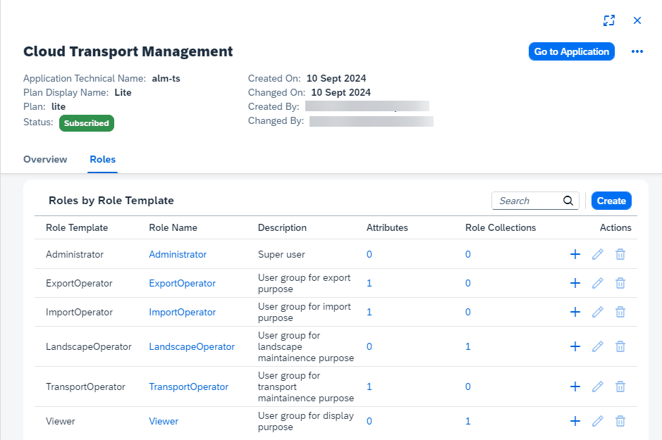

3. To create role collections for the roles that you want to use for the service, choose **Security > Role Collections** from the navigation on the left (1). Filter for role collections called *TMS* (2). The delivered role collections are displayed (3). To create a new role collection, choose **Create** (4).    

    

7. To create a role collection for administrative tasks, enter a name, here `TMS Admin`, and a description (optional), and choose **Create**.

    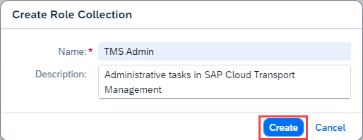

8. The role collection was created.

    

9. To assign the SAP Cloud Transport Management **Administrator** role to the new role collection, return to the **Roles** tab of the subscription details. In the row of the **Administrator** role template, choose the **+** button.

    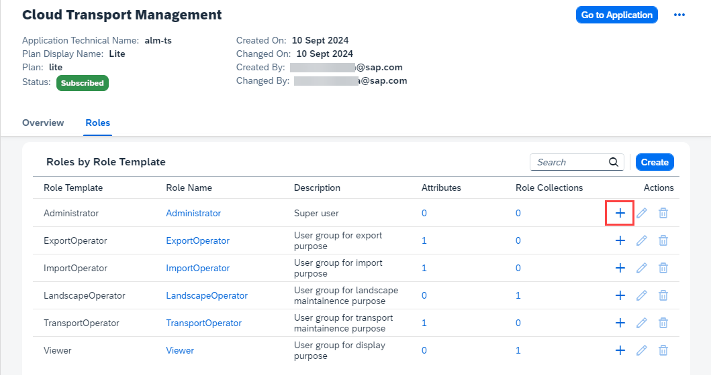

10.  On the **Add to Role Collection** dialog box, select the **TMS Admin** role collection (1), and choose **Add** (2).

     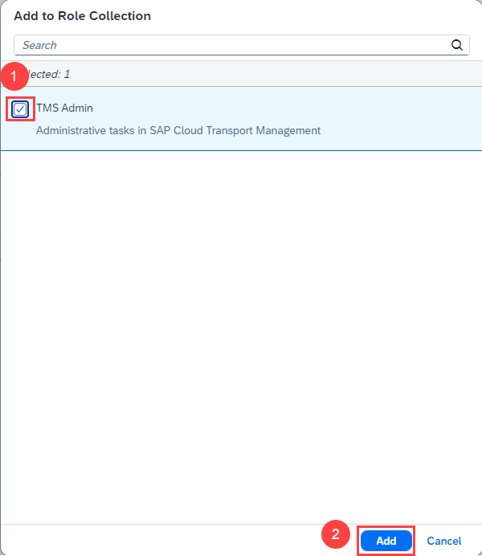

11. The role collection was added to the **Administrator** role template.

     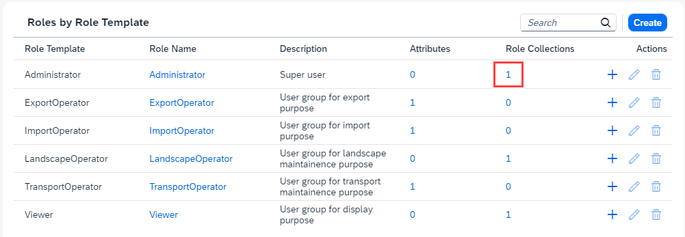

12. You can now add users to the new role collection. To do this, choose **Security > Role Collections** from the navigation on the left. Filter for the *TMS* role collections. Select the arrow at the end of the **TMS Admin** row.

     

13. In the details of the **TMS Admin** role collection, choose **Edit**.

    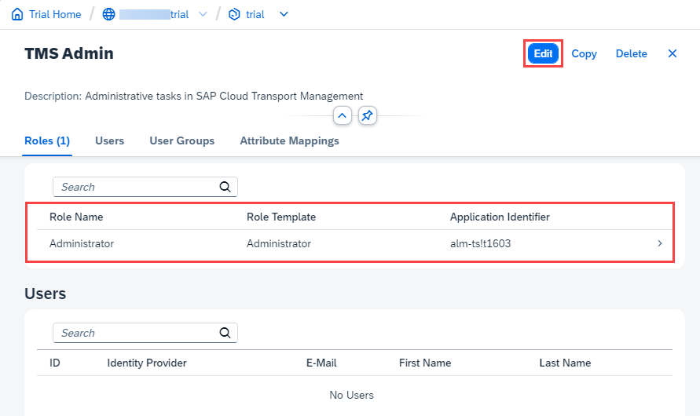

14. You can add individual users or user groups to the role collection. In the tutorial, add an individual user. To do this, select the identity provider (here: **Default identity provider**). In the ID field, enter an existing e-mail address and choose `Enter`. The **E-Mail** field is automatically filled with the selected e-mail address. Save your changes.

    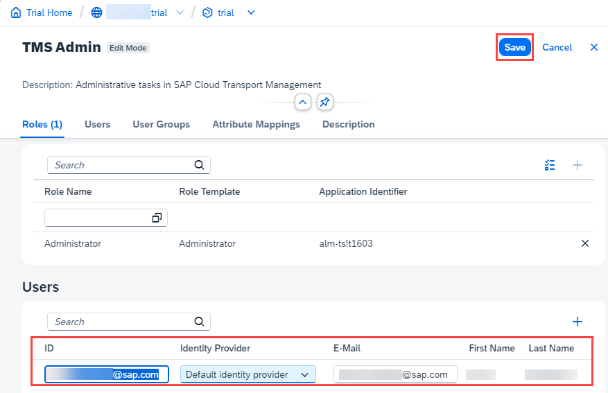

15. The role collection was added to the selected user. You see that **1** user is displayed.

    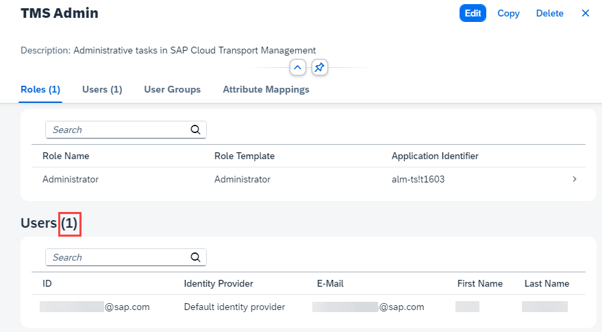

Repeat the steps, if you want to create other role collections for other tasks, such as the **Import Operator** for import tasks. 

See also on SAP Help Portal: [Setting Up Role Collections](https://help.sap.com/docs/TRANSPORT_MANAGEMENT_SERVICE/7f7160ec0d8546c6b3eab72fb5ad6fd8/eb134e02d2074918bcc5af34f50fb19f.html?locale=en-US)

---

### Create a Service Instance and a Service Key

A service instance is required to enable the usage of SAP Cloud Transport Management service using programmatic access (using API Remote Call), for example if you want to use the service to export content directly in your application. To create a destination to SAP Cloud Transport Management service, you need to provide a service key. 

>Although the screenshots show the steps in the trial account, they are identical and therefore also valid for an enterprise account.

1. In your subaccount, choose **Services > Instances and Subscriptions** (1). Go to the **Instances** tab (2). Choose **Create** (3).

    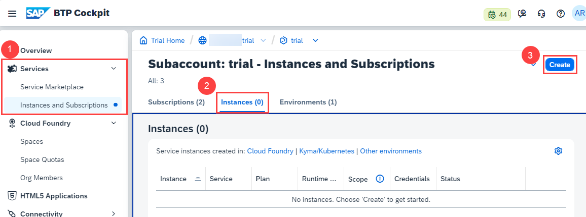

4. From the **Services** dropdown menu, select **Cloud Transport Management** (1). From the **Plan** dropdown menu, select the **standard** plan of the **Instances** type (2). 

    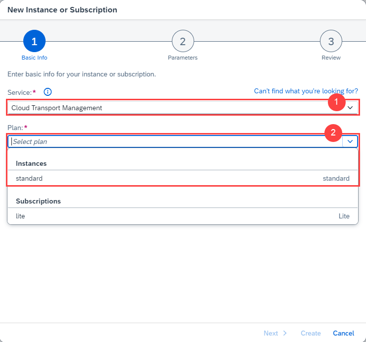

5. After you've selected, you no longer see that you've selected the **Instances** type (1). Enter an **Instance Name** (2), and choose **Create** (3).

    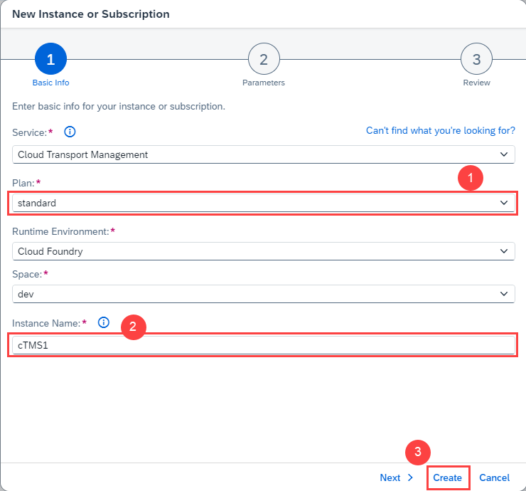

6. The service instance is being created.

    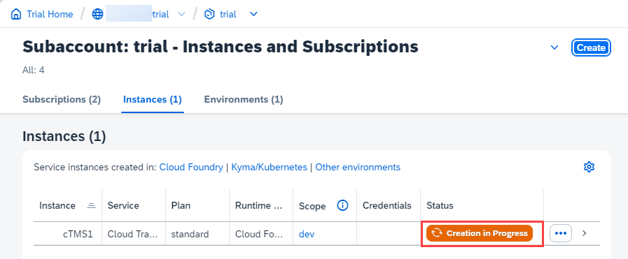

7. When the instance is created, you can create the service key. Select the three dots **(...)** at the end of the row and choose **Create Service Key**.

    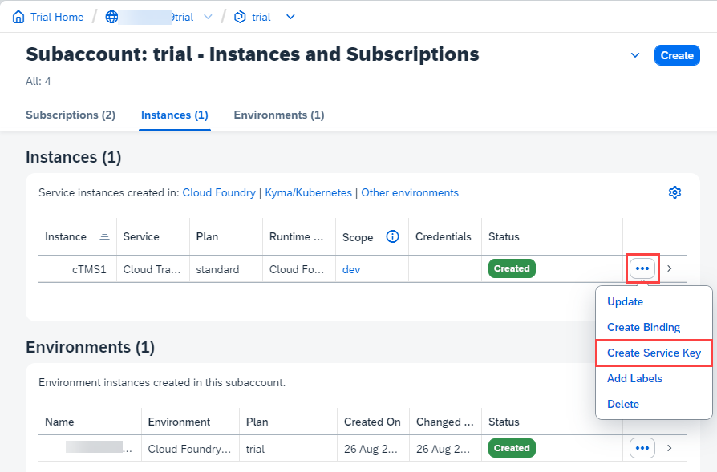

8. On the **New Service Key** dialog, enter a name for the service key, and choose **Create**.

    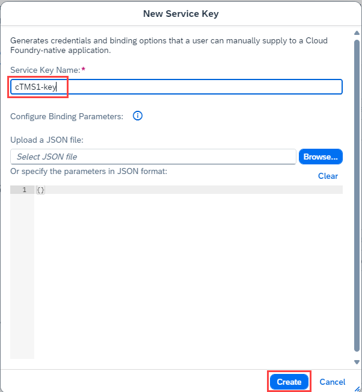

9. The service key is created. To display it, select the three dots **(...)** at the end of the row and choose **View**.

    
 
10. The service key looks as follows. For the destination to SAP Cloud Transport Management service, you need, for example, the values of `clientid`, `clientsecret`, and `url` in the `uaa` section. 

    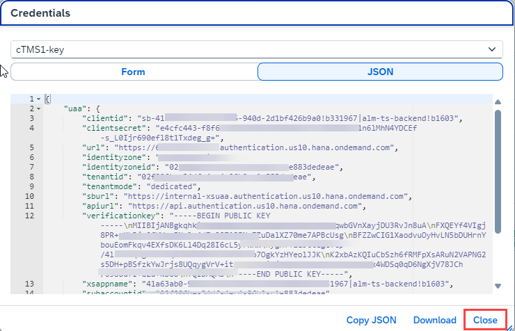

See also on SAP Help Portal: [Creating a Service Instance and a Service Key](https://help.sap.com/docs/TRANSPORT_MANAGEMENT_SERVICE/7f7160ec0d8546c6b3eab72fb5ad6fd8/f44956035ce54684b1dbb9e4d23c37d2.html?locale=en-US)

---

### Verify access to Cloud Transport Management

You should now be able to access the user interface of SAP Cloud Transport Management service. 

1. To check this, in your subaccount, choose **Services > Instances and Subscriptions**. In the **Subscriptions** section, choose the **Cloud Transport Management** link or the *Go to Application* icon to the right of it.

    

2. In a new tab, you should now see the **Overview** page of your SAP Cloud Transport Management instance. Currently, it looks quite empty which is expected from a new instance. 

    

This concludes the tutorial. Congratulations!
