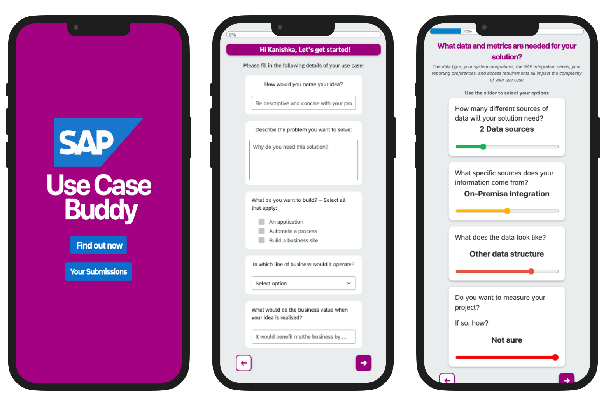
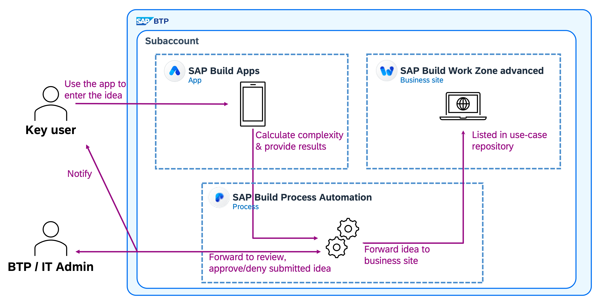
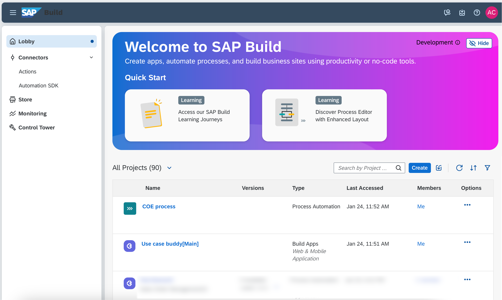
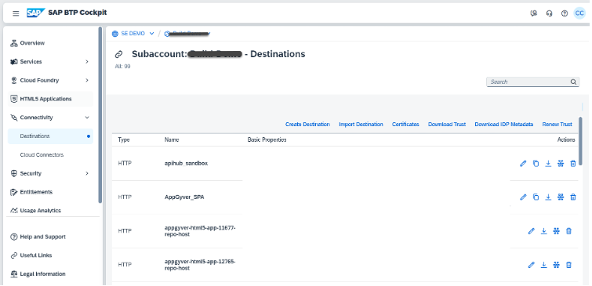
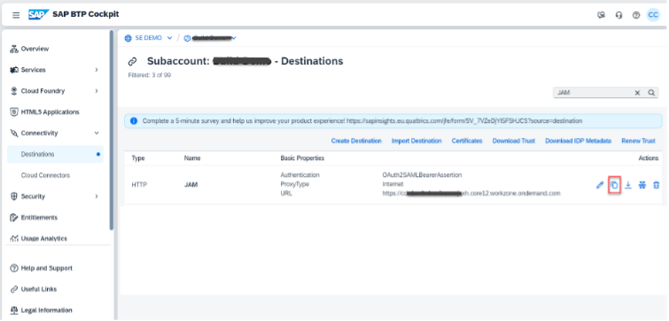
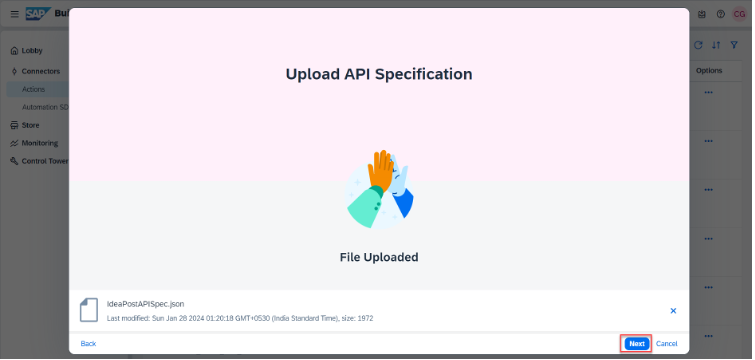
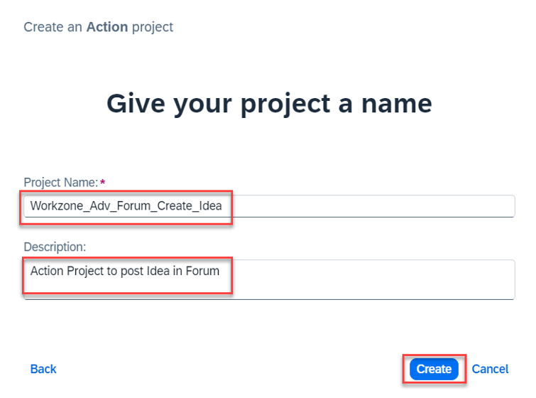
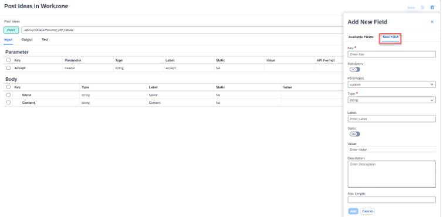
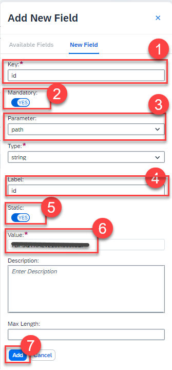
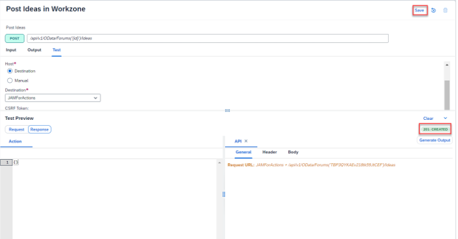

# Get your Use Case Buddy started
<!-- description --> This tutorial is for BTP Admins or CoE teams who are responsible for managing the pipeline of low-code use cases and the low-code solution portfolio. Start this tutorial to learn about how to build a "Use Case Buddy" which will give you a structured method to manage and review ideas of your users in the low-code realm. It will help IT departments avoid redundant requests and determine complexity of unique ideas and projects, preventing the risk of shadow IT.

## You will learn  
  - How you can ideate, collect and differentiate ideas from your users
  - How to build your own Use Case Buddy for your organization
  - How to connect SAP Build Apps, SAP Build Process Automation and SAP Build Work Zone Advanced Edition
  - How to customize contents, logics and workflows in the SAP Build portfolio 

## Prerequisites  
 - You have an account in SAP BTP ([Check out Free Tier Service Plans](https://developers.sap.com/tutorials/btp-free-tier-account.html) in case you want to start fresh)
 - Your IAS tenant runs in the same landscape as your BTP account with the openID protocol. (Important: SAML cannot be used as protocol)  
 - You have activated Boosters for [SAP Build Apps](https://help.sap.com/docs/build-apps/service-guide/activate-your-sap-build-apps-package) and [SAP Build Process Automation](https://developers.sap.com/tutorials/spa-subscribe-booster.html).
 - You have configured an [SMTP Destination](https://help.sap.com/docs/build-process-automation/sap-build-process-automation/configuring-smtp-mail-destination) to send mail notifications.
- You have created a [Destination](https://developers.sap.com/tutorials/spa-create-service-instance-destination.html) to trigger a process from any service.
- [optional] You have activated  [SAP Build Work Zone Advanced Edition](https://blogs.sap.com/2023/01/02/sap-btp-onboarding-series-step-by-step-guide-to-activate-your-sap-build-work-zone-advanced-edition/) and you set it up in your BTP account.

## Intro
The Use Case Buddy uses straightforward and practical questions to assess the project complexity during the ideation phase of low-code development. As a result of this, you’ll understand what each new idea will demand from your team and its resources, and determine whether it should be developed. Having a Use Case Buddy enables you to gather ideas from your users, translate them into requirements and technical descriptions for IT, let IT review them and establish a foundation of transparent low-code development and collaboration among all participants!

>Objective of this tutorial: *Take over the content packages,  give it your own branding, customize it according to your needs and ideas & you're already good to go!*

<!-- size:400px -->

### Understand how the Use Case Buddy works

Building the Use Case Buddy and making it work for your organization will bring huge benefits! But to be able to do this, it helps to understand the intended setup.

1. Take a look at this 📷 [demo video](https://dam.sap.com/mac/u/a/Dm9PwBT.htm?rc=10) to see how it could look like at your organization.

2. Go over the solution diagram for the Use Case Buddy setup including the respective roles. This is our target for this tutorial. 

     <!-- size:400px -->
    

    The key user with a potential use case would be using the Use Case Buddy App built using SAP Build Apps, to the their use case and answer few set of questions which will then automatically calculate the complexity of the use case. Now this idea and description will be forwarded to IT admins to check the feasibility of creating the use case using SAP Build Process Automation. The IT admins will review the use case and its complexity, and will make choice for the level of collaboration that might be needed to create the use case. For instance if they only need to check the final result for a low complexity use-case or whether they need to actively help because the needed systems are very big for a higher complexity use case.
    And ultimately the Use Case would be forwarded to a business site on SAP Build Work Zone Advanced Edition which then lists all of the Use Cases in a central repository.

**Ready to move on? You've got all you need now!**
    

### Get the templates

1. The templates are available on the [SAP Build Governance Resource Center](https://workzone.one.int.sap/site#workzone-notification?sap-app-origin-hint=&/groups/dfHGUSyc55Z70bNJiHhIsR/workpage_tabs/u4QN8ZTukJEYfR1SXxfMPQ). If you're not already signed up for the SAP Build Governance Resource Center - [sign up](https://url.sap/f96fc8) to get access. Please fill in your email, so that you can be added.
    
    You will get an email invitation afterwards. Please accept the invitation. *Note: Access requests may take up to some hours to verify and trigger the email, so kindly be patient.*
    
    <!-- size:300px -->
    

    You will need to create a SAP universal ID account - or you can use your existing account if you have one. Then you have access to the resource center.

    <!-- size:150px -->
    

    In case you don't receive an invitation mail after 24 hours, use this [link](https://workzone.one.int.sap/) and then create an SAP universal ID account or use your existing one. Afterwards when you're logged in, look for the invitation in the notifications (bell button) and join the workspace from there. This will only work when you signed up with your email before.
    
    <!-- size:300px -->
    

2. Scroll down in the SAP Build Governance Resource center until you reach the widget for the Use Case Buddy. Click on *Click here to get the templates.* and download the templates on the next page.

### Import the templates for SAP Build Apps & Process Automation

1. Open your SAP Build Lobby and if necessary log-in with your credentials or SSO.

    <!-- size:400px -->
    

1. Click on the *Import* symbol.

    <!-- size:400px -->
    
    
1. Click on *Browse Files*. Choose the first template you downloaded previously.

    <!-- size:400px -->
    

1. Select the template you just uploaded and click on the *Import* button.

    <!-- size:400px -->
    

1. Repeat the steps with the other templates you downloaded. 

1. All done! Now you can see your imported projects.

    <!-- size:300px -->
    

### Import the template for SAP Build Work Zone Advanced Edition

If you want to follow the recommended approach for the last part of the Use Case Buddy and present submitted ideas in a Work Zone site, you can use the "Digital Center of Exellence" Toolkit. This is a template for a workspace which is already pre-filled. The following step is all about importing the template site for this project. 
⚠️ You can also integrate any other workspace / Work Zone site built with SAP Build Work Zone Advanced Edition - in this case you can skip the next steps and just have your site ready.

1. Follow along the first and second step from this [tutorial](https://developers.sap.com/tutorials/build-digital-coe.html) to import and build your "Digital Center of Excellence". Of course you can later on finish the tutorial for yourself, but for the Use Case Buddy you only need to have the site built up.

###  Connect SAP Build Process Automation to SAP Build Work Zone Advanced Edition

Let's start setting up your Use Case Buddy with the first connection. As the Use Case Buddy will later forward the submitted ideas to a Work Zone page via SAP Build Process Automation, you will now connect SAP Build Work Zone and SAP Build Process Automation. We will later use an *Action Project* in SAP Build Process Automation to do this. To prepare the Action Project and the connection, we will now set up the required **Destination**.

1. For preparation: let's do Destination Setup first. Open **SAP BTP Cockpit** and navigate to **Destinations** section.

    <!-- size:500px -->
    

2. Search for **JAM** destination and click on **Clone** Icon to create a duplicate of the JAM Destination. 
    
    
    *JAM destination will be created by default when subscribed to the SAP Build Work Zone.*

    <!-- size:500px -->
    

3. In order to use this destination for the action project, change the following parameters in the cloned destination destination.

    - Give a different destination Name: **JAMForActions** *Please note: We will refer to this new destination “JAMForActions” later in Action Project.*
    - Add few **Additional Properties** as below:
      - sap.applicationdevelopment.actions.enabled : true
      - sap.processautomation.enabled : true
      - sap.build.usage: odata_gen
     - Click on SAVE

    <!-- size:500px -->
    
    
    Please take a note of the **JAM URL**. It’s the Work Zone domain URL of your BTP account.

4. Click on **Check Connection** on newly created destination and verify the connection. You should get “**200: OK**”.

    <!-- size:500px -->
    

5. To add the ideas in the forum, you will need the *forum id* of your workspace. Log into **SAP Build Work Zone** site (Advanced Edition) and navigate to your workspace, where you want to setup the Forum.

    <!-- size:500px -->
    

    Click on **Forums** and click on **New Forum Topic**.

    <!-- size:500px -->
    

6. Enter the **Topic** Name (For example “Use Case Buddy”) and click on **Save**.

    <!-- size:500px -->
    

    You will see that new Forum got added to the existing forum topics.
    
    <!-- size:500px -->
    

    Click on the new Forum topic, to navigate to see the ideas available. At this point, you will find zero ideas for the newly created forum.

7.  **Please write down** the **folder_id** for the forum topic, you just created. You can see the **forum id** as marked in the URL. It will be used while creating the Action project later.

    <!-- size:500px -->
    

8. Create an action project using the open API specification (API Spec). Download the specification from this git repository: [APISpec](https://github.com/SAP-samples/build-apps-enablement/blob/main/UseCaseBuddy/IdeaPostAPISpec.json)

    **Please note** that this is the custom API specification created for this particular use case. The complete Work Zone Forum API specification can be found in the [SAP Business Accelerator Hub](https://api.sap.com/api/Forum/overview).
    
9. Open the downloaded API spec using a text editor, and change the following value. 

    In  **Servers>url**, include JAM host URL (refer to the Step 3)
    
    <!-- size:500px -->
    

    **Please note** the *requestBody* and response of the API Spec. These are the properties we need to execute the Action Project.
    
    Refer the **Post Path URL**. The **“id”** is an input path parameter, we will configure while creating Action Project. 
        
    - Name: This is input Body parameter for Idea Title
    - Content: This is input Body parameter for Idea Content

### Create an Action Project

After you've setup the destination you are now ready to create an action project. This will enable your Use Case Buddy to create new ideas in the Forums of your workspace in SAP Build Work Zone based on the submitted information.

1. Open **SAP Build Lobby** and navigate to **Actions** section. Click on **Create**.

    <!-- size:400px -->
    

1. Click on **“Upload API Specification”**
   
    <!-- size:400px -->
    

2. **Browse** the API Spec which you have downloaded in previous section and click on **Next**.

    <!-- size:400px -->
    
    <!-- size:400px -->
    

    Enter the **Project Name** (For example "Workzone_Adv_Forum_Create_Idea") and **Description**. 
     
    Click on Create. It will open the **Action Editor**, with the option of selecting the Actions, which we have preconfigured in our APISpec file.
 
    <!-- size:300px -->
    

3. Choose the **Post Action** ("/api/v1/OData/Forums('{id}\*\*')/Ideas"). Click on **Add**

    <!-- size:400px -->
    

    Now, you can see the Action Project in Action Editor with prefilled **Input and Output** section.

    <!-- size:500px -->
    

    You can see that **“id”** as **path** parameter is missing as Input parameter. **Let’s create it.**

4.  In the **Input** Tab, click on **Add**.

    <!-- size:500px -->
    

    Select **New Field** and enter all the required fields as followed.

    <!-- size:500px -->
    

    Enter the values of New Field as follows:
    
    - **Key**: *id*
    - **Mandatory**: *Yes*
    - **Parameter**: *Path*
    - **Label**: *id*
    - **Static**: *Yes*
    - **Value**: *Forum folder id* (your id which you have created in Step 8 in the previous section)

    Click on **Add**.

    <!-- size:300px -->
    

    You can see that the **mandatory path parameter (id)** is now appearing in Input parameter section. 
    <!-- size:400px -->
    

5.  Select the parameter action. In the value field enter *application/json.* Click on **Save**.
     
     <!-- size:500px -->
     

1. Navigate to **Test** tab. And select the **JAM destination** (Say "JAMForActions") from Destinations dropdown, which we have created in previous section.

    <!-- size:500px -->
    

1. Enter the following **Input values** and click on **Test**.
    
    - **Name**: New Idea Title (For example: "New Mobile App for Finance Dept")
    - **Content**: New Idea Content (For example: "Considering the need for universal access, I propose developing a new mobile application for the team.")
    - **id** and **Accept** fields should be prefilled.

    <!-- size:500px -->
    

    You can see that now the execution is successful with *201 status* code. 

1. Click on **Save** to save the Action Project.

    <!-- size:500px -->
    

2. Lets verify the created Idea in Work Zone! Navigate to your Work Zone site's Forum, which you created in the previous steps. You can see the **idea posted** from Action Project now appears under the Forum.

    <!-- size:500px -->
    

    You can click on the **Idea Title** to navigate to the Idea detail. Where you can find various options for *Vote Up/Down* and *Comments*.

    <!-- size:500px -->
    

     **Go Back to Action Editor** to Release and Publish the Action Project. 

    <!-- size:500px -->
    
    
4. Enter *Summary* for Release Note. Click on **Release**

    <!-- size:400px -->
    

5. After Successful Release, click on **Publish to Library**.

    <!-- size:500px -->
    

    Click on **Publish** on Confirmation Dialog.

    <!-- size:300px -->
    

6. On successful publish, you can see the status of the Action project as **Published**.   

    >We have seen the process of creating an Action Project that can post an Idea to the Workzone Forum. With the Action Project now prepared, we can proceed to incorporate it into the SAP Build Process Automation - Process Artifact in the next steps.      

### Reality Check

✅ You just imported templates for SAP Build Apps, SAP Build Process Automation and SAP Build Work Zone Advanced Edition.

✅ You prepared an action project and destination to connect your process to your Work Zone site.

You successfully implemented content packages for SAP Build Apps, SAP Build Process Automation and SAP Build Apps Work Zone Advanced Edition! **Your Use Case Buddy is now setup.**

Now you will need to further connect your process and the app as well as modify some process steps. This will happen in the next tutorial of this group: ["Modify the process of your Use Case Buddy and connect it to your Work Zone site and app"](https://developers.sap.com/tutorials/build-use-case-buddy-connect.html) of the Use Case Buddy. See you there!
