# Create simple CAP Service with Node.js using the SAP Business Application Studio
<!-- description --> Use SAP Business Application Studio to develop a basic CAP Node.js service for Cloud Foundry. You will use only simple JavaScript functions (no database) and learn some basics from the SAP Cloud Application Programming Model (CAP).

## You will learn
  - How to create a Dev Space in SAP Business Application Studio
  - How to create a Project using the CAP Project template
  - How to develop a sample service using CAP and Node.js
  - How to run your service locally

## Prerequisites
  - [Get an Account on SAP BTP to Try Out Free Tier Service Plans](btp-free-tier-account) 
  - You are subscribed to [SAP Business Application Studio](appstudio-onboarding)
  - The following prerequisites are optional, on trial accounts the space and role should have been created by default
  - Under Cloud Foundry **Create a Space** if you don't have one already
    <!-- border -->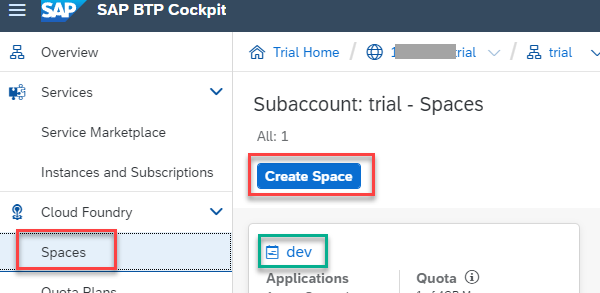
  - Make sure your user has a **Space Developer** Role
    <!-- border -->


## Overview
Find more information on SAP Cloud Application Programming Model [Welcome to CAP](https://cap.cloud.sap/docs/).

In this tutorial group you will learn all the steps to finally consume a CAP Service in a process of SAP Build Process Automation.

<!-- border -->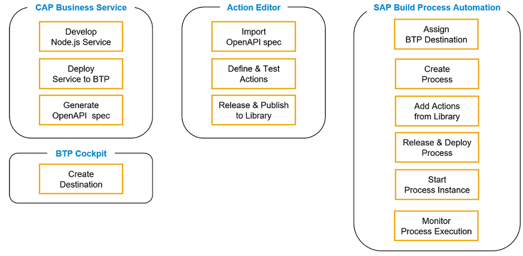

## The Use Case
In this series of tutorials, you will implement a CAP Service with very easy functions like converting a String to a number, converting a list of ids to a comma separated String and finally consume the CAP Service API functions in SAP Build Process Automation Process.


---
### Create your pre-configured dev space

1. Open **SAP Business Application Studio**.

2. Choose **Create Dev Space**.

    <!-- border -->

3. Use name **`demo`** for your dev space and select kind **`Full-Stack Application Using Productivity Tools`**. 

    <!-- border -->

    >By selecting **Full-Stack Application Using Productivity Tools**, your dev space comes with several extensions out-of-the-box that you need to develop CAP services.

4.  Choose **Create Dev Space**.

    <!-- border -->

    >The creation of the dev space takes a while. You see that the status for your dev space will change from **STARTING** to **RUNNING**.

6. Once the dev space is running, click the dev space name to open it.

    <!-- border -->

    >Opening the dev space and starting the Application Studio takes a while. 


### Create a Project

1. Use the **File** menu to create a **New Project from Template**.

    <!-- border -->

2. Choose **CAP Project** from the templates and choose **Start**.

    <!-- border -->

3. Enter the **CAP Project Details**, use name **`sap-build-cap-sample-library`**, select **`Cloud Foundry: MTA Deployment`**  and choose **Finish**.

    >Runtime **Node.js** is already selected.

    <!-- border -->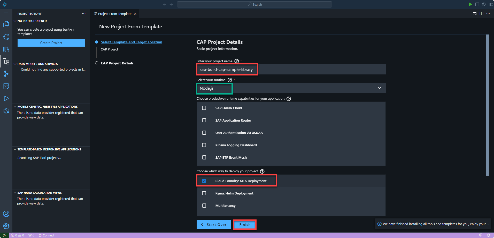

4. Change the view from **Project Explorer** to **Explorer**, choose **View** > **Explorer**.

    <!-- border -->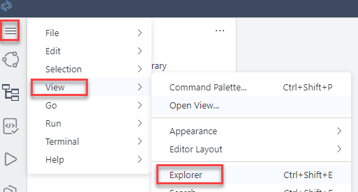

    >The Explorer view will show all files of your project. 


### Build your CAP Service

1. In the Explorer view you will find the file `mta.yaml` in the root folder of your project `sap-build-cap-sample-library`.

    <!-- border -->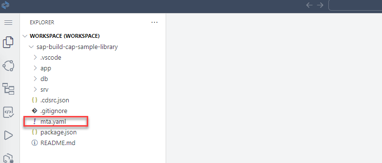


2. Check the file in a text editor, **right-click** > **Open With...** > **Text Editor default**.

    <!-- border -->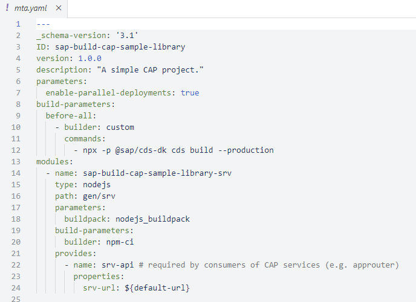

3. In the **`srv`** folder, create a new file called **`service.cds`**.
   
4. In the same folder, create another new file called **`service.js`**.

5. Select the file **`service.cds`** and copy the following code into the editor.

    >Contains the definition of data types and function headers. Functions and actions will make the API of your service.

    >Simple functions like converting a String to an Integer, a list to a CSV String or getting the list of Todos.

    ```CDS
    @Capabilities.BatchSupported : false

    service sap_build_cap_sample_library @(path : '/api/v1') {
    
    define type DataString {
        value : String;
    }

    define type DataInteger {
        value : Integer;
    }
    
    define type DataNumber {
        value : Double;
    }

    define type DataList {
        id : Integer;
        title: String;
        userId: Integer;
        completed: Boolean;
    }

    define type DataListArray {
        responseArray : array of DataList;
    }

    @Core.Description : 'toInteger'
    function toInteger(value : String) returns DataInteger;

    @Core.Description : 'toNumber'
    function toNumber(value : String) returns DataNumber;

    @Core.Description : 'toString'
    function toStr(value : Double) returns DataString;

    @Core.Description : 'addQuotes'
    function addQuotes(value : String) returns DataString;

    @Core.Description : 'listToString'
    action listToString(responseArray : array of DataList, field : String) returns DataString;

    @Core.Description : 'get list of dodos'
    function getListOfTodos() returns DataListArray;

    }
    ```

6. Select the file **`service.js`** and copy the following code into the editor.

    >The JavaScript implementation for the API of your service.

    ```JavaScript
    module.exports = srv => {

        srv.on('toInteger', req => {
            const {value} = req.data;

            return { 'value' : parseInt(value) };
        });

        srv.on('toNumber', req => {
            const {value} = req.data;

            return { 'value' : parseFloat(value) };
        });

        srv.on('toStr', req => {
            const {value} = req.data;

            return { 'value' : value.toString() };
        });

        srv.on('addQuotes', req => {
            const {value} = req.data;

            return { 'value' : "'" + value + "'"};
        });
        
        srv.on('listToString', req => {

            var values = req.data.responseArray;
            var resultList = [];
            var field = req.data.field;
            if (values) {
                for (var i = 0; i < values.length; i++) {
                    resultList.push(values[i][field]);
                }
            }

            return { value : resultList.toString() };
        });

        srv.on('getListOfTodos', req => {
            return { responseArray : [            {
                "id": 1,
                "completed": false,
                "title": "delectus aut autem",
                "userId": 1
            },
            {
                "id": 2,
                "completed": false,
                "title": "quis ut nam facilis et officia qui",
                "userId": 1
            }] }; 
        });

    }
    ```

### Test CAP service locally

This step describes how to test the service locally using a file that contains the Service Endpoints.

1. On the **`sap-build-cap-sample-library`** folder, create a new file called **`test.http`**.

2. Select the file **`test.http`** and copy the following content into the editor.

    >Samples for HTTP requests for the services of your API.

    ```HTTP
    ### call toInteger
    GET http://localhost:4004/api/v1/toInteger(value='20')

    ### call toNumber
    GET http://localhost:4004/api/v1/toNumber(value='20.2')

    ### call toString
    GET http://localhost:4004/api/v1/toStr(value=20.2)

    ### call addQoutes
    GET http://localhost:4004/api/v1/addQuotes(value='abcd')

    ### call getListOfTodods
    GET http://localhost:4004/api/v1/getListOfTodos()

    ### call listToString
    POST http://localhost:4004/api/v1/listToString
    Content-Type: application/json

    {
        "field" : "id",
        "responseArray": [
            {
                "id": 1,
                "title": "delectus aut autem",
                "userId": 1,
                "completed": false
            },
            {
                "id": 2,
                "title": "quis ut nam facilis et officia qui",
                "userId": 1,
                "completed": false
            }
        ]
    }     
    ```
 
4. From the **Terminal** menu, select **New Terminal**.

    <!-- border -->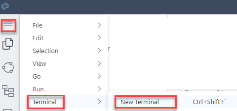

5. On the **`sap-build-cap-sample-library`** folder, run the following command in the **Terminal** window:

    >This will start a local server with your service that will allow you to test your API calls.
   
    ```Shell / Bash
    cds watch
    ```

6. Choose **Send Request**, you will get the response in a separate window.

    <!-- border -->

7. Choose **Ctrl - C** to terminate the Server session.


### Deploy your Service to Cloud Foundry

1. Select the package.json file and copy and paste the following code after `scripts`:

    ```JSON
    ,
    "cds": {
    "requires": { "auth": { "kind": "dummy" }}
    }
    ```

    <!-- border -->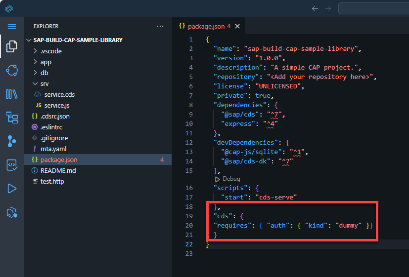

2. Run the following command in the Terminal window:

    ```Shell / Bash
    npm install
    ```

3. Right click on the file mta.yaml and select Build MTA Project.

    <!-- border -->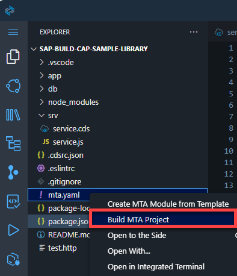

    The service gets built, wait until the tasks are completed.

4. Check your API endpoint definition.

    Check in BTP Cockpit, if the API Endpoint of your Cloud Foundry environment is matching the information you used for the script https://api.cf.us10-001.hana.ondemand.com

    <!-- border -->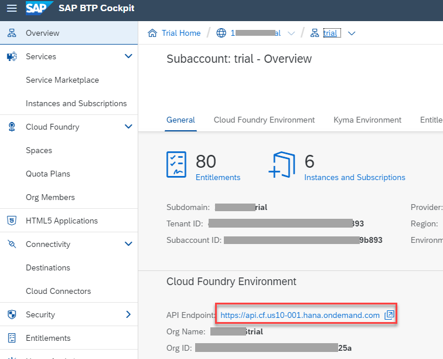

5. Under `mta_archives`, right click on `sap-build-cap-sample-library_1.0.0.mtar` and select Deploy MTA Archive.

    <!-- border -->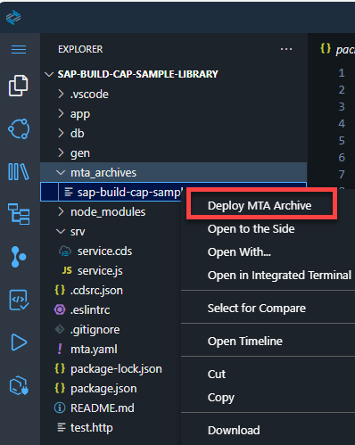

    You will provide your login information to sign in to the Cloud Foundry environment.

6. Validate the Cloud Foundry Endpoint and enter your username and password. 
   
    > In case you are using two factor authentication, you need to append the One-time password code to your password.

    > If you select the SSO Passcode authentication method, SAP Business Technology Platform will grant you a temporary authentication code to sign in.

    <!-- border -->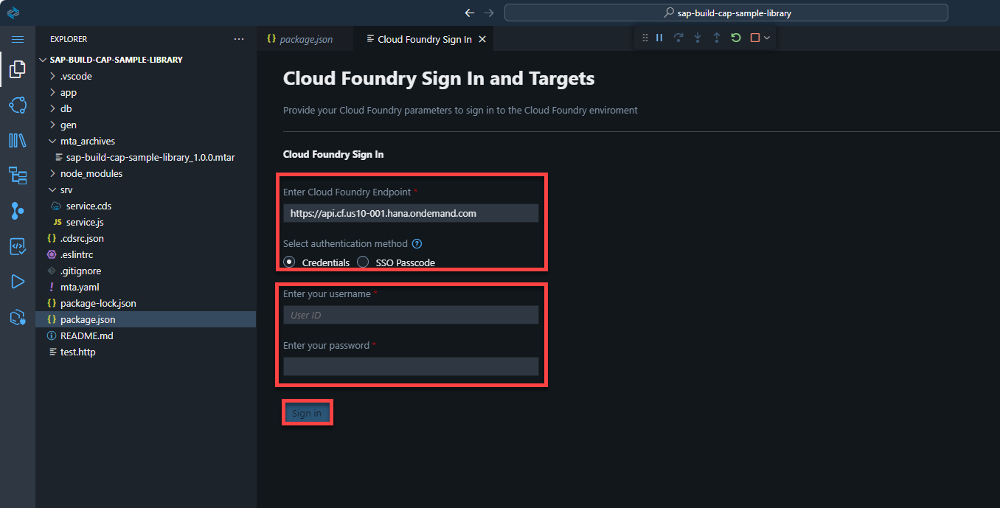

7. Select Cloud Foundry Organization and Space.
   
    > On trial, **dev** is created as default Cloud Foundry space

    <!-- border -->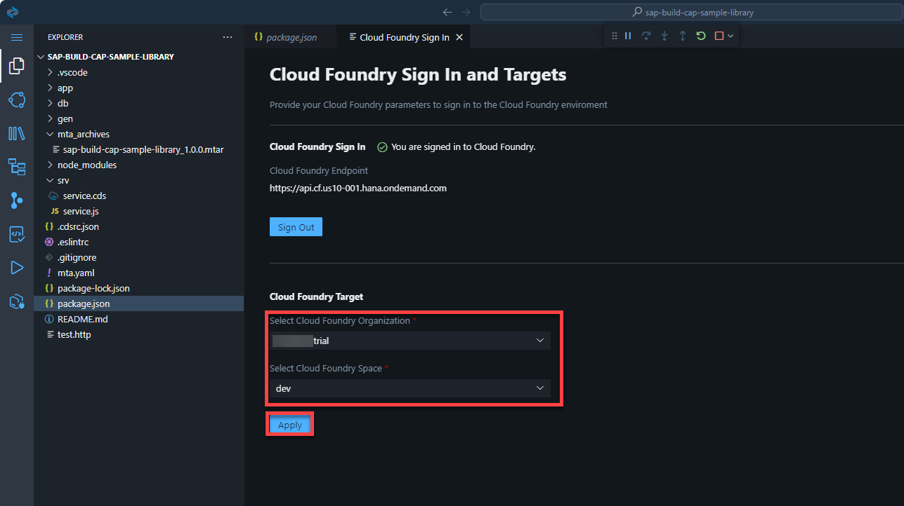

    Your service should be available and running in your Cloud Foundry space.

    In the **BTP Cockpit** you can check if the service is running:

    <!-- border -->

---

