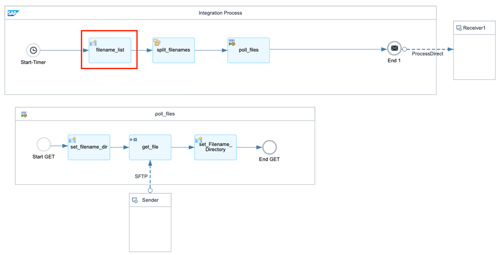
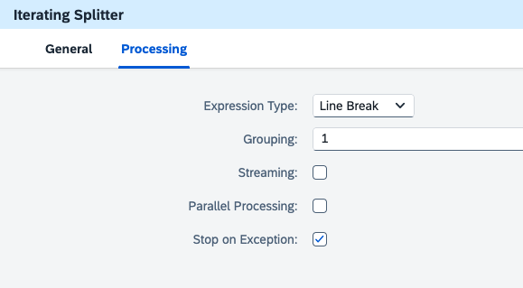
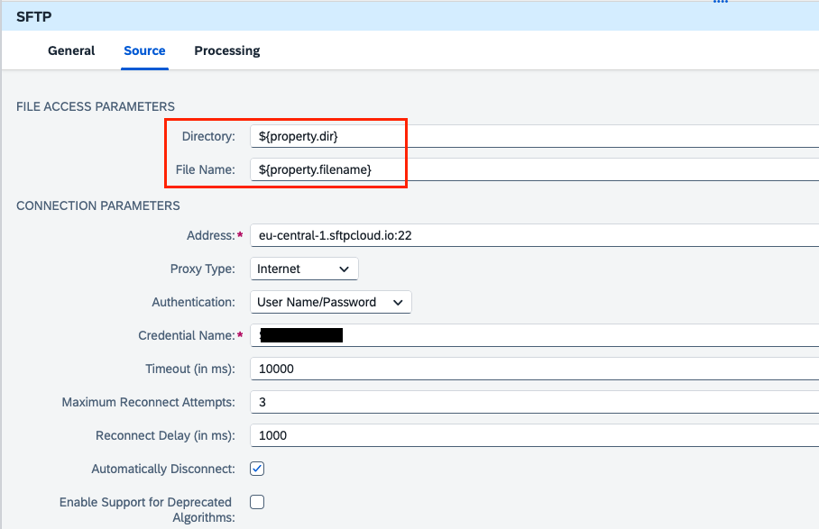
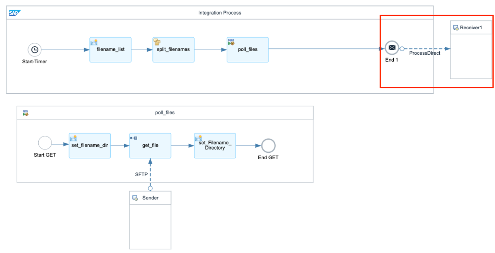

# Learn how to migrate SFTP Advanced File Selection from SAP Process Orchestration to Cloud Integration
<!-- description --> This tutorial covers the file polling by Poll enrich with SFTP Adapter in the SAP Integration Suite and achieve the file selection based on the list of filenames by Content Modifier with Iterating Splitter.

## Intro
In SAP Process Orchestration (PO), advanced file selection is typically used when working with the File Adapter in an Integrated Configuration (ICO) or Sender Agreement. It allows you to apply complex filtering logic to select files based on specific patterns, timestamps, or metadata. If you want to migration/implement this function in SAP Integration Suite, you need to know how to define, split, poll and process files in SAP Cloud Integration. The Apache Camel framework provides robust file handling capabilities, such as reading files from directories and handles them based on their presence. We´re using an example integration flow to provide you the step-by-step process and we hope you can ensure efficient and error-managed file handling within your integration processes.  

If you want to get an example with split and multicast in detail, please refer to the [SFTP Poll Use Case](https://github.com/sap-tutorials/Tutorials-Contribution/blob/master/tutorials/ci-sftp-file-polling/Use%20Case%202.pdf).

## Prerequisites
- Get permission to the SAP Integration Suite for design and monitor
- Have access to an SFTP Server for file upload and download
- Get Authentication to the SFTP Server
  

## You will learn
- How to use the Poll Enrich with SFTP Sender on Cloud Integration
- How to use the iterating splitter to select the file based on a list of filename
- How to process the files based on the presence by the Camel headers

### Use Content Modifier and Iterating Splitter based on Line Breaks

1.  Create a integration flow with a Start-Timer and Process Direct Receiver. We will only focus on the file polling function, therefore we use the simple start and receive to simulate.   

2.  Use a Content Modifier to process the message content. This Content Modifier should contain a list of all filenames in the Message Body. This step is used here to initialize a list of file names, specifying multiple possible CSV file patterns to be used by subsequent steps. 
The specific file name patterns include eg.: 

```Expression
Dummy_A_*.csv 
DummyB_*.csv 
DummyC_*.csv 
DummyD_Dummy1_*.csv 
```
  

3.  Add Iterating Splitter to split the input message based on line breaks, process each line individually, handle messages sequentially. In the following table there are the configurations inside the Interacting:

    |  Configuration Name               | Usage         | Description                                      
    |  :-------------           | :-------------        | :------------- 
    |  Expression Type | Line Break               | `This setting indicates that the splitter will use line breaks as the delimiter to split the content. Each line in the input will be treated as a separate message part. ` 
    |  Grouping          | 1                  | `This setting specifies the number of items to be grouped together in each split message. A value of "1" means that each individual line (or item) will be processed separately. `  
    |  Streaming              | Unchecked                | `When unchecked, this means that the splitter will not process the input as a continuous stream. Instead, it will handle the input as a whole. `   
    |  Table Name               | Unchecked                 | `When unchecked, the splitter will process the split messages sequentially. If checked, the splitter could process multiple split messages in parallel, which can improve performance for large datasets. `      
    |  Stop on Exception             | Checked                 | `When checked, this setting ensures that the processing will stop if an exception occurs in any of the split messages. This is useful for error handling, ensuring that issues are addressed before proceeding further in the process. `  


  

### Add local Integration Process Call to poll files from SFTP Server

1.  Build the Process Call and the Local Integration Process Call  poll_files. Local integration process poll_files will be triggered from the calling process afterwards.
          

2.  Configure a Content Modifier set_filename_dir to define directory and filename in the following property table:
     
    | Action | Name | Source Type | Source Value | Data Type                                            
    | :------------- | :------------- | :------------- | :------------- | :-------------                                            
    | Create | dir | Constant | `/` |                                           
    | Create | filename | Expression | ${in.body} | java.lang.String                                                                           

3.  Add Poll Enrich. It provides the ability polling content from an external component and enrich the original message with it. Currently, you can use the Poll Enrich step to read content from an SFTP server.
Define Poll Enrich with Replace as Aggregation Algorithm. It indicates that the current message payload will be removed and replaced with the newly retrieved file content.
  

4. In the SFTP Sender, configure the file access parameters by the properties defined for directory and file name. Set up the address and credentials alias based on your case. 
  
5. Set a content modifier after polling the file to process the headers during runtime. 

    | Action | Name | Source Type | Source Value      
    | :------------- | :------------- | :------------- | :-------------                                        
    | Create | Directory | Header | `CamelFileParent`                                       
    | Create | Filename | Header | `CamelFileNameOnly` 

Note: If the file exists and has been successfully polled by the file adapter in SAP Cloud Integration, the CamelFileParent and CamelFileNameOnly headers will be present in the message headers during runtime. These headers are automatically generated by the Apache Camel framework, which is embedded in SAP Cloud Integration, and they capture important file metadata such as:
CamelFileParent: The directory path of the file.
CamelFileNameOnly: The name of the file without the path or extension.

### Add your next steps to consume the polled file and parameters
In the last step, we are using the receiver adapter ProcessDirect. Therefore, after the file is polled, you can deliver to your consuming integration flow which can process the message further.  
Before sending the message to the next integration flow, you also have the option to take advantage of the Headers Directory and Filename which were set before and build your own message based on the specific scenario.
  


### Test yourself
