# Use Trial to Extract Information from Custom Documents with Generative AI and Document Information Extraction
<!-- description --> Learn how to use Document Information Extraction with generative AI to automate the extraction of information from custom document types using large language models (LLMs).

## Prerequisites
- You've created a trial account on SAP BTP: [Get a Free Account on SAP BTP Trial](hcp-create-trial-account)
- You've access to the Document Information Extraction UI, as described in the tutorial: [Use Trial to Set Up Account for Document Information Extraction and Go to Application](cp-aibus-dox-booster-app)

## You will learn
  - How to create and activate a custom schema for custom documents
  - How to define the fields that you want to extract from a custom document 
  - How to upload a custom document to the Document Information Extraction UI
  - How to get extraction results using the schema you’ve created and LLMs

## Intro
In this tutorial, you’ll create a schema and define the fields that you want to extract from custom document types using LLMs. You’ll then use your schema to get field value predictions for various documents that you upload to the Document Information Extraction UI, including delivery notes and birth certificates.

---

### Create schema

Before you upload a custom document for extraction, you’ll create a corresponding schema. In this tutorial, we provide sample files and settings for the following custom documents:

- Delivery note
  
- Résumé
  
- Birth certificate
  
- Work contract 
  
In the first example, you'll use a delivery note. After working through this example, you can go on and try out the other custom document types covered in Step 5.

1. Open the Document Information Extraction UI, as described in the tutorial: [Use Trial to Set Up Account for Document Information Extraction and Go to Application](cp-aibus-dox-booster-app).

2. In the left navigation pane, click **Schema Configuration**.

    <!-- border -->

3. To create your own schema, click **Create**. A dialog opens.

    <!-- border -->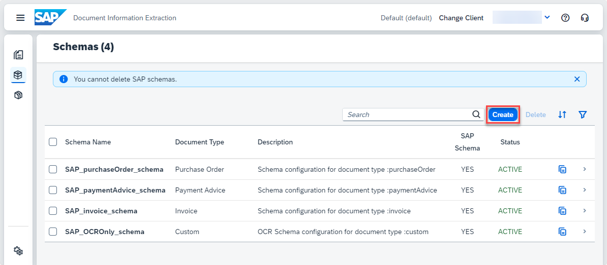

4. In the dialog, enter a name for your custom schema – for example, `delivery_note_schema`. Note that the name can't include blanks. Next, select `Custom` as your **Document Type** and `Document` as the **OCR Engine Type**. 

5. Click **Create** to create the schema.

    <!-- border -->    

6. Your schema now appears in the list. Access the schema by clicking on it.

    <!-- border -->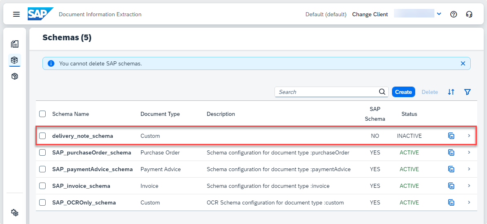

### Add data fields

To add your first header field, click **Add**.

<!-- border -->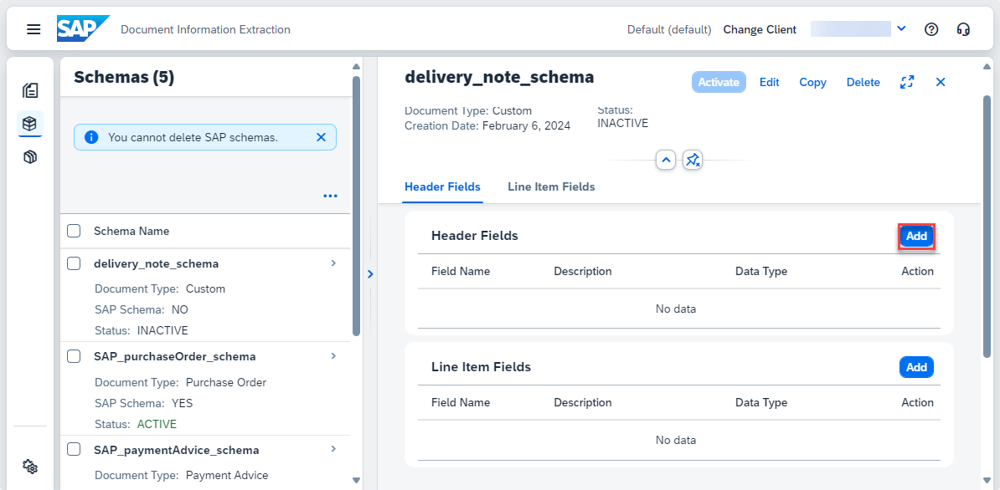

You must enter a field name and data type for each custom field. The available data types are `string`, `number`, `date`, `discount`, `currency`, and `country/region`. Default extractors aren't available for custom documents. You can also optionally add a field label (user-friendly name) and a description.

>A description is an optional entry. It can be useful if you want to include an explanation or some additional context for a field. 

>You can also use a description for other purposes, such as categorizing fields. For example, in the description of the field `limitedContract` in work contracts, you could specify `yes`, if the contract is limited and `no` if the contract is not. Or you could specify that the line item field `skillType` in a résumé can be technical or language.

>See Step 5 for examples of schemas that use the description field.

As your first header field, add the number of the delivery note.

1. Enter the name for your field – for example, `deliveryNoteNumber`.

2. Select `string` as the **Data Type**.

3. Use `auto` as the **Setup Type** and click **Add**.
   
>Note that when you use the setup type `auto` without a default extractor, LLMs are used to extract the information from the document. The setup type `manual` supports extraction using a template. For more details on this approach, take a look at the tutorial mission: [Shape Machine Learning to Process Custom Business Documents](https://developers.sap.com/mission.btp-aibus-shape-ml-custom.html).

<!-- border -->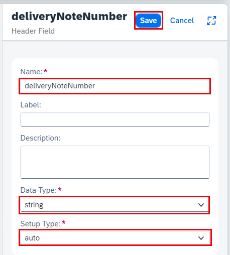

The field now appears in your list of header fields, where you can see all the information that you've just entered. You can edit or delete the field by clicking the respective icons on the right.

<!-- border -->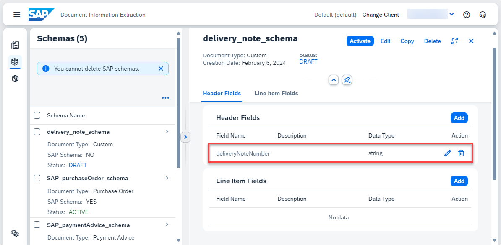

Click **Add** again to open the **Add Data Field** dialog.

1. Enter the name for your second header field – for example, `purchaseOrderNumber`.

2. Select `string` as the **Data Type**.

3. Use `auto` as the **Setup Type** and click **Add**.

<!-- border -->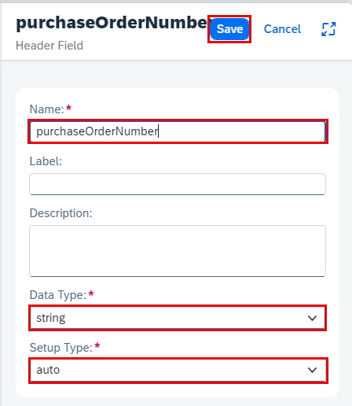

Now, go ahead and add the remaining header fields and line item fields shown in the table and image below. Pay attention to the different data types and notice that the last three fields are line item fields (not header fields). Feel free to extend or reduce the list of fields.

|  Field Type		    |  Field Name             | Data Type     | Setup Type   
|  :------------------- |  :-------------------	  | :----------   | :----------    
|  header field         |  `deliveryNoteNumber`   | string        | auto       
|  header field         |  `purchaseOrderNumber`  | string        | auto
|  header field         |  `deliveryDate`         | date          | auto           
|  line item field      |  `materialNumber`       | string        | auto       
|  line item field      |  `quantity`             | number        | auto       
|  line item field      |  `unitOfMeasure`        | string        | auto                      

<!-- border -->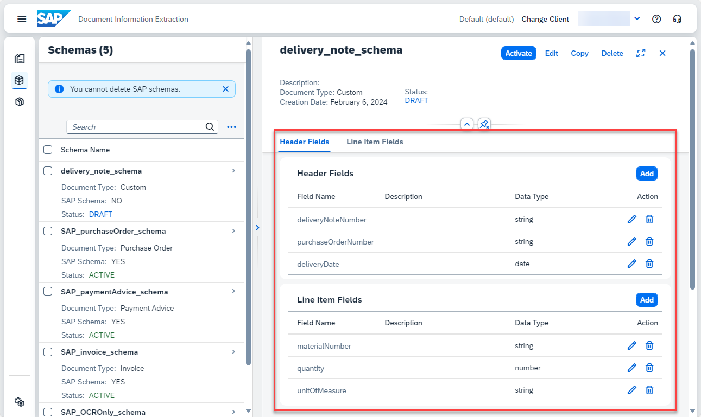

### Activate schema

Once you've added all your fields, you need to activate the schema so that you can use it to extract information from documents. Right now, the schema has the status `DRAFT`, indicating that it can't be used yet.

To activate the schema, click **Activate**.

<!-- border -->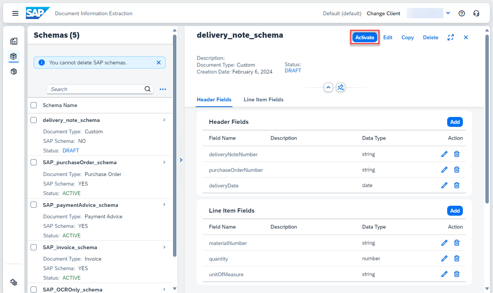

Now, the status of your schema changes to `ACTIVE`. To make changes to your schema, you must first **Deactivate** it.

<!-- border -->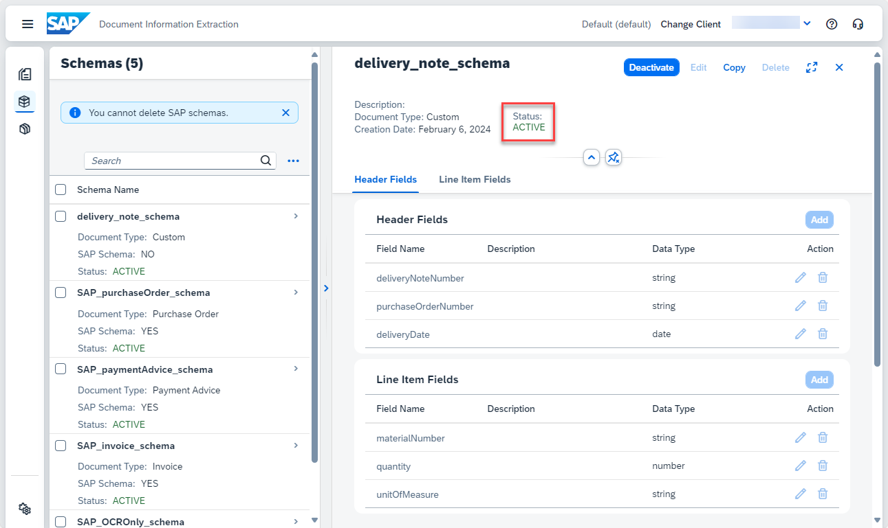

Congratulations, you've now created and activated your custom schema for delivery note documents.

### Get extraction results

1. Access **Document** from the navigation on the left of the screen, then click **+** to upload the delivery note document.

    <!-- border -->

2. On the *Select Document* screen, choose `Custom` for the **Document Type**.
   
3. Select the **Schema** you created (`delivery_note_schema`).
   
4. Right click on the link, then click ***Save link as*** to download locally the [delivery note](https://github.com/SAPDocuments/Tutorials/raw/master/tutorials/cp-aibus-dox-ui-gen-ai/delivery_note.jpg) sample document.
   
5. Drag and drop the file directly or click **+** to upload the sample document.

6. Click **Step 2**.

    <!-- border -->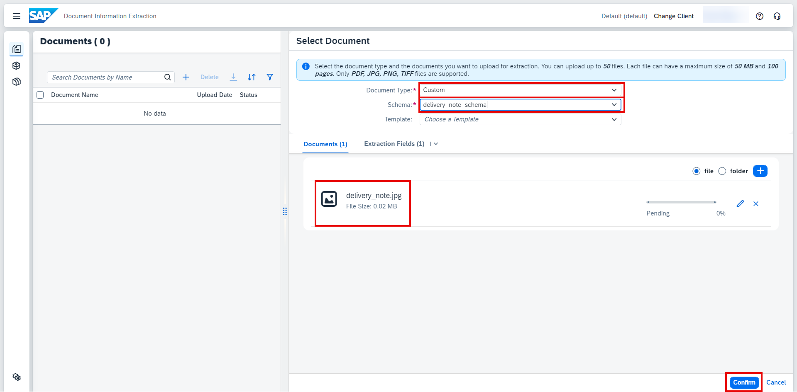

7. Click **Step 3** and then click **Review**.
   
8. Review your selection. Click **Edit** if you want to change anything. Click **Confirm**.

    <!-- border -->

    The document status changes from `PENDING` to `READY`.

    <!-- border -->

9.  Access the document by clicking on it. Click **Extraction Results** to see the information extracted from the delivery note using LLMs and the schema that you created.

    <!-- border -->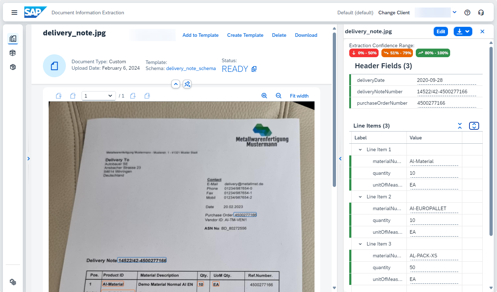

Congratulations, you've now successfully extracted information from a delivery note document using the schema configuration feature from Document Information Extraction and LLMs.

### Create schema and get extraction results for other custom document types

You can now repeat the steps previouly described for the following documents (using the suggested fields or your own fields):

- Résumé – [sample document](https://github.com/SAPDocuments/Tutorials/raw/master/tutorials/cp-aibus-dox-ui-gen-ai/resume.pdf)

Create the header fields shown in the table and image below. Don't forget to add a description for `degree`, `employer` and `jobTitle` (as in the image). Feel free to extend or reduce the list of fields.

|  Field Type		    |  Field Name           | Data Type     | Setup Type   
|  :------------------- |  :-------------------	| :----------   | :----------    
|  header field         |  `firstName`          | string        | auto       
|  header field         |  `lastName`           | string        | auto
|  header field         |  `degree`             | string        | auto           
|  header field         |  `employer`           | string        | auto       
|  header field         |  `jobTitle`           | string        | auto       
             

<!-- border -->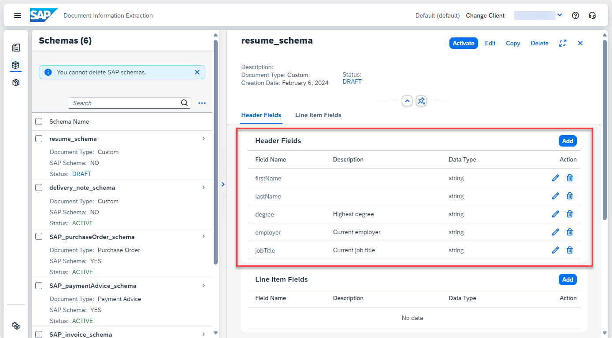

- Birth Certificate (in Chinese) – [sample document](https://github.com/SAPDocuments/Tutorials/raw/master/tutorials/cp-aibus-dox-ui-gen-ai/birth_certificate.png)

Create the header fields shown in the table and image below. Pay attention to the different data types and don't forget to add a description for `name` (as in the image). Feel free to extend or reduce the list of fields.

|  Field Type		    |  Field Name             | Data Type     | Setup Type   
|  :------------------- |  :-------------------	  | :----------   | :----------    
|  header field         |  `name`                 | string        | auto       
|  header field         |  `birthDate`            | date          | auto
|  header field         |  `motherName`           | string        | auto           
|  header field         |  `fatherName`           | string        | auto       
|  header field         |  `registrationNumber`   | string        | auto       
             

<!-- border -->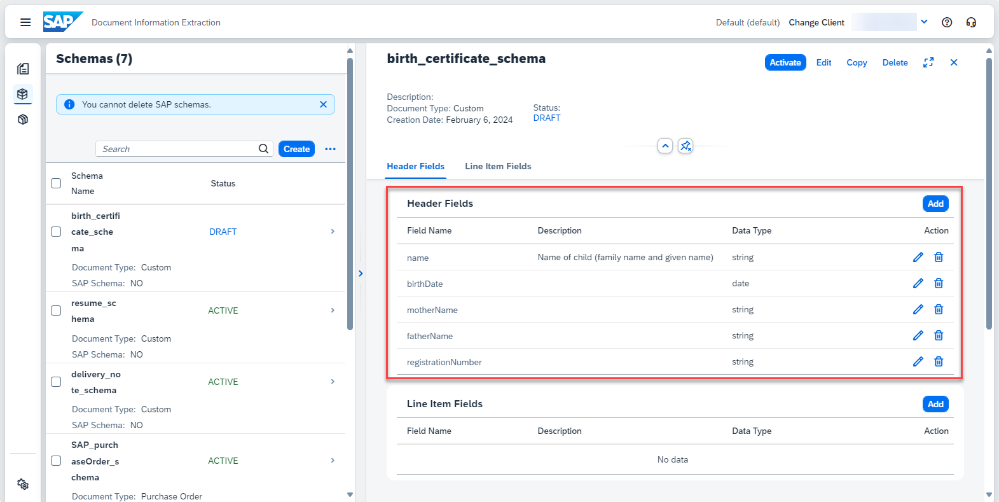

- Work Contract (in German) – [sample document](https://github.com/SAPDocuments/Tutorials/raw/master/tutorials/cp-aibus-dox-ui-gen-ai/work_contract.pdf)

Create the header fields shown in the table and image below. Pay attention to the different data types and don't forget to add a description for all fields (as in the image). Feel free to extend or reduce the list of fields.

|  Field Type		    |  Field Name           | Data Type     | Setup Type   
|  :------------------- |  :-------------------	| :----------   | :----------    
|  header field         |  `companyName`        | string        | auto       
|  header field         |  `employeeName`       | string        | auto
|  header field         |  `limitedContract`    | string        | auto           
|  header field         |  `salary`             | number        | auto       
|  header field         |  `startDate`          | date          | auto       
             

<!-- border -->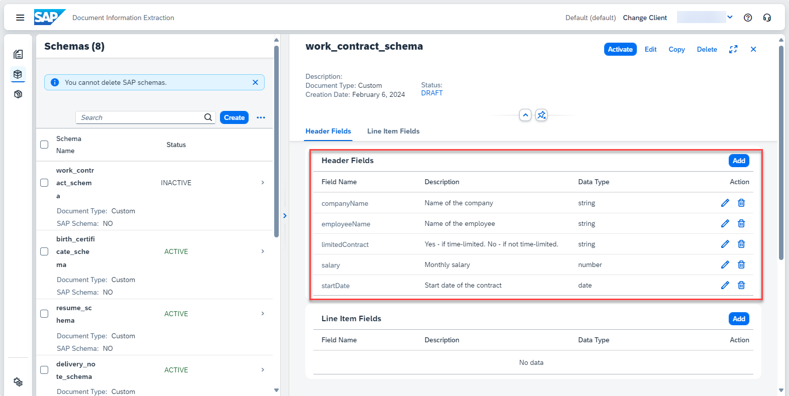

Congratulations, you've completed this tutorial. Feel free to repeat the steps using your own custom documents.