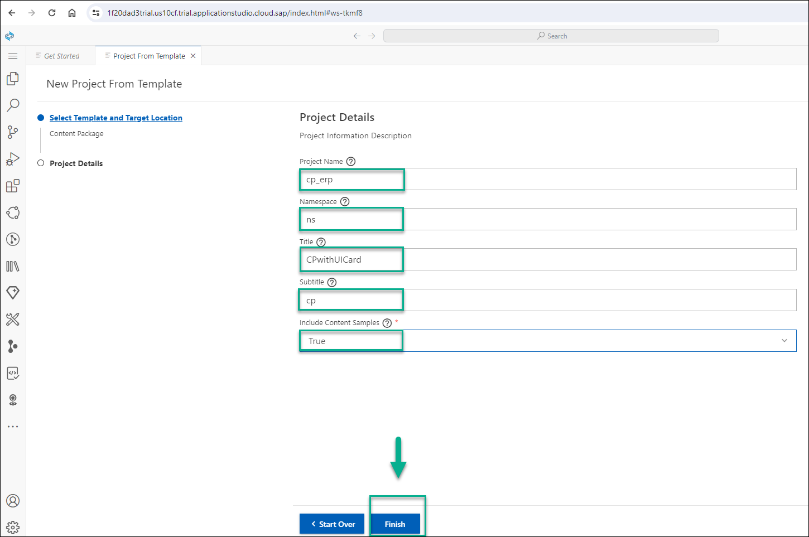
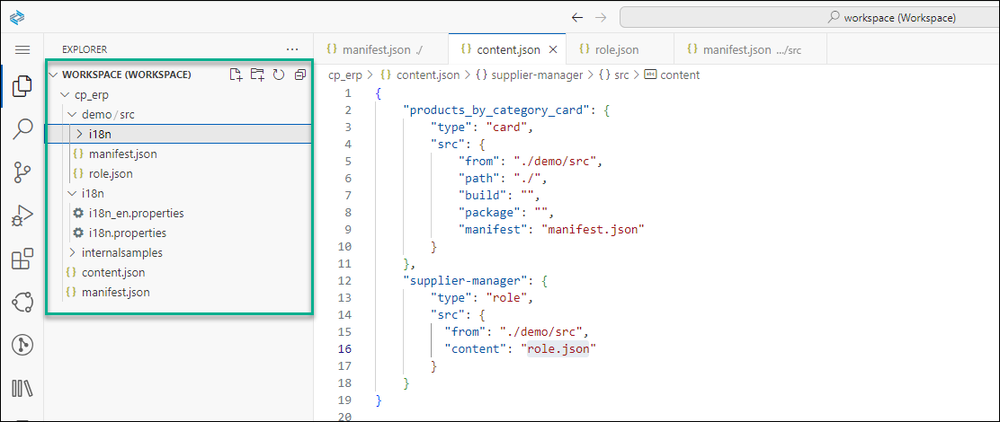
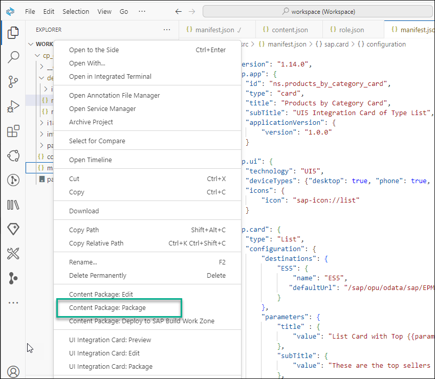
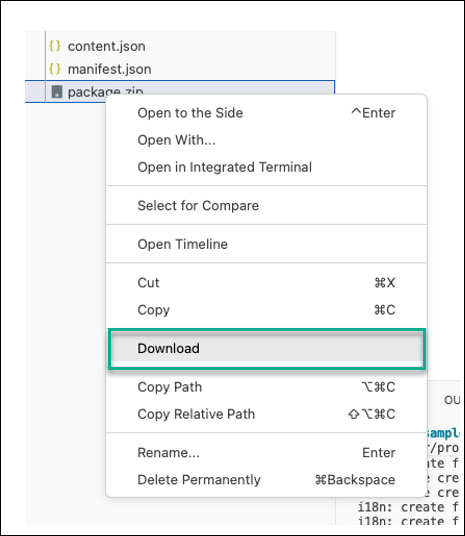

# Create a Content Package with Your UI Integration Card
<!-- description --> Create a content package that includes a UI integration card with it's associated role.

## Prerequisites
 - You've created a UI integration card with data coming from the SAP Gateway Demo System
 - You have a subscription to SAP Business Application Studio

## You will learn
  - How to create a content package that includes a UI integration card

## Intro
A content package is a collection of content items such as cards, workspace templates, home pages, workflows, and workspaces that are bundled together in a ZIP file that can easily be uploaded and used in your site. Once the content in the content package has been activated, it's ready for use in the workpages of your site.  

In this tutorial, you'll learn how to create a content package in SAP Business Application Studio. The content package will include a UI integration card as well as the role that the card is assigned to.

### Create a dev space

Follow the steps of this tutorial to create a dev space: [Create a Dev Space for SAP Fiori Apps](https://developers.sap.com/tutorials/appstudio-devspace-fiori-create.html).

### Create a New Project in SAP Business Application Studio

1. Select **New Project from Template**.

    <!-- border -->

2. When the templates are loaded, scroll down and select the **Content Package** template, and then click the **Start** button.

    <!-- border -->

3. Enter the project details as follows and then click **Finish**:

    |  Field     | Value
    |  :------------- | :-------------
    |  Project Name       | `cp_erp`
    |  Namespace          | `ns`
    |  Title              | `CPwithUICard`
    |  Subtitle           | `cp`
    |  Include Content Samples  | `True`

    <!-- border -->
    
A workspace is created for your new project and the structure will look like this:

  <!-- border -->

 ### Create the content package

1. Click on the `manifest.json` file. Everything needed to render the content package is described in this file. Copy and paste the following code snippet into the file as follows:

    ```JSON
    
        "i18n": "i18n/i18n.properties",
        "icon": "sap-icon://accept",
        "title": "{{PACKAGE_TITLE}}",
            "subTitle": "{{PACKAGE_SUBTITLE}}",
            "shortTitle": "{{PACKAGE_SHORTTITLE}}",
            "info": "{{PACKAGE_INFO}}",
            "description": "{{PACKAGE_DESCRIPTION}}",
        
    
    ```
    
      A content package must contain at least one role as well as the card that it will be assigned to so that it can be deployed to SAP Build Work Zone, standard edition.

2. To achieve this, copy and paste the following code in the `content.json` file:

    ```JSON
    {
      "sample-role1": {
          "type": "role",
          "src": {
            "from": "./demo/src",
            "content": "role.json"
              }
            },
      "card-sample": {
          "type": "card",
          "src": {
            "from": "./demo/src",
            "path": "./",
            "build": "",
            "package": "",
            "manifest": "src/manifest.json"
            }
      }
    }
    ```

    We've added a role and a card. Now we'll create the respective json files for both.

3. Create a new folder under the workspace by right clicking on the project `cp_erp` and select **New Folder**.

    <!-- border -->

4. Name the new folder `demo`. This folder will contain the necessary role and UI integration card code. 

5. Right click on the `demo` folder and then select **New Folder** and name the new folder `src`. 

    <!-- border -->

6. Right click on the `scr` folder and select **New File** - name it `role.json`. Do this again and call the second file `manifest.json`. 
 
    <!-- border -->

    > Note that this `manifest.json` file is for the card. The other `manifest.json` file at the bottom of the structure is for the content package.

7. Last, copy the i18n (Internationalization) folder into the `src` folder, otherwise the build will fail.

    The folder structure should now look like this:

    <!-- border -->

    The workspace structure is ready, and now you can populate the json files. 
  
8. Copy and paste the following code into the `role.json` file:

    ```JSON
    {
      "_version": "3.2.0",
      "identification": {
        "id": "ns.cp_erp_ns.mycontentpackage.sm",
        "title": "ContentPackageRole",
        "entityType": "role"
      },
      "payload": {
        "apps": [
          {
            "id": "ns.products_by_category_card.app"
          }
        ]
      }
    }
    ```

9. Now copy and paste the UI integration card code that you created in this tutorial: [Create a UI5 Integration Card that Displays Data from the SAP Gateway Demo System](https://developers.sap.com/tutorials/appstudio-sapui5-integrationcard-create.html) into the `manifest.json` file 
    
### Build the content package

As a final step, build the content package as follows:

1. Right click on the `manifest.json` file of the content package and select **Content Package: Package** to start the build process.

    <!-- border -->

2. When the build is done, you'll have a `package.zip` file that you can download as follows:

    <!-- border -->


