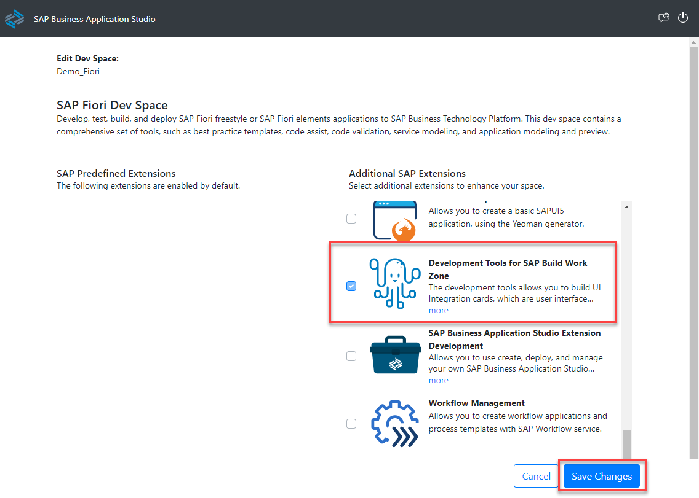
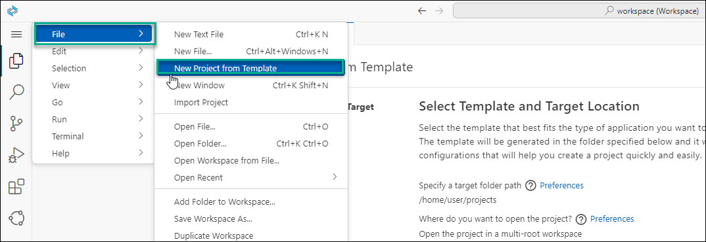
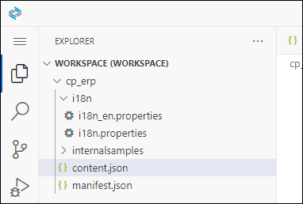
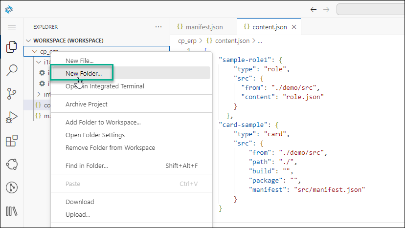
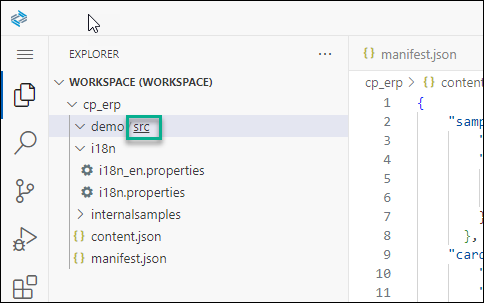
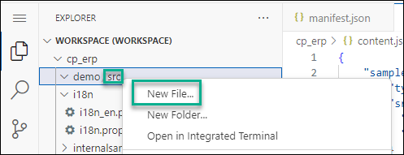

# Create a Content Package with Your UI Integration Card
<!-- description --> Create a content package that includes a UI integration card with it's associated role.

## Prerequisites
 - You've created a UI integration card using this tutorial: [Create a UI5 Integration Card that Displays Data from the Gateway Demo System](https://developers.sap.com/tutorials/appstudio-sapui5-integrationcard-create.html). You can decide to skip this tutorial - in this case you will copy and paste the `manifest.json` file from this tutorial and insert it in the relevant step below.
 - You have a subscription to SAP Business Application Studio
 - You've created a **Dev Space** in SAP Business Application Studio. For more information, see [Create a Dev Space for SAP Fiori Apps](https://developers.sap.com/tutorials/appstudio-devspace-fiori-create.html)

## You will learn
  - How to create a content package that includes a UI integration card

## Intro
A content package is a collection of content items such as cards, roles, pages, and spaces that are bundled together in a ZIP file that can easily be uploaded and used in your site.   

In this tutorial, you'll learn how to create a content package in SAP Business Application Studio. The content package will include a UI integration card as well as the role that the card is assigned to. 

### Check for development tools for SAP Build Work Zone extension

1. In SAP Business Application Studio, stop the dev space if it's not already stopped.

2. Click the **Edit** button.

    <!-- border -->

3. Ensure that the **Development Tools for SAP Build Work Zone** extension is checked, and save the changes if necessary.

    <!-- border -->


### Create a new content package project

1. Start the dev space.

2. When the dev space is running, select **New Project from Template**.

    <!-- border -->

    If you don't get to the opening screen you can create a new project from template directly from the workspace.

    <!-- border -->

2. When the templates are loaded, scroll down and select the **Content Package** template, and then click the **Start** button.

    <!-- border -->

3. Enter the project details as follows and then click **Finish**:

    |  Field     | Value
    |  :------------- | :-------------
    |  Project Name       | `cp_erp`
    |  Namespace          | `ns`
    |  Title              | `CPwithUICard`
    |  Subtitle           | `cp`
    |  Include Content Samples  | `True`

    <!-- border -->
    
A workspace is created for your new project and the structure will look like this:

  <!-- border -->

 ### Edit your content package and add a card, a role, and a Common Data Model descriptor to it

 The Common Data Model (CDM) includes business content from various SAP products all integrated in a unified manner in one site. It contains definitions of entities such as roles, spaces, apps, pages, groups, and catalogs and their relationships. For this tutorial we will be using the role and card entities. 

1. Click on the `manifest.json` file. Everything needed to render the content package is described in this file. Copy and paste the following code snippet to replace the existing code:

    ```JSON
    
        "i18n": "i18n/i18n.properties",
        "icon": "sap-icon://accept",
        "title": "{{PACKAGE_TITLE}}",
            "subTitle": "{{PACKAGE_SUBTITLE}}",
            "shortTitle": "{{PACKAGE_SHORTTITLE}}",
            "info": "{{PACKAGE_INFO}}",
            "description": "{{PACKAGE_DESCRIPTION}}",
        
    
    ```
    
      A content package must contain at least one role as well as the card that it will be assigned to so that it can be deployed to SAP Build Work Zone, standard edition.

2. We will first add a descriptor (in the Common Data Model format) that describes the content of this content package - in this case the content is the card and the role. We will later add a card and a role to the Content Package. 
 In the `content.json` file, replace the existing code with the following code: 

    ```JSON
    {
      "sample-role1": {
          "type": "role",
          "src": {
            "from": "./demo/src",
            "content": "role.json"
              }
            },
      "card-sample": {
          "type": "card",
          "src": {
            "from": "./demo/src",
            "path": "./",
            "build": "",
            "package": "",
            "manifest": "src/manifest.json"
            }
      }
    }
    ```

    We’ve added a descriptor of the role and card. Now we’ll create the respective card and role files in our content package.

3. Create a new folder under the workspace by right clicking on the project `cp_erp` and select **New Folder**.

    <!-- border -->

4. Name the new folder `demo`. This folder will contain the necessary role and UI integration card code. 

5. Right click on the `demo` folder and then select **New Folder** and name the new folder `src`. 

    <!-- border -->

6. Right click on the `scr` folder and select **New File** - name it `role.json`. This file will contain the role. Do this again and call the second file `manifest.json`. The `manifest.json` file will contain the code of the card.
 
    <!-- border -->

    > Note that this `manifest.json` file is for the card. The other `manifest.json` file at the bottom of the structure is for the content package.

7. Last, copy the i18n (Internationalization) folder into the `src` folder, otherwise the build will fail.

    The folder structure should now look like this:

    <!-- border -->

    The workspace structure is ready, and now you can populate the json files. 
  
8. Copy and paste the following code into the `role.json` file:

    ```JSON
    {
      "_version": "3.2.0",
      "identification": {
        "id": "ns.cp_erp_ns.mycontentpackage.sm",
        "title": "ContentPackageRole",
        "entityType": "role"
      },
      "payload": {
        "apps": [
          {
            "id": "ns.products_by_category_card.app"
          }
        ]
      }
    }
    ```

9. Now copy and paste the UI integration card code that you created in this tutorial: [Create a UI5 Integration Card that Displays Data from the SAP Gateway Demo System](https://developers.sap.com/tutorials/appstudio-sapui5-integrationcard-create.html) into the `manifest.json` file 

>Note if you chose to skip doing the above tutorial, you can simply copy the code from the end of Step 5. Under **Results after Step 5**, in the first sentence, there's a link to the `manifest.json` file that you need to copy and paste it here.
    
### Build the content package

As a final step, build the content package as follows:

1. Right click on the `manifest.json` file of the content package and select **Content Package: Package** to start the build process.

    <!-- border -->

2. When the build is done, you'll have a `package.zip` file that you can download as follows. The content package is available in the **Downloads** folder in your file system.

    <!-- border -->

In the next tutorial you'll integrate the zip file with the card into your site. 


