# Integrate Your UI Integration Card from the Content Package Into Your Site
<!-- description --> Integrate a card from your content package into your SAP Build Work Zone, standard edition site.  

## Prerequisites
 - You've created a content pakage that includes a UI integration card with its associated role
 - You've successfully deployed the card into a ZIP file and downloaded it on to your computer
 - You have a subscription to SAP Build Work Zone, standard edition
 
## You will learn
- How to integrate the UI integration card that you created

## Intro 
In this tutorial, you'll learn how to integrate the card and role from the content package that you created in SAP Business Application Studio.  

### Open your SAP Build Work Zone, standard edition site

From the SAP BTP cockpit, go to **Instances and Subscriptions** and click `SAP Build Work Zone, standard edition` to open the service.

<!-- border -->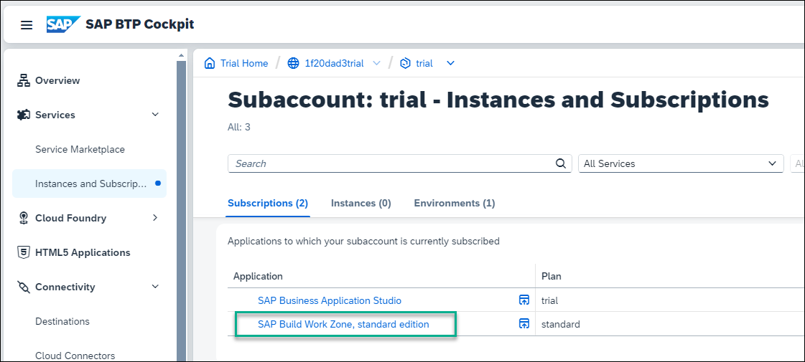

The **Site Directory** opens.

<!-- border -->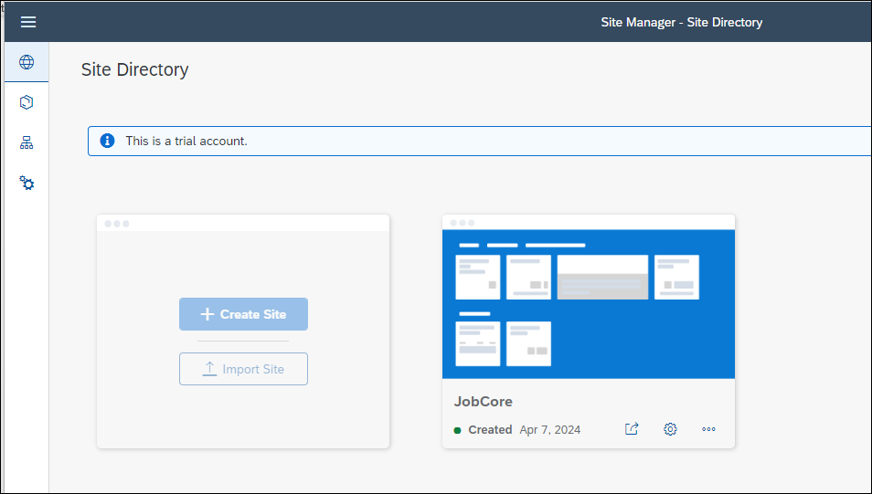

### Upload your content package

1. Click the **Channel Manager** icon in the side navigation panel to open it.

    <!-- border -->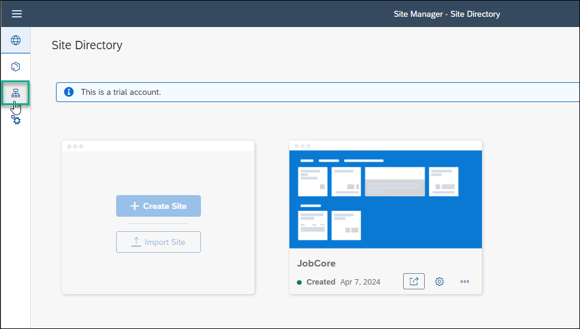

2. Click **+ New** and select **Content Package**.

    <!-- border -->

3. In the **New Content Package** dialog box, browse for and select the ZIP file that you downloaded in the previous tutorial. You'll find the ZIP file in your **Downloads** folder on your computer. 

    <!-- border -->

4. In the **Runtime Destination** field, select `ES5`, and leave the default values in the other fields. Click **Save**.

    <!-- border -->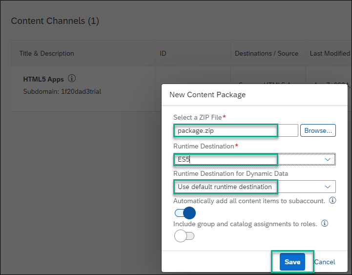

    Once you've saved the content package properties, the ZIP file is created in the **Channel Manager**.  
    
5. Click **Report** to check the content of the package. It should look like this showing that your content package includes a role and an app:

    <!-- border -->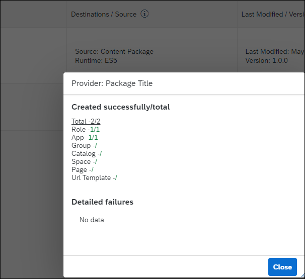

6. Ensure that the app is assigned to the `ContentPackageRole` by opening the Content Manager and searching for this role. In the role editor, under the **Apps** tab, you'll see the `Products by Category Card`.

    <!-- border -->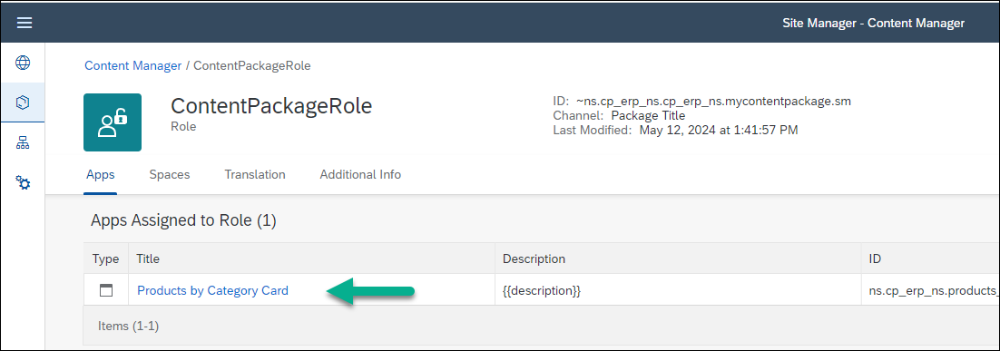

### Add a header to your page

In this step, you'll add a header to your page for the card that you will add.

1. Go back to the Content Manager by using the breadcrumbs above.

    <!-- border -->

2. Click the `Overview` page to open the page editor.

    <!-- border -->

3. Click **Edit**.

4. Click **+** to add a new secion.

    <!-- border -->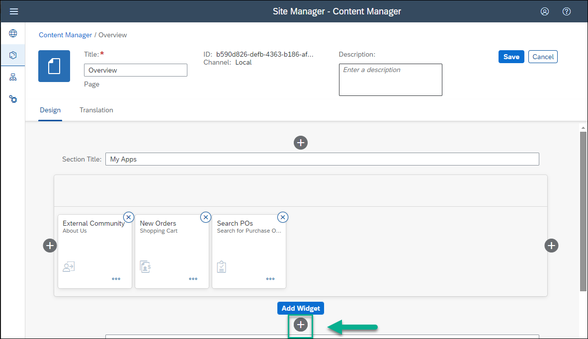

5. In the **Section Title** field, type **My Cards**

    <!-- border -->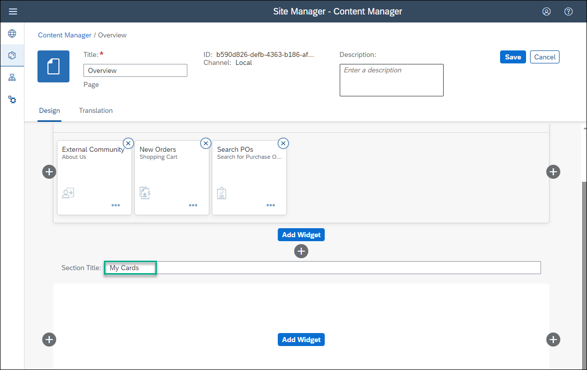

6. Click **Add Widget**

    <!-- border -->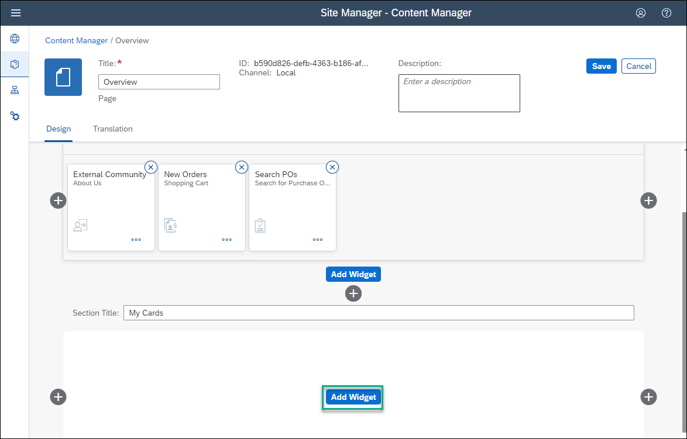

7. Select **Cards**.

    <!-- border -->

8. Select the **Products by Category Card** to add it to your **Overview** page and then click **Save**. 

    <!-- border -->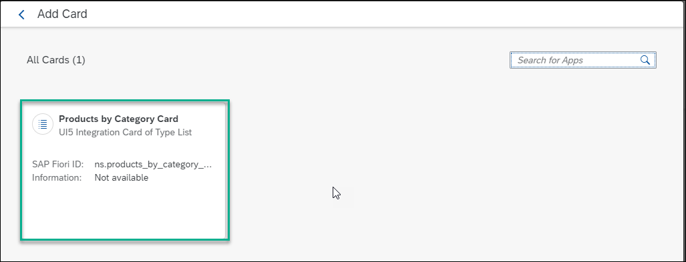

    Your screen will look like this. Don't worry the content will appear on the card once you do the necessary role assignments.

    !-- border -->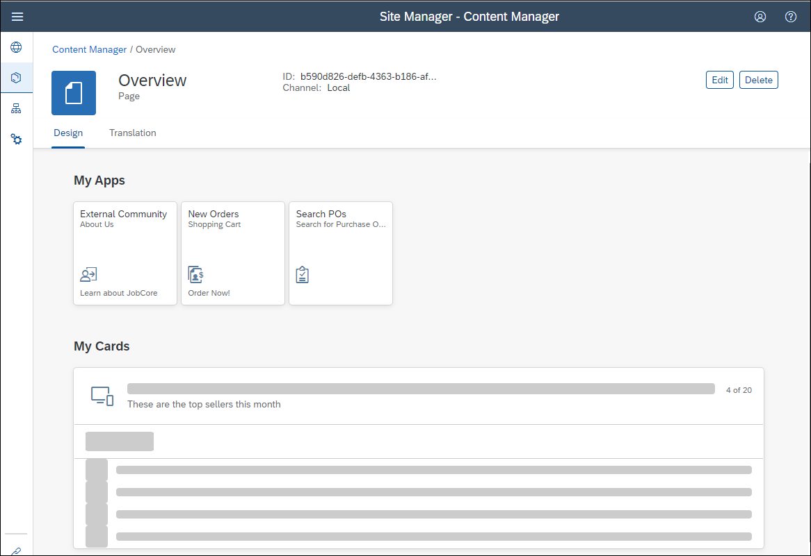

### Assign the ContentPackageRole to the site

The `ContentPackageRole` is part of the content in the content package ZIP file. You now have to assign the `ContentPackageRole` to your site and you will also need to assign your user to this role in the next step. 

1. Open the **Site Directory**.

    <!-- border -->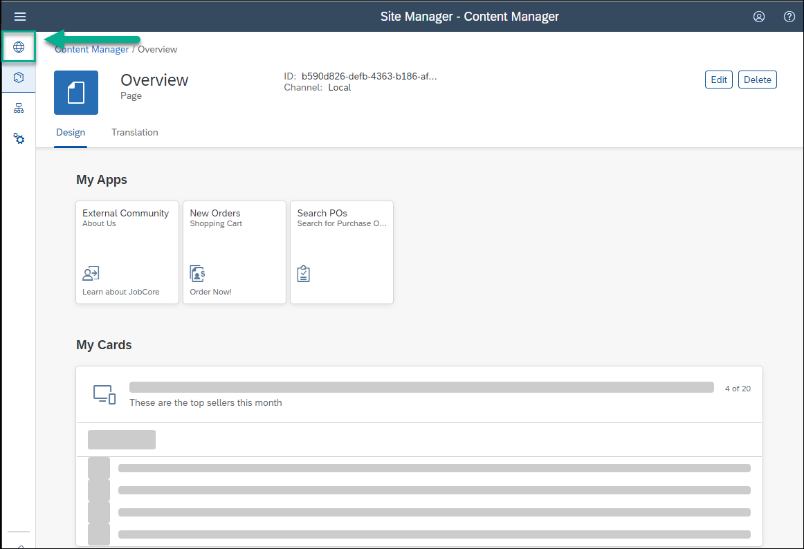

2. Open the **Site Settings** screen.

    <!-- border -->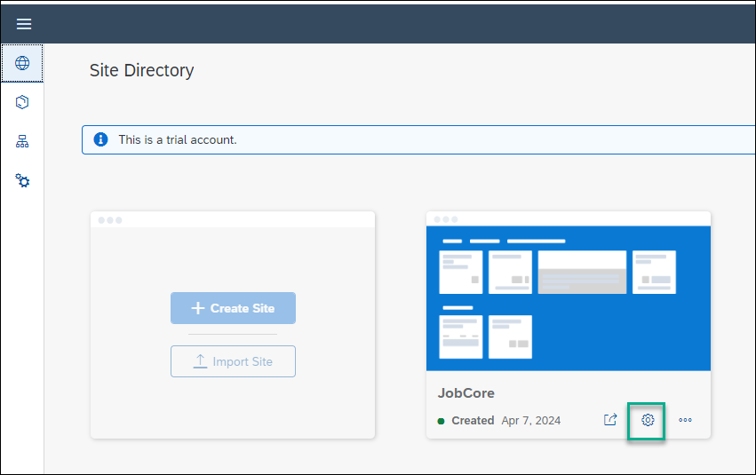

3. Click **Edit**.

4. In the **Assignments** panel, click inside the search box to open a list of available roles. You'll see the `ContentPackageRole`.  Assign it to the site by clicking the **+** next to the role name and then click **Save**.

    <!-- border -->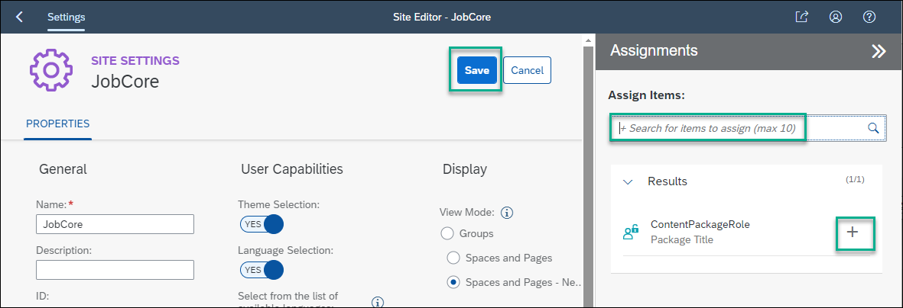    

### Assign yourself to the ContentPackageRole

1. Go back to the SAP BTP Cockpit using the **Instances and Subscriptions** tab in your browser.

    <!-- border -->

2. From the side menu, go to **Security** --> **Role Collections** and search for the `ContentPackageRole` role.

    <!-- border -->

3. Click the arrow at the far right of the row displaying the `ContentPackageRole`.

    <!-- border -->

4. In the screen that opens, click **Edit**.
  
    <!-- border -->

5. In the **Users** section of the screen, add your ID (your email), and then your email again and add it to the list of users by clicking the **+** button. **Save** your changes.

    <!-- border -->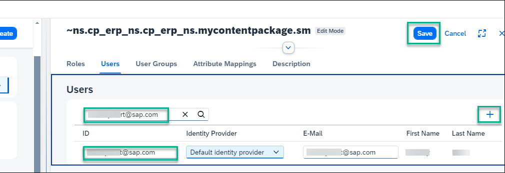

    >Note that assignment to the role can take time. If you don't want to wait, you can log out and log in again in order for the role assignment to take effect. 

### View the card in your runtime site

1. Still in the SAP BTP cockpit, click **Instances and Subscriptions** and go to SAP Build Work Zone, standard addition. The **Site Directory** is in focus.

2. Click the **Go to site** icon.

     <!-- border -->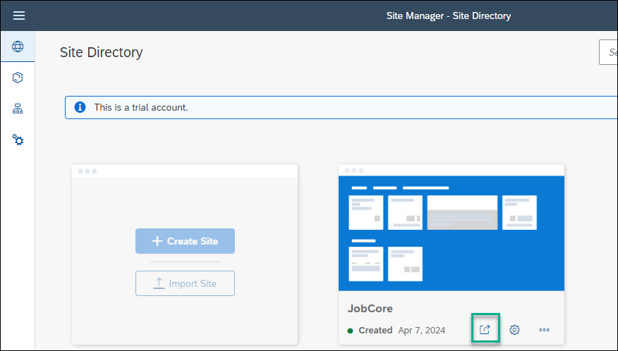 

3. You'll see that your card has been added to the **Overview** page:

    <!-- border -->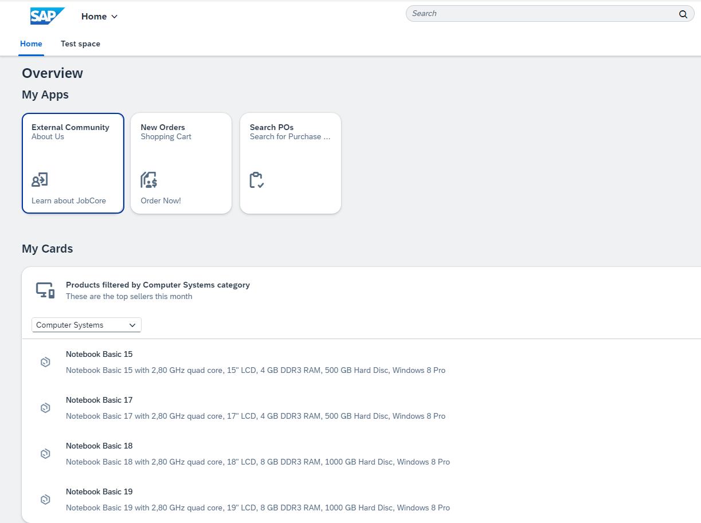 