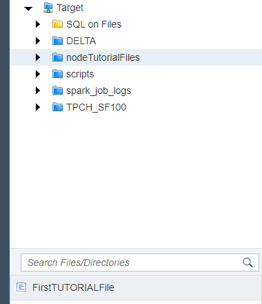
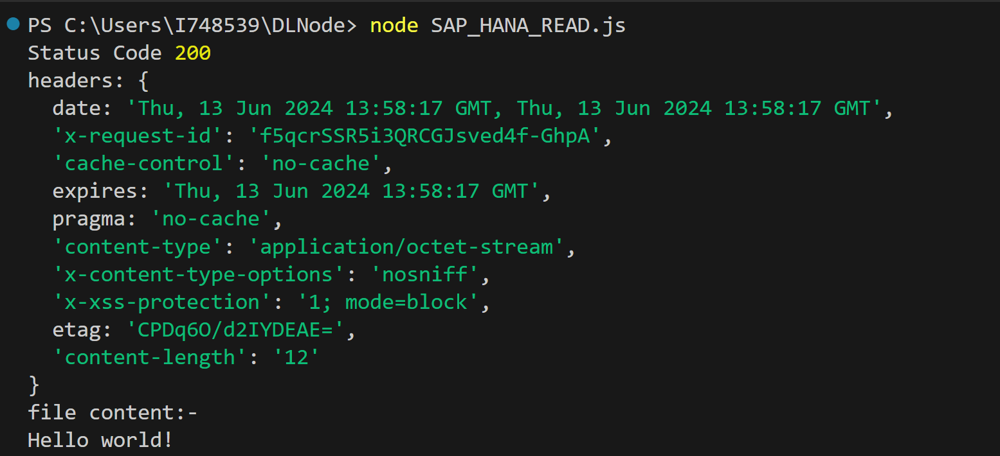

# Using the SAP HANA data lake File Store REST API with Node.js
<!-- description --> Learn how to use the SAP HANA data lake REST API to manage, upload, delete, and list your files using Node.js.

## Prerequisites
 - Access to a non-trial SAP HANA data lake instance.
 - Node.js: Ensure you have Node.js installed on your machine.
 - [Download the sample TPCH Data](https://help.sap.com/viewer/a89a80f984f21015b2b2c84d2498d36d/QRC_4_2021/en-US/6e1dd06335704f4c96d48279ca1ed555.html).

## You will learn
  - How to use the SAP HANA data lake File Store REST API.
  - Users without access to the HDLFSCLI can use the REST API to perform File Store operations.

## Intro
SAP HANA data lake file containers are accessible via a REST API. The official REST API reference can be found [here](https://help.sap.com/doc/9d084a41830f46d6904fd4c23cd4bbfa/latest/en-US/html/index.html). However, below are some javascript demonstrations using some of the common endpoints. Although this tutorial doesn't cover other endpoint testing tools, these endpoints and the contents of the request body can be used in any other HTTP interface such as PostMan or CURL.

---

### Set Up a Node Environment


First, in the top of a JavaScript file that you are working with append the following and fill in the variables with the appropriate data for your SAP HANA data lake file container. This will load the appropriate node libraries for making HTTP requests and reading files and will also set some commonly re-used variables for the API calls.

```JavaScript
const https = require('https');
const fs = require('fs');

const FILES_REST_API = '<File Container REST API>'; 
const CONTAINER = '<File Container ID>';  
const CRT_PATH = '<Path to Client Certificate>';  
const KEY_PATH = '<Path to Client Key>'; 
```


### Use the CREATE Endpoint

The CREATE Endpoint is used to create a new file.

Fill in the code below with your information. The following code sets up the API call to the CREATE endpoint and will upload a file to the folder specified in your SAP HANA data lake File Store.

```JavaScript
const file_path='/nodeTutorialFiles'; // Define the path where the new file will be created within the data lake.
const file_name='FirstTUTORIALFile';  // Specify the name for the new file you want to create.NOTE:-an existing file with the given name will be overriden.
const file_content='Hello world!'; // Set the content that will be written to the new file.
const options = {
    hostname: FILES_REST_API,
    port: 443,
    path: `/webhdfs/v1${file_path}/${file_name}?op=CREATE&data=true`,
    method: 'PUT',
    key: fs.readFileSync(KEY_PATH),
    cert: fs.readFileSync(CRT_PATH),
    headers: {
      'x-sap-filecontainer': CONTAINER,
      'Content-Type': 'application/octet-stream'
    },
    rejectUnauthorized: false,  
  };
const req = https.request(options, (response)=>{
  let str='';
  response.on('data', function (chunk) {
    str += chunk;
  });
  response.on('end', function () {
    console.log('Response:', str);
    console.log('File Created');
  });

});
req.on('error', (e) => {
  console.error('Request error:', e);
});
req.write(file_content);
req.end();
```
Run the code

We can verify the file and its contents using the HDLFSCLI or DBX. 

`hdlfscli -cert <PATH>\client.crt -key <PATH>\client.key -cacert <PATH>\ca.crt -k -s https://<REST API Endpoint> -filecontainer <Instance ID> cat <file_path>/<file_name>`


OR

DBX:-



Download the file uploaded and open it with a text editor and you should see the file content.


### Use the OPEN Endpoint

The OPEN Endpoint is used to read the contents of a file.

Fill in the code below with your information. Ensure that you have a file in your SAP HANA data lake File Store that you want to read. The following code sets up the API call to the OPEN endpoint and will print your file contents.
```JavaScript
const file_path='/nodeTutorialFiles'; // Define the path to the file that is to be read.
const file_name='FirstTUTORIALFile';  //Name of the file that is to be read .
const options = {
    hostname: FILES_REST_API,
    port: 443,
    path: `/webhdfs/v1${file_path}/${file_name}?op=OPEN`,
    method: 'GET',
    key: fs.readFileSync(KEY_PATH),
    cert: fs.readFileSync(CRT_PATH),
    headers: {
      'x-sap-filecontainer': CONTAINER,
      'Content-Type': 'application/json'
    },
    rejectUnauthorized: false 
  };

const req=https.request(options,(res)=>{
    console.log('Status Code', res.statusCode);
    console.log('headers:',res.headers);
    let output='';
    res.on('data',(chunk)=>{
        output+=chunk;
    })
    res.on('end', () => {
        console.log("file content:-\n"+output);  
      });
})

req.on('error', (e) => {
  console.error(e);
});

req.end();
```
Run the code.

Example Output-




### Use the LISTSTATUS Endpoint

The LISTSTATUS Endpoint returns the metadata of a specified file or the contents of a specified directory.

Fill in the code below with your information. Ensure that you have a files in your SAP HANA data lake File Store that you can list. The following code sets up the API call to the LISTSTATUS endpoint and will print the list of files in your SAP data lake File Store.

```Javascript
const file_path = '/nodeTutorialFiles'; // Path to the directory containing the files to be listed


const options = {
    hostname: FILES_REST_API,
    port: 443,
    path: `/webhdfs/v1${file_path}?op=LISTSTATUS`,
    method: 'GET',
    key: fs.readFileSync(KEY_PATH),
    cert: fs.readFileSync(CRT_PATH),
    headers: {
      'x-sap-filecontainer': CONTAINER,
      'Content-Type': 'application/json'
    },
    rejectUnauthorized: false 
  };

const req = https.request(options, (res) => {
  let data = '';
  res.on('data', (chunk) => {
    data += chunk;
  });
  res.on('end', () => {
    console.log(data); 
  });
});

req.on('error', (e) => {
  console.error(e);
});

req.end();

```

Run the code.

Example Output-


### Use the LISTSTATUS_RECURSIVE Endpoint

The LISTSTATUS_RECURSIVE Endpoint is used to list the metadata of all files and directories in a specified directory and its subdirectories.

Fill in the code below with your information. Ensure that you have a files in your SAP data lake File Store that you can list recursively (i.e. some folder hierarchy exists). The following code sets up the API call to the `LISTSTATUS_RECURSIVE` endpoint and will print the list of files and their hierarchy in your SAP data lake File Store.

```Javascript
const file_path='/nodeTutorialFiles'  //Path to the files.

const options = {
    hostname: FILES_REST_API,
    port: 443,
    path: `/webhdfs/v1${file_path}?op=LISTSTATUS_RECURSIVE`,
    method: 'GET',
    key: fs.readFileSync(KEY_PATH),
    cert: fs.readFileSync(CRT_PATH),
    headers: {
      'x-sap-filecontainer': CONTAINER,
      'Content-Type': 'application/json'
    },
    rejectUnauthorized: false 
  };

const req = https.request(options, (res) => {
  let data = '';
  res.on('data', (chunk) => {
    data += chunk;
  });
  res.on('end', () => {
    console.log(data); 
  });
});

req.on('error', (e) => {
  console.error(e);
});

req.end();

```
Run the code .

Example Output-


### Use the DELETE Endpoint

The DELETE Endpoint is used to delete a file.

Fill in the code below with your information.The following code sets up the API call to the `DELETE` endpoint and will delete the given file in your SAP data lake File Store.

```Javascript
const file_path='/nodeTutorialFiles'; //Define the path where the file to be deleted is located within the data lake.
const file_name='FirstTUTORIALFile'; //name of the file that needs to be deleted.
const options = {
    hostname: FILES_REST_API,
    port: 443,
    path: `/webhdfs/v1/${file_path}/${file_name}?op=DELETE`,
    method: 'DELETE',
    key: fs.readFileSync(KEY_PATH),
    cert: fs.readFileSync(CRT_PATH),
    headers: {
      'x-sap-filecontainer': CONTAINER,
      'Content-Type': 'application/json'
    },
    rejectUnauthorized: false, 
    
  };
if (file_name!=''){
const req = https.request(options, (response)=>{
  let str='';
  response.on('data', function (chunk) {
    str += chunk;
  });
  response.on('end', function () {
    const obj=JSON.parse(str);
    if (obj.boolean===false){
        console.log("statuscode:"+response.statusCode)
        console.log(str);
        console.log("File or directory does not exist, make sure the file/directory exists and try again!");
        }
    else{
        console.log(str);
        console.log('File Deleted');
    }
  });

});
req.on('error', (e) => {
  console.error('Request error:', e);
});
req.end();
}
else{
    console.log("Please enter a valid file name and try again!");
}

```
Run the code .

Example Output-

The file that was meant to be deleted no longer exists in DBX.

Or 

Upon attempting to access the file via the command line, an error message indicates that the file no longer exists, confirming its deletion.


`hdlfscli -cert <PATH>\client.crt -key <PATH>\client.key -cacert <PATH>\ca.crt -k -s https://<REST API Endpoint> -filecontainer <Instance ID> cat <file_path>/<file_name>`


### Use the DELETE_BATCH Endpoint

The DELETE_BATCH Endpoint is used to delete multiple files in a single go.

Fill in the code below with your information.The following code sets up the API call to the `DELETE_BATCH` endpoint and will delete the given files in your SAP data lake File Store.

```Javascript
const filePathList = [   //A list containing all the file paths of the files that need to be deleted.
  "/nodeTutorialFiles/Test",
  "/nodeTutorialFiles/Test2"
];

const postData = JSON.stringify({
  files: filePathList.map(path => ({ path }))
});

const options = {
    hostname: FILES_REST_API,
    port: 443,
    path: '/webhdfs/v1/?op=DELETE_BATCH',
    method: 'POST',
    key: fs.readFileSync(KEY_PATH),
    cert: fs.readFileSync(CRT_PATH),
    headers: {
      'x-sap-filecontainer': CONTAINER,
      'Content-Type': 'application/json'
    },
    rejectUnauthorized: false
};

const req = https.request(options, (response)=>{
  let str='';
  response.on('data', function (chunk) {
    str += chunk;
  });
  response.on('end', function () {
    console.log('statusCode: ' + response.statusCode);
    console.log("status:" +response.statusMessage);
    console.log('Response:', str);
    console.log('Files Deleted');
  });

});
req.on('error', (e) => {
  console.error('Request error:', e);
});
req.write(postData);
req.end();

```
Run the code .

Example Output-

The files that were meant to be deleted no longer exists in DBX.

Or 

Upon attempting to access the files via the command line, an error message indicates that the files no longer exists, confirming thier deletion.


`hdlfscli -cert <PATH>\client.crt -key <PATH>\client.key -cacert <PATH>\ca.crt -k -s https://<REST API Endpoint> -filecontainer <Instance ID> cat <file_path>/<file_name>`


>Note:-the call returns true, if all the files listed were successfully deleted, regardless of whether or not the files actually existed when the delete batch was initiated.  If a file does not exist in the list you provided, this is not considered an error.  


### Explore and Experiment!

These endpoints along with the others documented in the [REST API reference](https://help.sap.com/doc/9d084a41830f46d6904fd4c23cd4bbfa/QRC_4_2021/en-US/html/index.html) can be used by any application to manipulate or manage the files in the HANA Data Lake File Container. Other endpoints not demonstrated here include APPEND, GETRESTORSNAPSHOT, WHOAMI, RENAME, and RESTORESNAPSHOT.

To replicate these requests in other languages or HTTP tools, copy the request headers, FILES REST API + request URL, and body contents.

---
