# Learn how to bring SAP Concur data to SAP Datasphere

For analyzing data, SAP Datasphere is a flexible, scalable, and cost-effective solution; with Integrated tools and data governance, and Self-service analytics, you can easily cleanse, enrich, and visualize your data. It provides a large set of default connections to access data from a wide range of sources, which might be in the cloud as well as on-premises, or from SAP as well as from non-SAP sources or partner tools.

To extend connectivity beyond SAP Datasphere standard remote connectivity and cover additional data sources we can create a connection to a partner tool and generate an Open SQL schema in SAP Datasphere. When data is pushed by the source via created database users with an Open SQL schema, you can directly import a table in the Data Builder which is then deployed as a local table.

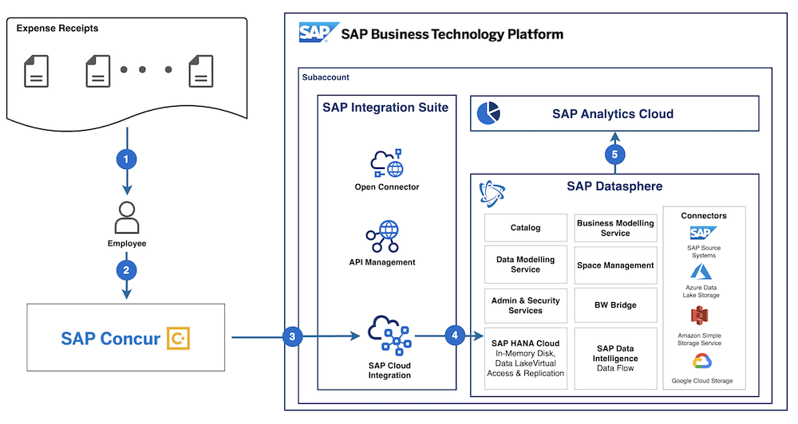

## You will learn
- How to create Database Users/Open SQL Schemas SAP Datasphere's database.
- How to registered external systems IP address in  SAP Datasphere IP allowlist.
- Update the existing integration flow with SAP Datasphere Data Source.
- Modeling using Graphical view on SAP Concur data

## Prerequisites
- A SAP Concur: cloud travel & expense system
- A SAP BTP global account setup and to entitled the SAP Datasphere Cloud Foundry environment please follow the excellent blog [How to create SAP Datasphere service instance in the SAP BTP Platform?](https://blogs.sap.com/2023/03/17/how-to-create-sap-datasphere-service-instance-in-the-sap-btp-platform/)
- Complete the tutorial: [SAP Concur APIs Overview](../data-to-value-conn-concur-part01/data-to-value-conn-concur-part01.md)
- Complete the tutorial: [Consume SAP Concur API using Cloud Integration](../data-to-value-conn-concur-part02/data-to-value-conn-concur-part02.md)

### Create Database Schema & table

1. To create a Space, click on the **Space management** tab on the bottom left, and click on the **Create** button on the top right.
   
2. Enter a name for your **Space**. The Space ID will auto-populate. In this example, let’s call your Space DEV SPACE. Click on **Create**, and you’ve successfully created your Space in SAP Datasphere.
    
3. We need this space to create a dedicated schema which will be used to store the Concur Expense Report data. To do so, navigate to **Database Access**, and choose **Database Users** section.
   

4. To create database users to connect external tools to SAP Datasphere Click on **Create** in the Database Users section.
   
5. Provide a **Database User Name Suffix** for your schema, and enable both **Read and Write access**. Click on **Create** to close.
   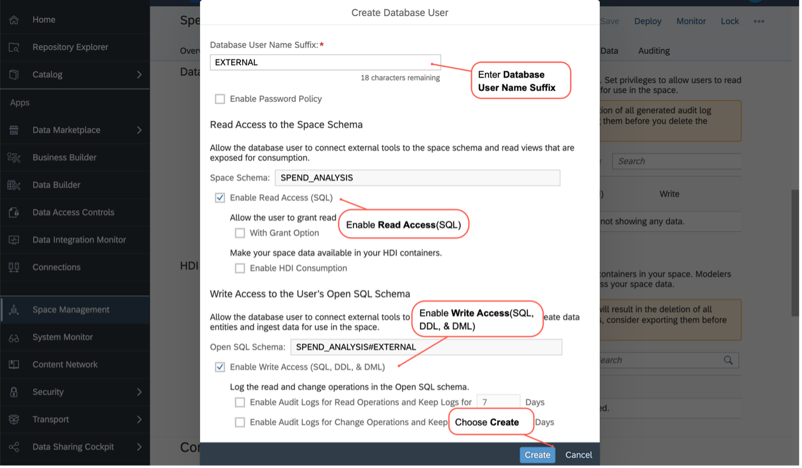
6. Once created, Click the little **information** icon next to your user to open its details.
   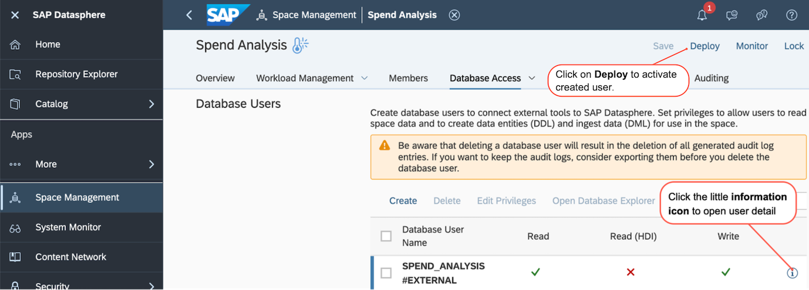
7. Take note of the **Database User Name**, **Host Name**, **Port** and **Password**. To see the password you have to request one by clicking the button. Make sure to note this password down as you won’t be able to retrieve it again afterwards.
   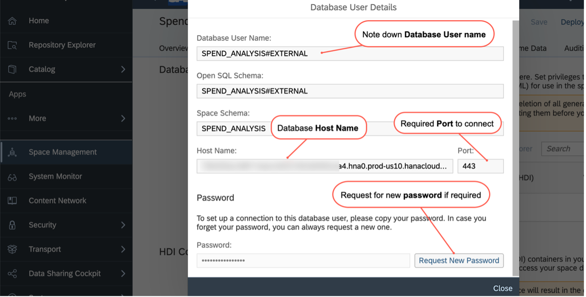
8. Finally, we can open the **Database Explorer** and **log in** with the credentials we just noted down.
   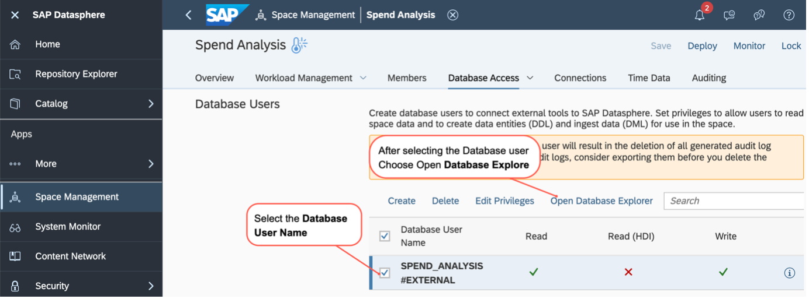
9.  In Explorer, open a **new SQL window** (use the little SQL icon on the left) and verify that you are connected to the correct schema. In order to store the Concur Expense Report data we need to create a new table.
    
    We will create a table to store Expense Reports, which will have an ID, Name, currency code, Country, Total, and so on with all necessary fields which are required for analyzing data.
    
    You can use the below sample code and hit **Execute** (the green play button) to execute your statement.
   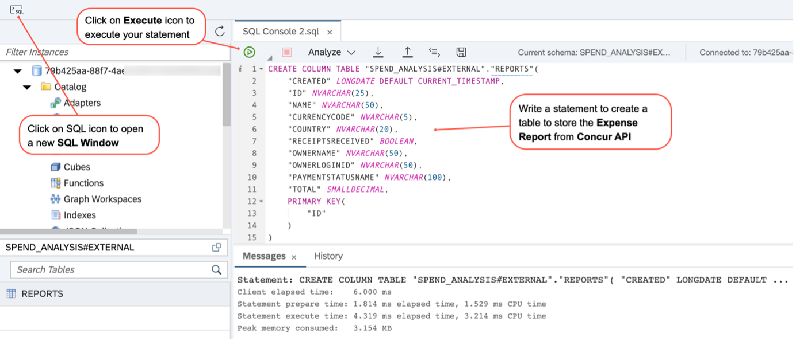

10. This is the SQL code you can used to create the "SPEND_ANALYSIS#EXTERNAL"."REPORTS" table:
```
CREATE COLUMN TABLE "SPEND_ANALYSIS#EXTERNAL"."REPORTS"(
	"CREATED" LONGDATE DEFAULT CURRENT_TIMESTAMP,
	"ID" NVARCHAR(25),
	"NAME" NVARCHAR(50),
	"CURRENCYCODE" NVARCHAR(5),
	"COUNTRY" NVARCHAR(20),
	"RECEIPTSRECEIVED" BOOLEAN,
	"OWNERNAME" NVARCHAR(50),
	"OWNERLOGINID" NVARCHAR(50),
	"PAYMENTSTATUSNAME" NVARCHAR(100),
	"TOTAL" DOUBLE,
	PRIMARY KEY(
		"ID"
	)
)
```

### Add Cloud Integration IP address range to IP Allowlist
SAP Datasphere uses an IP allowlist concept where external systems have to be registered with their IP address before they can connect. In our case, SAP Integration Suite is the external system.

1. First, you need to find out where your cloud integration's tenant is hosted. You can see that in your integration's tenant URL, for me it shows us10-001.
   
2. Now look up the range of potential egress IP addresses this tenant can use via the documentation on the SAP Help portal: [Regions and API Endpoints Available for the Cloud Foundry Environment](https://help.sap.com/docs/btp/sap-business-technology-platform/regions-and-api-endpoints-available-for-cloud-foundry-environment). This is the list of IP addresses you have to register in SAP Datasphere.
   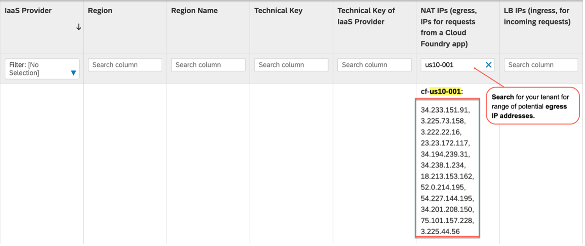
3. In the SAP Datasphere menu, click on **System** and **Configuration**. Open the **IP Allowlist** menu and select **Trusted IPs**. Now click on **Add** for each of the addresses to add them to your allowlist.
   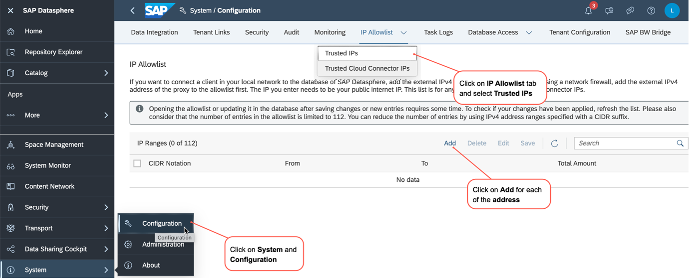

SAP Datasphere is now ready to store your data.

### Create the JDBC Data Source
To connect an integration flow to the SAP Datasphere data source, you need to provide the credentials hence the JDBC data source artifact is required. This artifact will be used to store the access data for the database (as defined and generated with the previous steps).
During the integration flow design, for the JDBC adapter, you need to point to the alias of the JDBC data source. No additional configurations are then required in the integration flow.

1. For this, In SAP Integration Suite tenant, we need to navigate to **Monitor > Integration**, which you can do by clicking on **Overview** in the breadcrumbs on top. Then choose **JDBC Material**.
   
2. Click **Add** to create a new data source, and provide the SAP Datasphere schema credentials noted down earlier. 
Make sure to change the Database Type to **SAP HANA Cloud**, and use the correct format for the JDBC URL field: **jdbc:sap://{hostname}:{port}**. 
   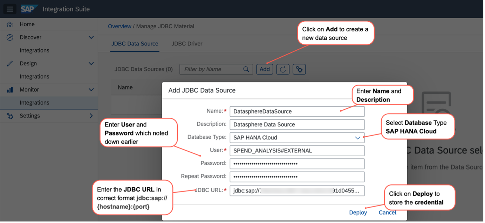
3. Click on **Deploy** to store this credential. 

### Update the existing integration flow

In previous [tutorial](../data-to-value-conn-concur-part02/data-to-value-conn-concur-part02.md), we have already used pre-packaged integration content which help us to get started with minimal integration efforts. Now we are going to extend the same integration package.

1. To get started, Go to your SAP Integration Suite tenant. navigate to the **Design > Integration** and select your integration package which you have created in previous [tutorial](../data-to-value-conn-concur-part02/data-to-value-conn-concur-part02.md).
   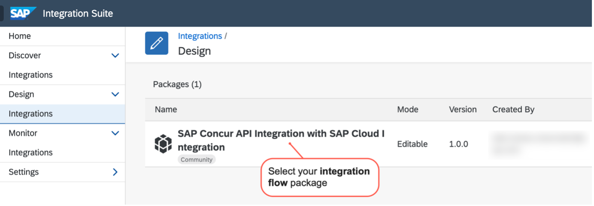
2. Switch to the **Artifacts** tab, and **select** the Consume SAP Concur API Integration Package.
   
3. then select **Edit** to start editing the integration flow.
   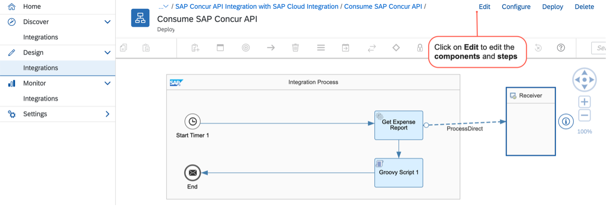
4. Select the **Groovy Script 1** Integration flow step and select the **script file** from the Processing tab.
   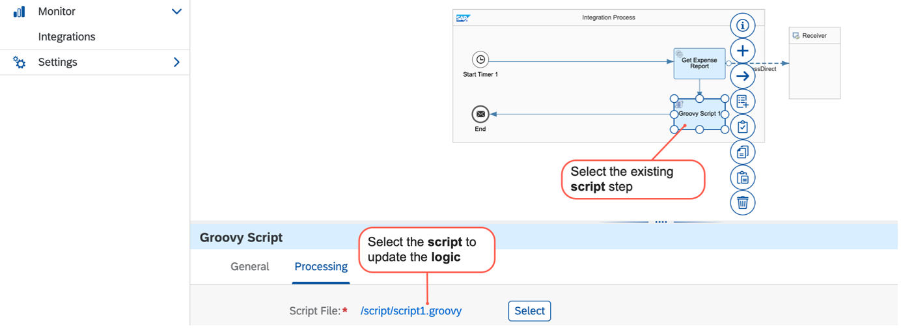
5. In the script editor, specify the script according to the requirements of your scenario. For an overview of the classes and interfaces supported by the Script step, see [SDK API](https://help.sap.com/docs/cloud-integration/sap-cloud-integration/sdk-api). For more information on how to use the dedicated interfaces and methods for specific use cases, refer to [Script Use Cases](https://help.sap.com/docs/cloud-integration/sap-cloud-integration/script-use-cases).
    This is the Groovy script you can use to insert the data in the **“SPEND_ANALYSIS#EXTERNAL”.”REPORTS”** table which we have created in the SAP Dataspace Database. **Copy** & **Paste** it.

   ```

    import com.sap.gateway.ip.core.customdev.util.Message;
    import java.util.HashMap;
    import java.util.Arrays;

    def Message processData(Message message) {
        def body=message.getBody(java.lang.String) as String;
        def xml=new XmlSlurper().parseText(body);
        List paramList = new ArrayList();
        
        xml.Items.Report.each{
            paramList.add(Arrays.asList(it.ID.text(),it.Name.text(),it.CurrencyCode.text(),
            it.Country.text(),it.ReceiptsReceived.text(),it.OwnerLoginID.text(),
            it.OwnerName.text(),it.PaymentStatusName.text(),it.Total));
        }
        message.setHeader("CamelSqlParameters",paramList);
        message.setBody("INSERT INTO SPEND_ANALYSIS#EXTERNAL.REPORTS(ID,NAME,CURRENCYCODE,COUNTRY,RECEIPTSRECEIVED,"+
        "OWNERNAME,OWNERLOGINID,PAYMENTSTATUSNAME,TOTAL) VALUES(?,?,?,?,?,?,?,?,?)");
        
        return message;
    }

   ``` 

When you've finished the definition of your script, Click **OK**.
   

### Deploy & Monitor Integration Flow

1. Select **Save** and then select **Deploy** to deploy the integration flow to SAP Integration Suite tenant. This will trigger the deployment of your integration flow.
   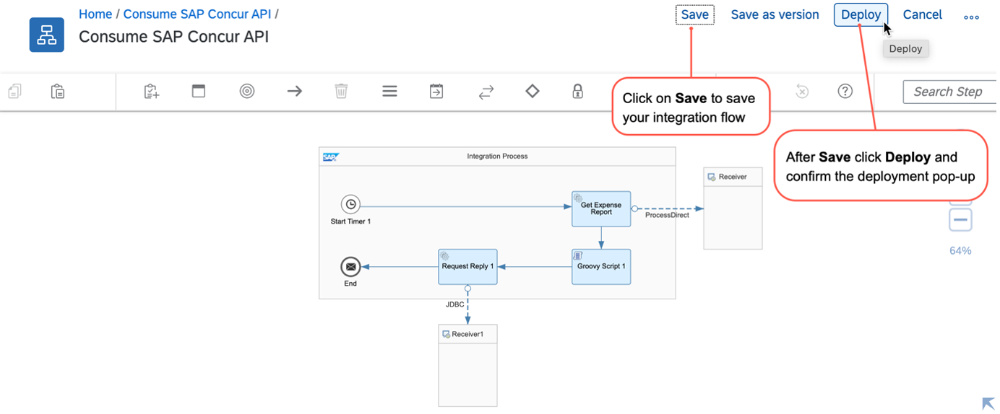 
2. Navigate to **Monitor-> Integrations** tab to check the status of the deployed integration flow.
Since the integration flow was designed as a Run immediate timer-based integration the flow will be executed as soon as it deployed. Select **Completed Messages** tile to view the successfully executed
integration flows. In case of any failure, it will appear under **Failed Messages**.
 
3. Check the status of the newly created integration flow from the **Monitor Message Processing**. If status changes to **Completed** then go the **Attachments** Tab and click on **Response Payload attachment**.
   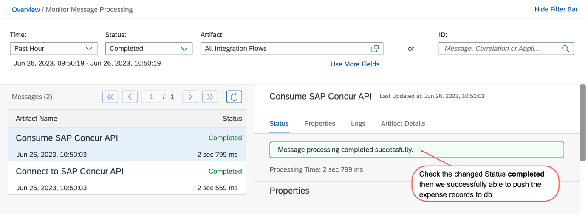 
4. Now open the Datasphere **Database Explorer** and log in with the credentials. In the explorer **Search** for you table, Right click on it and select **Open Data** to check the records.
   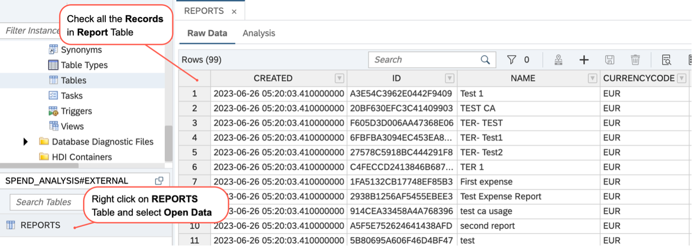 

### Modeling using Graphical view

The graphical view builder in SAP Datasphere makes it simple to develop data views. You may proceed logically without requiring to be familiar with SQL statements. 
In the graphical view builder, you have many resources to model your data, combine them from many sources and assigning business semantics that make your output easier to understand. 

1. In your DataSphere tenant, On welcome page, select **Data Builder** in the left side menu and select the **space** where you want to model your data
    
2. Then click on the **New Graphical View**
    
3. Your data is under Sources, Select **Sources** on the top right-hand side of the screen.
   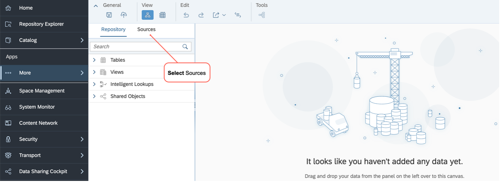  
4. To start building your model, click and drag the **REPORT** table onto the canvas.
   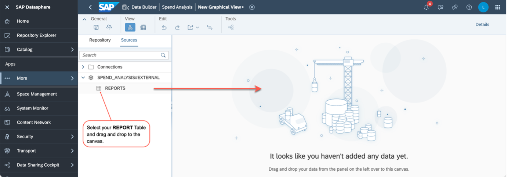

### Final Result

Now you can easily transform or drill down your Expense Report Data by adding filters, joins and projections as below.
   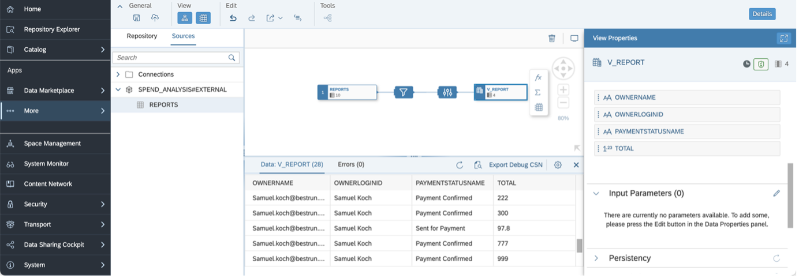  

You have successfully completed the last tutorial of this tutorial group. you have seen the **Integrating Data via Database Users/Open SQL Schema approach** to store SAP Concur's Data in SAP Datasphere using SAP Integration Suite and to use it in Data Builder to model and enrich the business expenses data.


