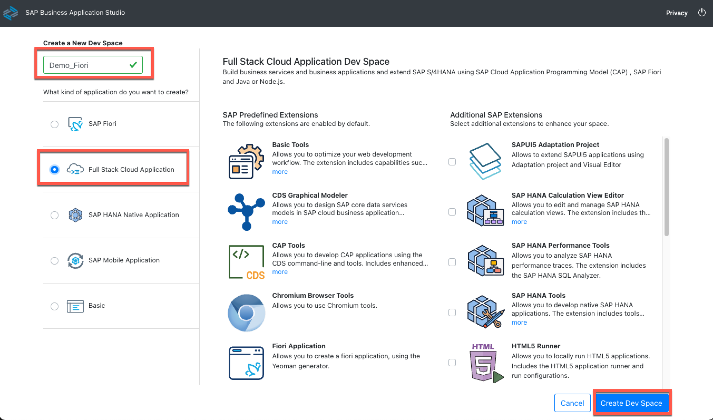
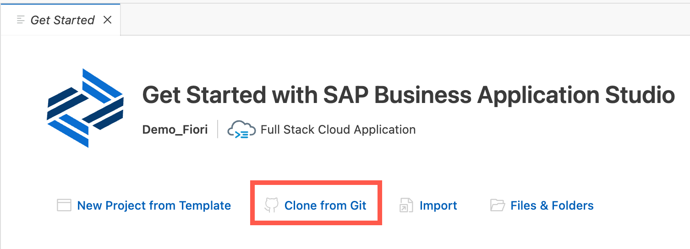
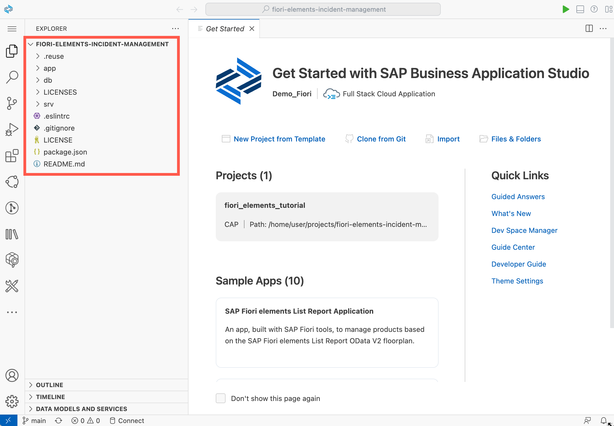
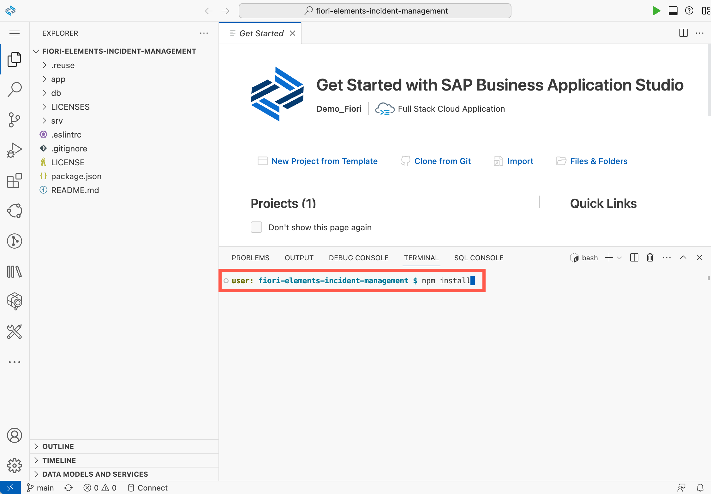

## Prerequisites
- You need a trial account on SAP Business Technology Platform. If you don't have one, follow the instructions in: [Get a Free Account on SAP BTP Trial](hcp-create-trial-account).
- Ensure that you have started SAP Business Application Studio in your SAP Business Technology Platform trial account. For detailed instructions: [Set Up SAP Business Application Studio for Development](appstudio-onboarding).

## Details
### You will learn
- How to set up SAP Business Application Studio for SAP Fiori elements application development
- How to create a project containing the service needed for generating your sample application

Click [here](https://cap.cloud.sap/docs/about/) for more information about the SAP Cloud Application Programming Model.

---

[ACCORDION-BEGIN [Step 1: ](Create development space)]

1. On the SAP Business Application Studio start page, click **Create Dev Space**.

2. On the following page, enter a name for your new development space and choose the application type **Full Stack Cloud Application** from the list.

    Click **Create Dev Space**.

    

    Your development space is now ready to use. Wait until the status has changed from **STARTING** to **RUNNING**. After the initial creation this is done automatically.

    >In case your development space was stopped, you can restart it by clicking the start button (for example after a longer idle time).

3. Open the development space by clicking on its name.
   

[DONE]
[ACCORDION-END]

&nbsp;

[ACCORDION-BEGIN [Step 2: ](Clone the demo service)]

Once you are in the development space, you will see a **Welcome** page from which you can create the application project.

1. Copy the following GitHub repository URL into your clipboard:

    ```URL
    https://github.com/SAP-samples/fiori-elements-incident-management.git
    ```

2. Click the link **Clone from Git**.

    

    Paste the repository link into the input field and press **Enter**.

    

3. Wait until the cloning has finished. When you see a toast message in the lower right corner, click **Open** to open the project.
    You see your project in the explorer panel as shown in the image below:

    

[DONE]
[ACCORDION-END]

[ACCORDION-BEGIN [Step 3: ](Complete the service)]

1. From the hamburger menu select **Terminal** and then **New Terminal**

    Ensure that your terminal prompt shows **fiori-elements-incident-management**. At the terminal prompt, enter **`npm install `** and press **Enter**. This command will download and install all necessary modules from the npm package repository required to run the SAP Fiori elements application.

    


Your development environment is now ready.

In the next tutorial, you will create an SAP Fiori elements application and run it inside the SAP Business Application Studio.

<!---
Comment needed for md update. Can be deleted next time
-->

[DONE]
[ACCORDION-END]

[ACCORDION-BEGIN [Step 4: ](Test yourself)]

[VALIDATE_4]
[ACCORDION-END]