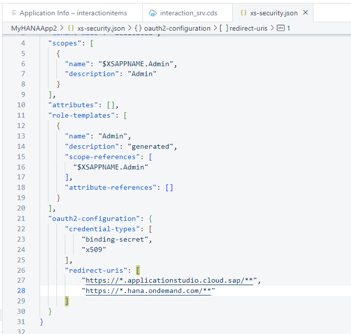
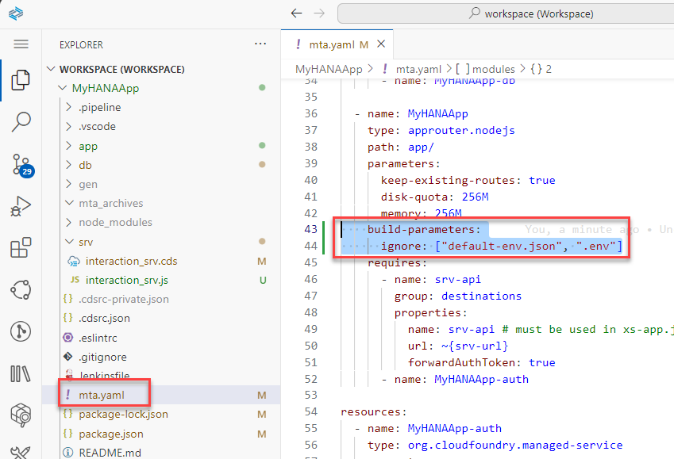
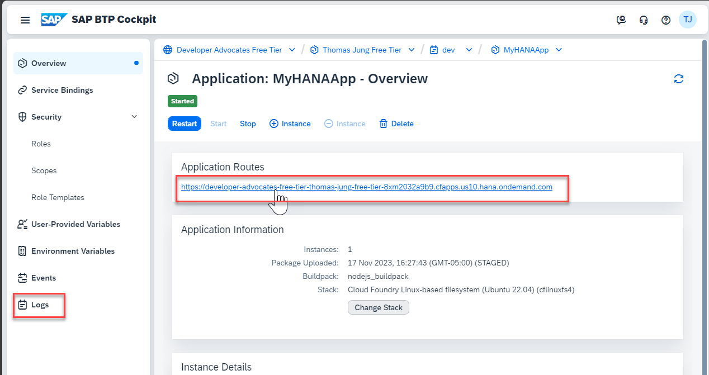

# Deploy CAP with SAP HANA Cloud project as MTA

<!-- description --> Deploy your SAP HANA Cloud and Cloud Application Programming Model application as a Multi-Target Application (MTA) to SAP BTP, Cloud Foundry runtime

## Prerequisites

- This tutorial is designed for SAP HANA Cloud. It is not designed for SAP HANA on premise or SAP HANA, express edition.
- You have completed all previous tutorials in this Mission or have at least developed up to the point of [adding User Authentication to your application](hana-cloud-cap-add-authentication).

## You will learn

- You will prepare our project for deployment via Multi Target Application to SAP BTP, Cloud Foundry runtime
- You will use the Cloud MTA Build tool to package your project for deployment
- You will deploy your application to SAP BTP, Cloud Foundry runtime

## Intro

Note:  This is an optional tutorial as part of this mission on SAP HANA Cloud plus Cloud Application Programming Model for those that want to fully deploy like a production application. There are limited resources allocated in an SAP BTP trial or free tier account and you should consider deleting this content after deploying to avoid using up all of these resources.  

---

### Project final adjustments and preparations

1. In this tutorial mission we've combined several different development types (HANA, CAP, Fiori) and wizards into a single project making it easy to develop and test locally. We just need a couple of more adjustments before we can deploy the complete application in a production ready format.

1. We will begin with the `xs-security.json` file. We need to make one adjustment to this file. Remember that we added the `oauth2-configuration` section to allow authentication redirection from the SAP Business Application Studio testing. We want add a similar redirection allowance for when our application will be running from SAP BTP Cloud Foundry, environment. Add a line for `https://*.hana.ondemand.com/**`. Your `xs-security.json` should now look like this:

    

1. The other adjustment needs to be made in the `mta.yaml` file in the root of the project. This is the file that will control the build and deployment of the application.

1. The adjustment we want to make is to the app router module section. The wizard added `default-env.json` file to the project so that we could test from the SAP Business Application Studio.  However we don't want these files to be present in a "real" deployment, instead getting configuration from the bound service instances. Therefore we can tell the builder to exclude these files from this module making sure they aren't part of any productive deployment. That way we can keep these files in our project for future testing and development but ensure that they don't accidentally make it into a production deployment.

    

### Use the Cloud MTA Build tool to package your project for deployment

1. Now that all of our project adjustments are complete, we can use the Cloud MTA Build tool to package the project for deployment.

1. Open a terminal window in SAP Business Application Studio and from the root folder of your project issue the command `mbt build`

    

1. This will take several minutes as various build steps are performed (such as running npm install on each module) to prepare the project for deployment.  The output of this command will be a zip archive with the extension `MTAR` in a new folder of your project named `mta_archives`.

    

1. Not required as part of the deploy process, but it might be interesting to see what is inside this `MTAR` file. You can download the file to your desktop and then open with an zip archive tool.  In the root of the zip you will find folders (with zip files inside them) for the three modules we described in your mta.yaml file.  Looking at the MTAR file in a zip utility is a good way to double check and make sure that your content is structured the way you wanted (and that your build-parameters exclusions worked) before attempting to deploy to Cloud Foundry.  

   

### Deploy your application to SAP BTP, Cloud Foundry runtime

1. Now we are ready to deploy our entire project to SAP BTP, Cloud Foundry runtime. Although you can perform the deployment from the command line using the `cf deploy` command, you can also trigger it from the SAP Business Application Studio just by right mouse click on the MTAR file and choosing **Deploy MTA Archive**.

    

1. If you start the deploy and immediately receive this error don't be alarmed.

    

    This just means that your login to Cloud Foundry has expired (which it does daily).  From the Business Application Studio you can click on the **Targeting CF** section in the bottom bar or from any terminal window use the `cf login` command to renew your login credentials. Then you can repeat the deployment.

1. Otherwise your deploy should continue as normal. It will take several minutes to complete.  You should see services being created from the resources section of the mta.yaml first then applications from the modules section of the mta.yaml.

    

1. Upon successful completion of the MTAR deployment, you should be able to navigate to your space and applications in the SAP BTP Cockpit and see the three deployed applications.  It is normal that the database deployer would be in a state of stopped. A deployer is an application that only needs to run upon deployment to send it's content somewhere (SAP HANA in this case).  The application then shutdown and no longer consume resources.

    

1. If either of other two application have bad requested state or their instances are not 1/1 then there may have been an error during deployment. If so continue to the next step where we will see how to view the Logs.

1. If you click on the name of the app, you will navigate to a detail screen for each application. From here you can access the URL for your application or view the Logs if there was some startup error.

    

1. Remember to test via the Application Router as only that application will have the redirect to the Login Screen to generate the security token. But other than the different URLs everything should work the same as when we tested with authorization from the SAP Business Application Studio.  Also because the database container was deployed to a new HDI container instance; you will need to return to the Database Explorer, connect to this new instance and load the data from CSV files.  Will now have two copies of the same HDI container instance. One used for development and one deployed via the MTA that is used for testing.  Often you would deploy these into separate spaces or even sub accounts, but to keep this tutorial easier we only use one of each of these and deploy into the same.

---
