# Create a Development Project in SAP Business Application Studio
<!-- description --> Create a development project, establish a connection to a database, create a user-provided service and .hdbgrants file, and deploy your project.

## Prerequisites
- You have access to [SAP HANA Cloud trial](hana-cloud-mission-trial-2) or [SAP HANA Cloud free tier](hana-cloud-mission-trial-2-ft), or a production environment of SAP HANA Cloud, SAP HANA database
- You have completed the tutorial to [provision an instance of SAP HANA Cloud, SAP HANA database](hana-cloud-mission-trial-3)
- You have completed the tutorial to [import the sample data needed for this mission](hana-cloud-mission-trial-5)
- [Download the sample code](https://github.com/SAP-samples/hana-cloud-learning/blob/4ac0be770033d3425cc30a2f22f8f5c0823bb810/Mission:%20SAP%20HANA%20Database%20in%20SAP%20HANA%20Cloud/Tutorial%206/Tutorial%206%20Queries.txt) files from our public GitHub repository


## You will learn
- How to create an HDI container in a Cloud Foundry runtime that is mapped to a HANA Cloud instance
- How to create a development space and project in SAP Business Application Studio
- How to establish a connection to your database
- How to create a user-provided service
- How to create an `.hdbgrants` file
- How to deploy a project


## Intro
>
> 
>
> Reminder: This tutorial is part of a mission, in which you will help Alex, the CEO of Best Run Travel, to answer a concrete business question with SAP HANA Cloud, SAP HANA database.
>
> *Alex needs to know the top 5 partners of their agency and wants to find out the days with maximum booking of each partner.*

In this tutorial, you will learn how to start preparations to create a calculation view by setting up a project in SAP Business Application Studio and establishing a connection to your database.

---

### Create an HDI Container
**Important**: If you have been using an instance provisioned under **Other Environments** as shown in the prerequisite tutorials, you must map that instance to a Cloud Foundry organization and optionally a space.

1. In the **SAP BTP Cockpit Overview** page, verify that the Cloud Foundry environment is enabled and that a space exists.

    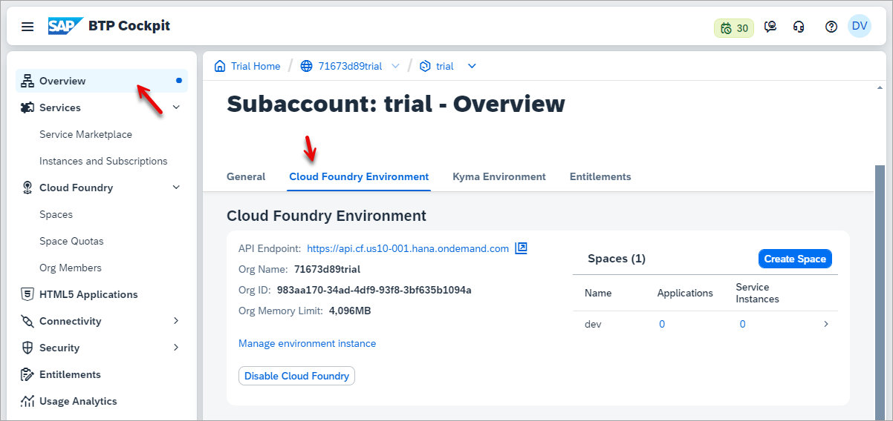

    Take note of the the **Org Name** under the **Cloud Foundry Environment** tab as this will be needed in the next step.

2. If a Cloud Foundry space does not exist, create one.

    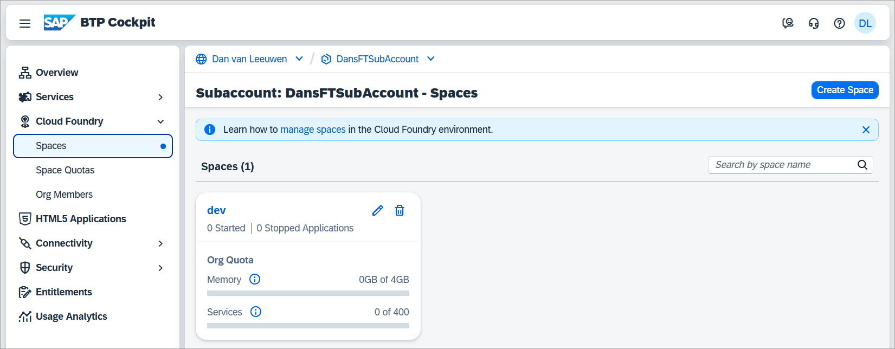

    >The list of users that can access a space can be found under **Space Members** once a space has been opened.

3. Open **SAP HANA Cloud Central**. Click on the SAP HANA Cloud database instance used for this tutorial, select **Manage Configurations** from the actions menu.  Select **Instance Mapping**.  Select the option to **Sign Into the Cloud Foundry Environment**.  

    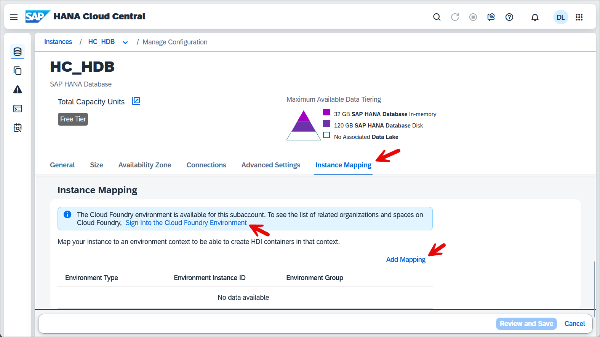

    Then select **Add Mapping** and select your Cloud Foundry organization.

    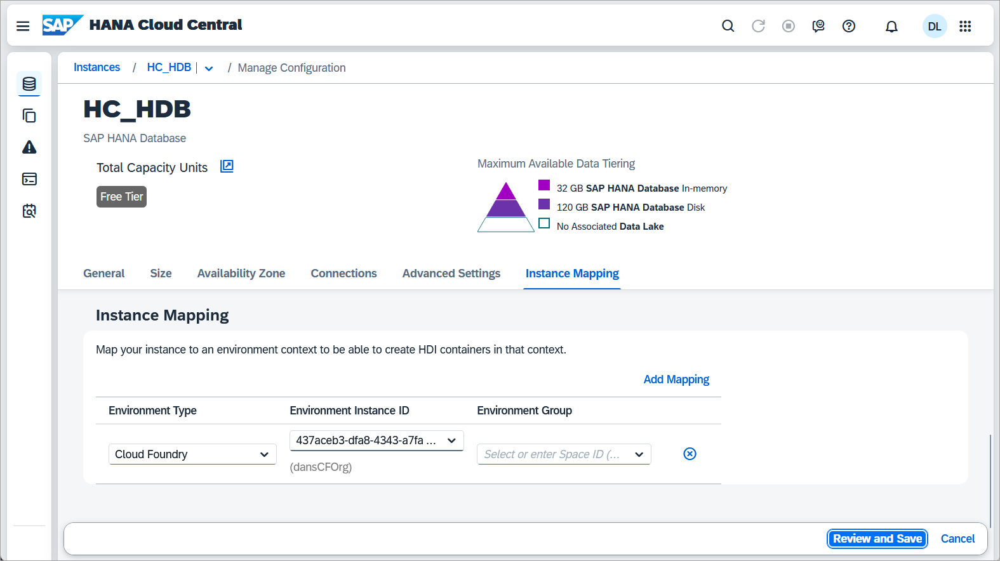

    Once finished, press **Review and Save**.

4. In the SAP BTP Cockpit, go to **Instances and Subscriptions**.  Click **Create**.  

    

    Select **SAP HANA Schemas & HDI containers** under **Service**. Choose the `hdi-shared` plan and provide an Instance Name, such as `HDI_Tutorial`. This is the HDI container you will use in your SAP Business Application Studio project.

    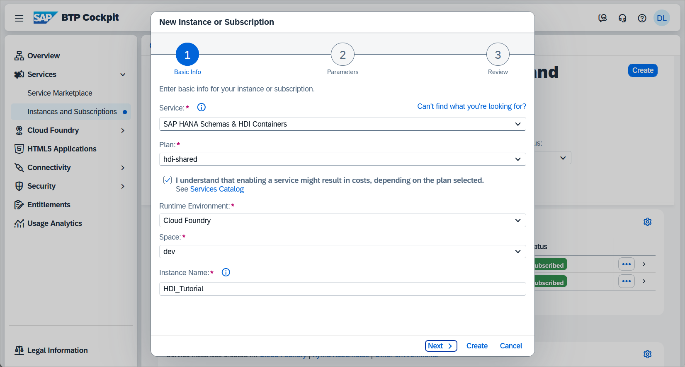

    Press next. Here you will specify the instance parameters. To associate the HANA Cloud instance (that you have just mapped to Cloud Foundry) with the HDI container instance, specify the following parameters. Be sure to replace the contents in `database_id` with your SAP HANA database instance ID.

    ```JSON
    {
        "schema":"HDI_Tutorial",
        "database_id":"<SAP HANA Cloud database instance ID>"
    }
    ```
    >You can copy your SAP HANA Cloud database instance ID from SAP HANA Cloud Central, through the **three dots** menu under the Actions column.
    >
    >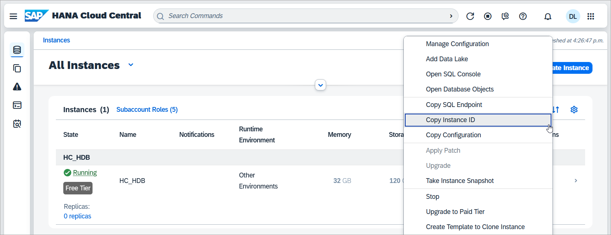

    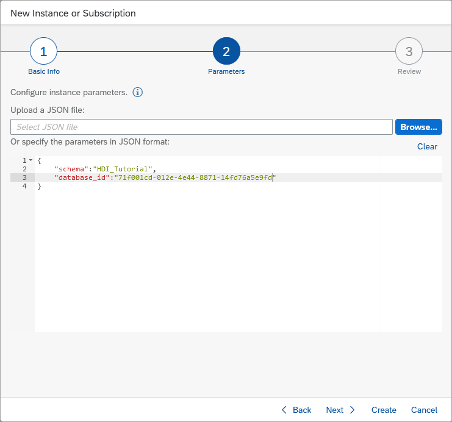

5. Review and create your instance.

    When completed, the HDI container will appear as shown below.

    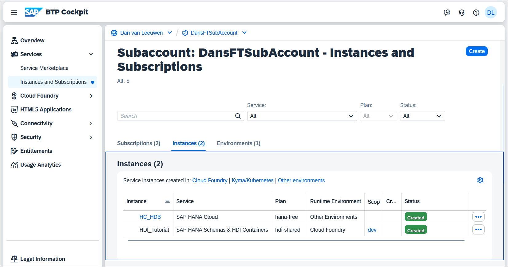


### Create your development space

> **Reminder:** What is SAP Business Application Studio?
>
> SAP Business Application Studio is a service within SAP Business Technology Platform that provides a development environment for SAP Cloud Foundry. This is an important tool to any kind of development with SAP HANA Cloud, SAP HANA database, including creating calculation views.  
> If you are unsure how to open it, please check out [Tutorial 4](hana-cloud-mission-trial-4) of this mission.

 Ensure that your user has the correct permissions to manage the SAP Business Application Studio (i.e. Business Application Studio Administrator). You can check the assigned roles of your users under **Security > Users > *Select your user* > *Select the three dots* > Assign Role Collection**. Ensure your user has the **`Business_Application_Studio_Administrator`** role.  

 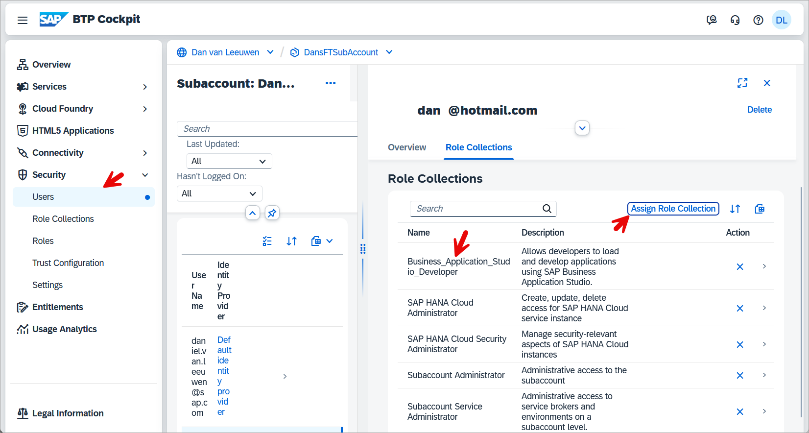

The first step in the SAP Business Application Studio is to create your development space. Development spaces are like isolated virtual machines in the cloud containing tailored tools and pre-installed runtimes per business scenario, such as an SAP HANA development project.


You are now ready to create your first development space.

1.	Open **SAP Business Application Studio** 

    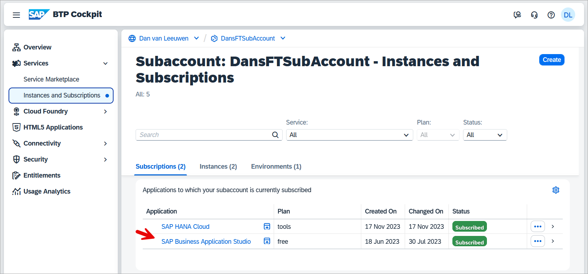
    
    If you have yet to subscribe to SAP Business Application Studio application, you can create one by clicking **Create** on the top right-hand corner of the screen.

2.	Once you have opened Business Application Studio, click on **Create Dev Space**.

    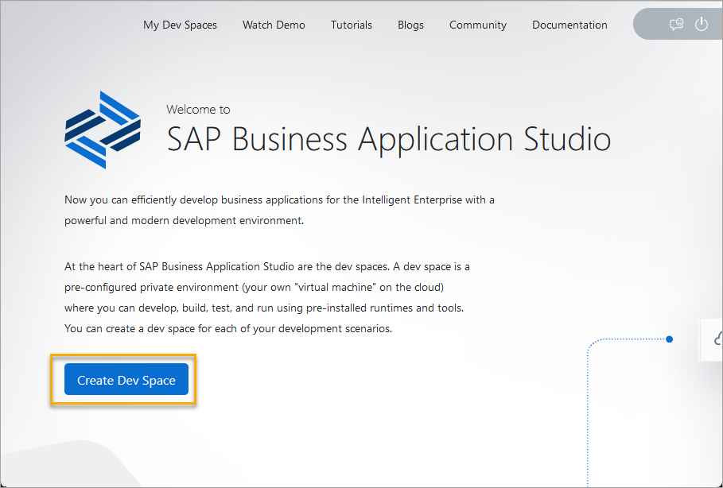

3.	Give your development space a name. You can choose any name you prefer, but you cannot use spaces in this name.

4.	Under the name, you need to choose the kind of application you will create. To use SAP HANA tools, such as calculation views, please make sure to check **SAP HANA Native Application** in the list.

    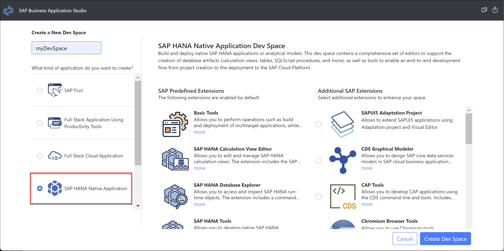

5.	On the right-side of the screen, you will see a list of the pre-defined extensions included in this project. You can also choose to select additional extensions to your project, if necessary.

6.	Then, click on **Create Dev Space** on the bottom right-side of the screen. You will return to the list of existing development spaces. Your newly created space is now on the list and you can see the status as **Starting**. This should take no more than a couple of minutes to start.

7.	Once the status changes to **Running**, you can click on the name of the development space to open it.

    


### Create your development project


Now you can create a development project within your new space. Follow these steps:

1.	On the **Get Started** page, click on **Start from template**.

    

2.	Next, click on **SAP HANA Database Project**, and then click on **Start** at the very bottom of the screen.

    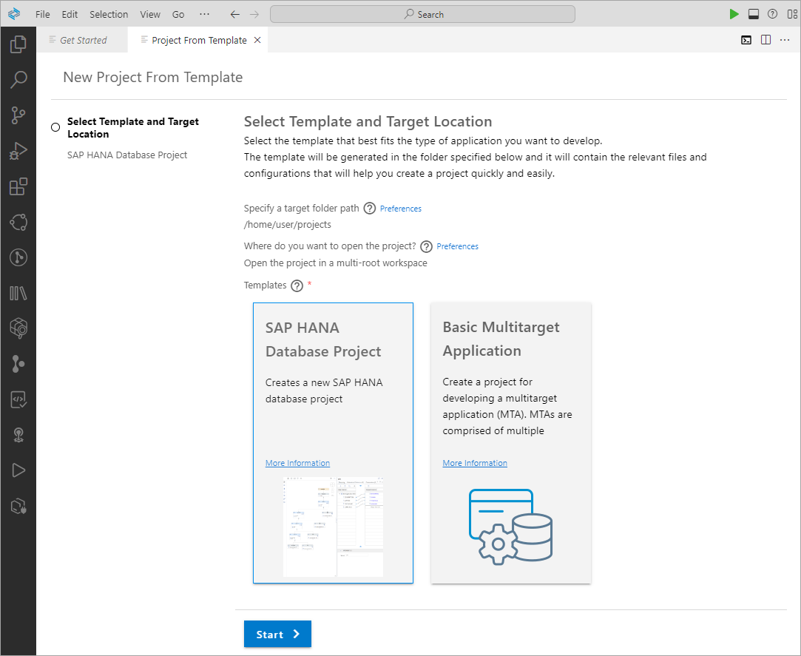

3.	Give your project a name, such as `BestRunTravel`, and then click on **Next**.

4.	The module name defaults to `db`.  Click on **Next**.

5.	In the step **Set Database Information**, you can choose to determine a **Namespace** and a **Schema Name**. These are not mandatory and for the purpose of this mission, *we recommend you leave these fields **empty***.

    Make sure the **SAP HANA database version** is set to `HANA Cloud` and  **Bind the database tutorial to a Cloud Foundry service instance** is set to **Yes**.

    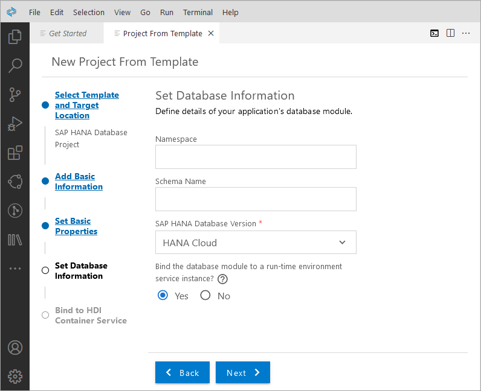

6.	To bind your project to your SAP HANA Cloud, SAP HANA database, you must log on to Cloud Foundry.

    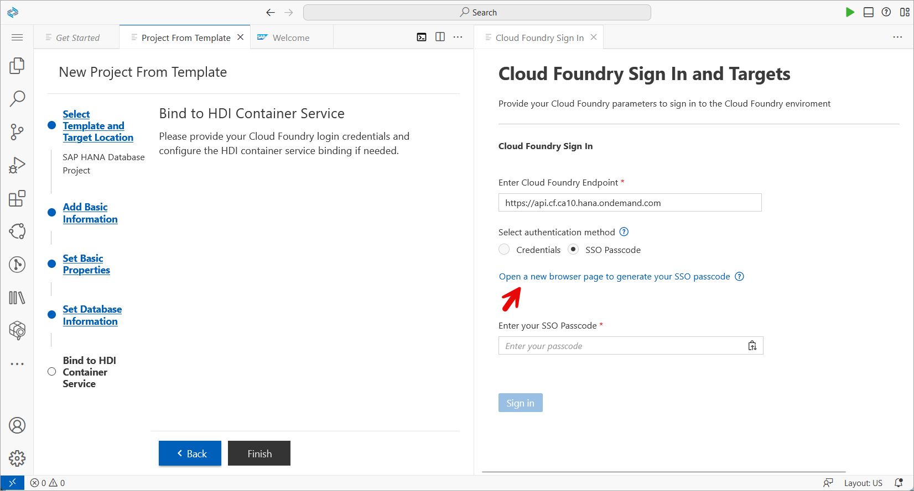

    Check and update, if needed, the API URL to match the URL displayed in SAP BTP Cockpit for the Cloud Foundry environment you plan to use and login.

    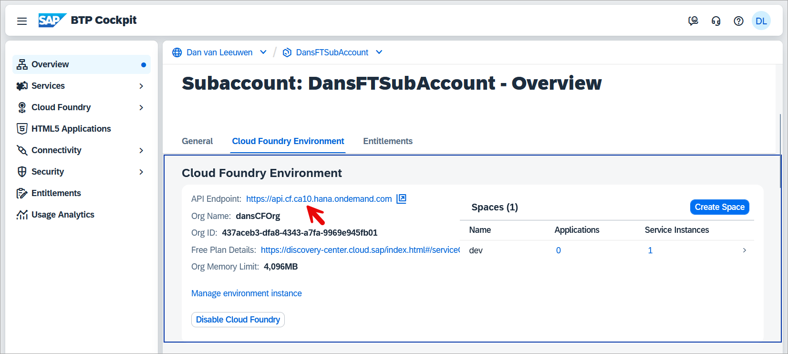

7.	Once the login is complete, your organization and space are automatically selected. If you are part of multiple organizations or spaces, you can adjust the preselected options via the drop-down menus.

8. Under **Create a new HDI service instance**, select **No**. This will prompt you to choose a Cloud Foundry service. Select the HDI Container service you created earlier in this tutorial.

    

9.	Click on **Finish** to create the project.

    Your project will be generated, which takes a few minutes to complete. You can follow the status of your project creation on the bottom right corner of the screen.

    Once the project is complete, the project will open in a new workspace, and the structure can be seen on the left-hand panel.

    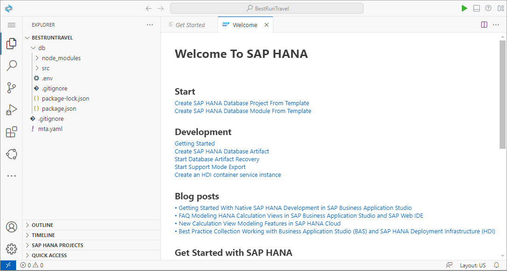


### Get to know the SAP HANA Project Panel
On the left panel, you can now see your workspace where you have your files, and the **SAP HANA Project** panel underneath where you can deploy your project and open the HDI container in the SAP HANA database explorer.

> **What is an HDI container?**
>
> Applications are bound to an SAP HANA Cloud instance through a schema or an HDI container. HDI containers ensure isolation, and within an SAP HANA database you can define an arbitrary number of HDI containers. HDI containers are isolated from each other by means of schema-level access privileges. You can read more in this [technical documentation](https://help.sap.com/docs/hana-cloud/sap-hana-cloud-getting-started-guide/binding-applications-to-sap-hana-cloud-instance).

Whenever you add a new database object that can be deployed to your HDI container, it will appear in this panel and you can deploy it. In this area you can also check the database connections of your project.

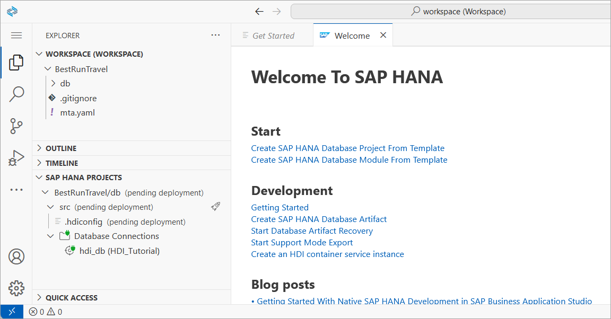

Moving your cursor to the name of an object, folder, or connection in this panel, you will see different icons:

-	This icon  will open the HDI container in SAP HANA database explorer
-	This icon  will deploy an object, folder or the whole project to the HDI container or other connected database.
-	This icon  (only on the Database Connections level) allows you to create a new database connection.
-	This icon  /   allows you to bind (green color) or unbind (grey color) a database connection.

**Command Palette**

An important function that can help you get the commands you need, is the `Command Palette`.  

When you open the side menu, click **View**, and select **Command Palette**, a prompt will open at the top center of the screen. In this field, you can search for all commands available and select the one you need.

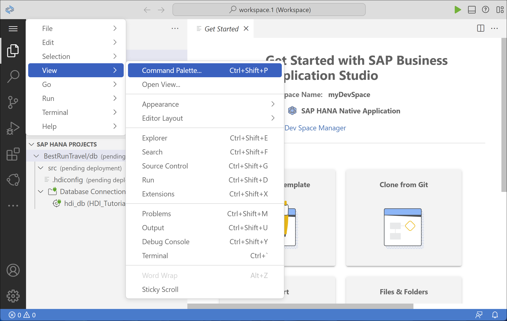

The most important one for SAP HANA Cloud, SAP HANA database development is the command **Create SAP HANA Database Artifact**. This command will open a UI that allows you to create many database objects, like tables, roles, services, and many more.

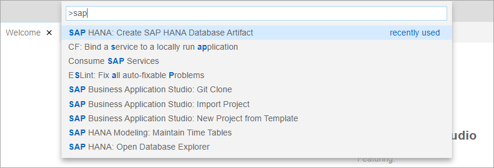

> To open the **Command Palette**, you can also use the key combination `Ctrl + Shift + P` or F1.


### Create a user-provided service
Now that your project is created and you know the basics of how to navigate SAP Business Application Studio, your next step is to create a user-provided service, which will allow the project to access the data within the database.

1.	In the **SAP HANA Projects** panel, expand your project.

2.	Hover your cursor over the section **Database Connections**, and a plus icon () will appear. This option allows you to add a new database connection. Click on the icon.

    

3.	In the field **Select connection type**, choose the option **Create user-provided service instance** from the drop-down menu.

4.	Enter a name for your service and provide the user name and password for the `UPS_GRANTOR` user you previously created in step 2 of the [Create Users and Manage Roles and Privileges](hana-cloud-mission-trial-5) tutorial.

    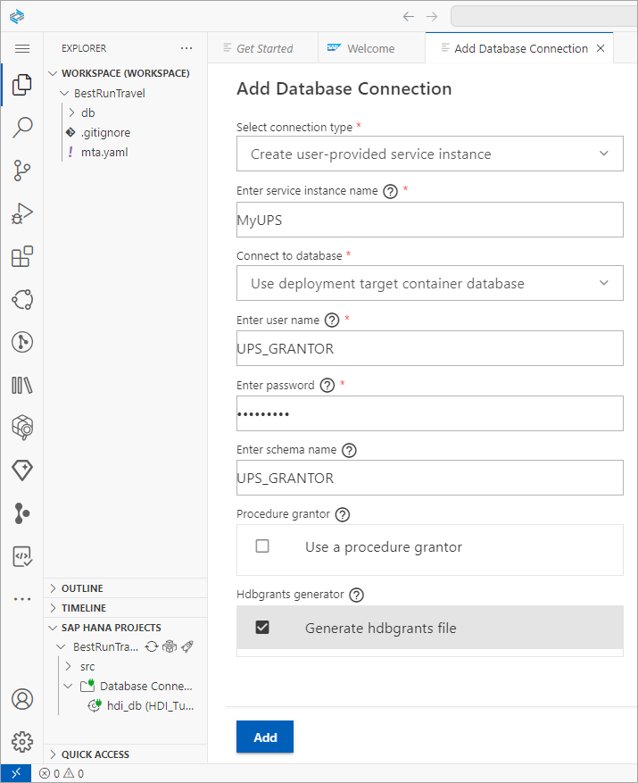

5.	Select the `Generate hdbgrants file` checkbox.

    You will assign a set of privileges to many users directly from your project in an `.hdbgrants` file. This file will specify that the user-provided service will be used to grant the privileges entered in the `.hdbgrants` file in the connected database.

    > This step only has to be done once in the beginning for a project. You will only have to modify the file if you need additional privileges.

6. Click on **Add**. The user-provided service will be created.

    

### Modify the hdbgrants file

1. In File explorer, open the `.hdbgrants` file. Here, you can see a template of all different types of privileges you could grant to different user groups. There is a dedicated section for object owner users and application users.

    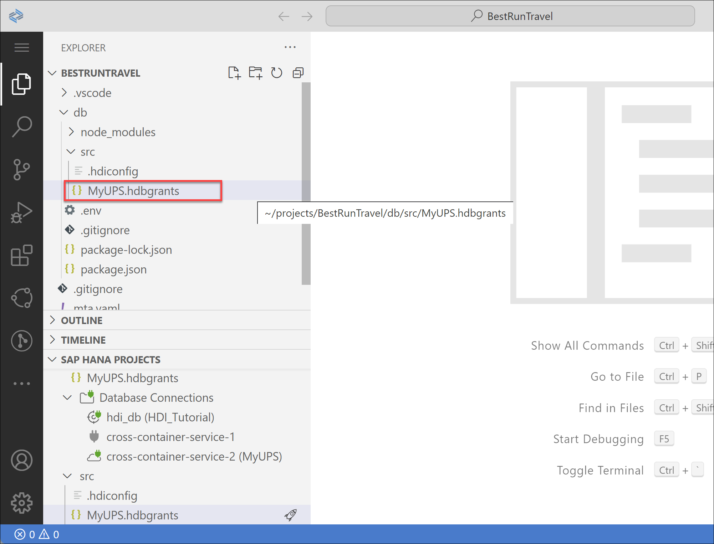

2.	For the purposes of this tutorial, we would like to grant the roles we have previously created to object owners and application users. The object owner will be assigned the role `genericRoleForOO` and the application user the role `genericRoleForAP`.

    To do so, replace the contents of the `hdbgrants` file with the following:

    ```JSON
    {
        "MyUPS": {
            "object_owner": {
                "global_roles": [
                    {
                        "roles": ["genericRoleForOO"]
                    }
                ]
            },
            "application_user": {
                "global_roles": [
                    {
                        "roles": ["genericRoleForAP"]
                    }
                ]
            }
        }
    }
    ```

### Deploy your project


Now that the connection to your database is established and the grants file is created, you can deploy the project.

1.	Go to the lower left corner of the screen, where you can see the **SAP HANA Projects** pane.

2.	Next to your project name, you will see a small icon in the shape of a rocket(). Click on it to deploy your project.

    Once the deployment is successfully completed, you will see the completion message in the bottom area of your screen.

    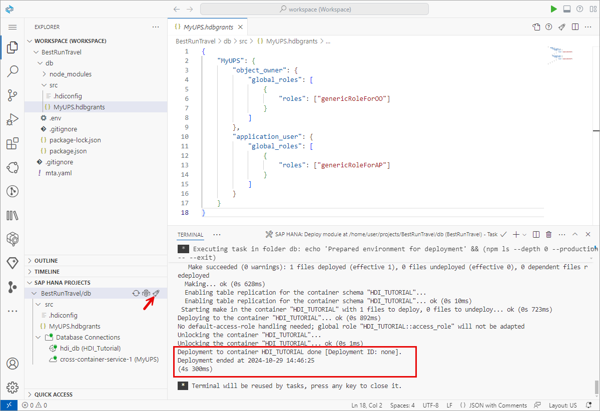

3.  Open the HDI container in the SAP HANA database explorer.

    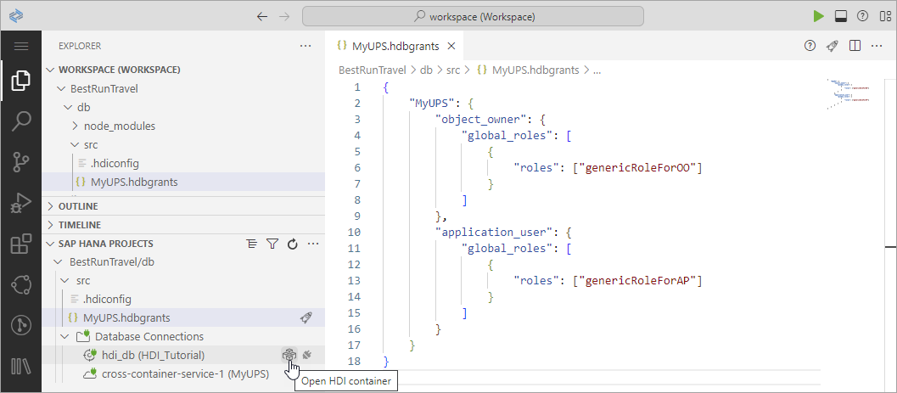

4.  Notice that you can now access the tables in the SFLIGHT schema from within the HDI container.

    ```SQL
    SELECT * FROM SFLIGHT.SAIRPORT;
    ```

    

*Well done!*

You have completed the seventh tutorial of this mission! You learned how to set up a development project in SAP Business Application Studio and connecting it to your database with a user-provided service and an `.hdbgrants` file. You are all set now to create a calculation view.
Learn in the next tutorial how to create a calculation view to achieve your mission objective.


### Knowledge Check


---
