 
# Create an SAP Mobile Services App for the SAP Service and Asset Manager Mobile App
<!-- description -->Create and update an SAP Mobile Services app for the SAP Service and Asset Manager mobile app using the Mobile Services App Create transaction /MERP/CPMS_APPCREATE from the SAP GUI.

## Prerequisites
- Access to your SAP BTP Subaccount and Space.
- Access to the SAP Mobile Services service in your SAP BTP subaccount.
- Implement SAP Notes 3504624 and 3524755 in your system to get the latest updates for the SAP Service and Asset Manager Mobile Services App Create transaction `/MERP/CPMS_APPCREATE`. Note 3504624 (component MOB-APP-MAO-FND) contains updates to the Mobile Services App Admin classes on which note 3524755 (component MOB-APP-MAO-ERP) depends on. Please ensure note 3504624 can be implemented in your system before implementing note 3524755.

## You will learn
- How to create and update an SAP Mobile Services app for the SAP Service and Asset Manager mobile app using the MS App Create transaction `/MERP/CPMS_APPCREATE`.
- How to review the created MS app.
- Optional features:
  1. Use an RFC Destination (Middleware Server).
  2. Add `sap-client` header to the Mobile Destinations.
- Troubleshoot the following symptoms:
  1. Prompted to sign-in after selecting the **Launch in Browser** icon when testing the Mobile Destinations.
  2. Missing Offline Configuration.
  3. Usage Metering Middleware Server Missing and/or Properties Missing.
  4. Usage Metering Background Job Missing.

## Intro
In this mission you will learn how to create and update an SAP Mobile Services app for the SAP Service and Asset Manager mobile app using the SAP Service and Asset Manager Mobile Services App Create transaction **`/MERP/CPMS_APPCREATE`** from the SAP GUI. The Mobile Services app created by the transaction may be used to onboard your SAP Service and Asset Manager mobile app.

### Gather the Required Information

1. The **Admin API** link can be found in the **Important Links** section of the SAP BTP Mobile Services service in your SAP BTP subaccount.

    

2. The **SAP Cloud Connector Location Id** and **Virtual Host** can be found in the **Cloud Connector** section of the SAP BTP Cockpit in your subaccount.

    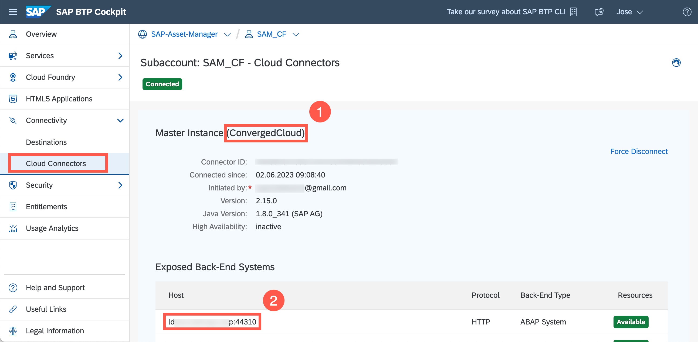

    1. The **SAP Cloud Connector Location Id** is located within the parenthesis (i.e., `ConvergedCloud`). If there are no parenthesis, then the **SCC Location Id** is not required.

    2. The **Virtual Host** is located in the Host column of the Exposed Back-End Systems table. Please remove any leading or trailing spaces when copied.

### Create the Mobile Services App via the MS App Create Transaction

1. Execute the transaction **`/MERP/CPMS_APPCREATE`** from the SAP GUI, then select your desired variant.

2. Fill in the **Admin API**, **SCC Location Id** and **Virtual Host**. Please review the **Background Job User** parameter (additional info below). To add the `sap-client` header to the Mobile Destinations please see Step 5 (optional). To use an RFC Destination instead of the **Admin API** please see Step 4 (optional). Then execute the transaction.

    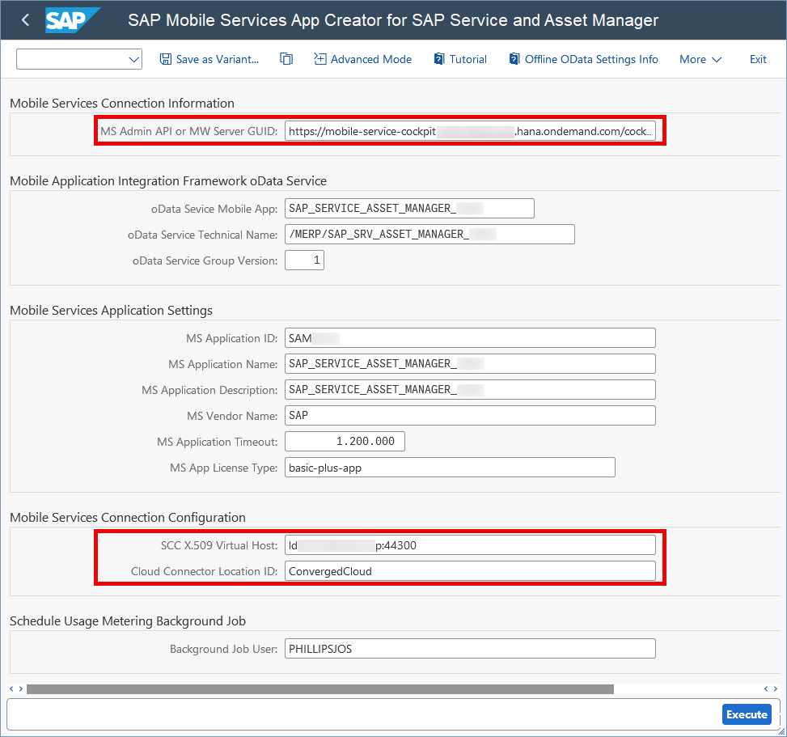

    | Parameter                          | What's the use?                                                                                                                                                                                                                                      |
    | :--------------------------------- | :--------------------------------------------------------------------------------------------------------------------------------------------------------------------------------------------------------------------------------------------------- |
    | **MS Admin API or MW Server GUID** | Used to establish a connection from the SAP Backend to the SAP Mobile Services service.                                                                                                                                                              |
    | **OData Service Mobile App**       | Used to generate the mobile app's offline configuration sent to the SAP Mobile Services **Mobile Offline Access** feature.                                                                                                                           |
    | **OData Service Technical Name**   | Used to generate the mobile app's offline configuration sent to the SAP Mobile Services **Mobile Offline Access** feature.                                                                                                                           |
    | **OData Service Group Version**    | Used to generate the mobile app's offline configuration sent to the SAP Mobile Services **Mobile Offline Access** feature.                                                                                                                           |
    | **MS Application ID**              | The unique application identifier given to the SAP Mobile Services app.                                                                                                                                                                              |
    | **MS Application Name**            | The application name given to the SAP Mobile Services app.                                                                                                                                                                                           |
    | **MS Application Description**     | The application description given to the SAP Mobile Services app.                                                                                                                                                                                    |
    | **MS Vendor Name**                 | The vendor name given to the SAP Mobile Services app.                                                                                                                                                                                                |
    | **MS Application Timeout**         | The maximum time in milliseconds before a client connection times out in your environment. After that timeout period, the connection is closed.                                                                                                      |
    | **MS App License Type**            | The Service Plan used by Mobile Services                                                                                                                                                                                                             |
    | **SCC X.509 Virtual Host**         | Used to generate the URL for the Mobile Services Mobile Destinations                                                                                                                                                                                 |
    | **Cloud Connector Location ID**    | Used to set **Cloud Connector Location Id** for the Mobile Services Mobile Destinations                                                                                                                                                              |
    | **Background Job User**            | Used to schedule the Usage Metering background job with a daily frequency. If no user is provided, then the user executing the transaction is used. Please ensure the **Background Job User** will maintain authorization to run the background job. |
   
    >**WARNING:** Any change that may affect the offline configuration (e.g., a new entity type is added to your mobile app configuration, or the **Defer Batch Response** setting is changed for the **OData Service Technical Name** provided when generating the offline configuration) will require you to update the offline configuration in Mobile Services and reset your mobile app. See Step 2.5 to update.

3. If you are not using a Middleware Server with an RFC Destination with Basic Authentication enabled, then you should receive a sign-in prompt after executing the transaction. Please use your SAP BTP username and password to sign in.

    >Please allow ~5 minutes to complete processing.

4. Your app should now be available in the **Native/MDK** section of the SAP Mobile Services service in your SAP BTP subaccount. Please take note of the **Mobile Services App ID**, **Middleware Server** and **Background Job** name in the output.

    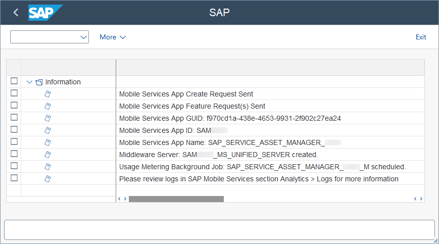

5. The Mobile Services app can be updated by re-executing the transaction and selecting the features to update when prompted. See additional info for each option below.

    

    | Feature                             | What is Updated?                                                                                                                      |
    | :---------------------------------- | :------------------------------------------------------------------------------------------------------------------------------------ |
    | **Update Mobile Offline Access**    | Updates the offline configuration of your app.                                                                                        |
    | **Update Usage Metering**           | Creates Usage Metering Middleware Server and Background Job. Existing Middleware Server and Background Job are deleted.               |
    | **Compare Offline Configuration**   | Compare offline configuration properties, request groups and request download phases between the backend and the mobile services app. |
    | **Update Mobile Connectivity**      | Updates the offline and online destination settings of your app.                                                                      |
    | **Update Mobile App Update**        | Assigns the feature to your app if not already assigned.                                                                              |
    | **Update Mobile Push Notification** | Updates the Predefined Global Push Configuration to **SAP ASSET MANAGER**.                                                            |

### Review the Created Mobile Services App

1. In the **Native/MDK** section of the SAP Mobile Services service in your SAP BTP subaccount you should see your app in a **Started State** with the **MS Application ID** you provided in Step 2.2.

    

2. Select your app to see the **Assigned Features**. The following features should be assigned to your app:

    - **Mobile App Update**
    - **Mobile Connectivity**
    - **Mobile Offline Access**
    - **Mobile Push Notification**

3. From your app's overview screen, select the **Mobile Connectivity** feature. You should see two Mobile Destinations created with the properties below. Under the **Actions** column, selecting the **Launch in Browser** icon should return the metadata. If you are prompted to sign in after clicking the **Launch in Browser** icon then please see Step 6.

    

    | Destination Name                 | Destination URL                                                               |
    | :------------------------------- | :---------------------------------------------------------------------------- |
    | `DEST_SAM<version>_PPROP`        | **`http://<host>:<port>/sap/opu/odata/MERP/SAP_SRV_ASSET_MANAGER_<version>`** |
    | `DEST_SAM<version>_ONLINE_PPROP` | **`http://<host>:<port>/sap/opu/odata/MERP/SAP_ONLINE_LOOKUP_EXT_<version>`** |

4. From your app's **Mobile Connectivity** feature, select the **Service Keys** tab. You should see a Service Key with the properties below. The Key should be automatically maintained as the `X-API-Key` property in the Additional Properties of the Usage Metering Middleware Server which we will review in Step 3.7.

    | Field Name | Value                                       |
    | :--------- | :------------------------------------------ |
    | Alias      | **`<system><client>`** (i.e., **`PRD001`**) |
    | Roles      | **`sap_application_metering`**              |
    | Type       | **`API Key`**                               |

5. From your app's overview screen, if you select the **Mobile Offline Access** feature you should be able to display and edit the offline configuration. If the offline configuration is missing, then please see Step 7.

6. From your app's overview screen, select the **APIs** tab to view the onboarding QR code which you can scan from the SAP Service and Asset Manager mobile app.

7. We will now check the Usage Metering Middleware Server. Execute transaction **/SYCLO/ADMIN** from the SAP GUI to open up the MAIF Admin Panel. Navigate to **Administration** > **Server Management**. Select the Middleware Server with the name noted in Step 2.4. If the Usage Metering Middleware Server is missing then please see Step 8.

    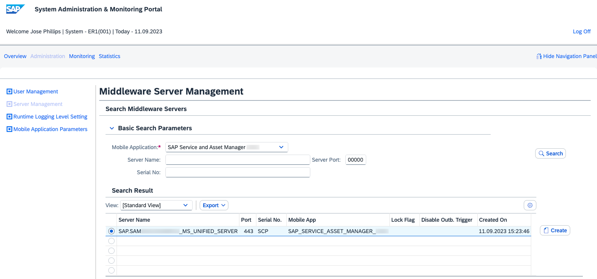

8.  Verify that the Middleware Server has the following **Basic Info** and **Additional Properties**. If the Middleware Server's **Basic Info** or **Additional Properties** are not as expected then please see Step 8.

    **Basic Info**

    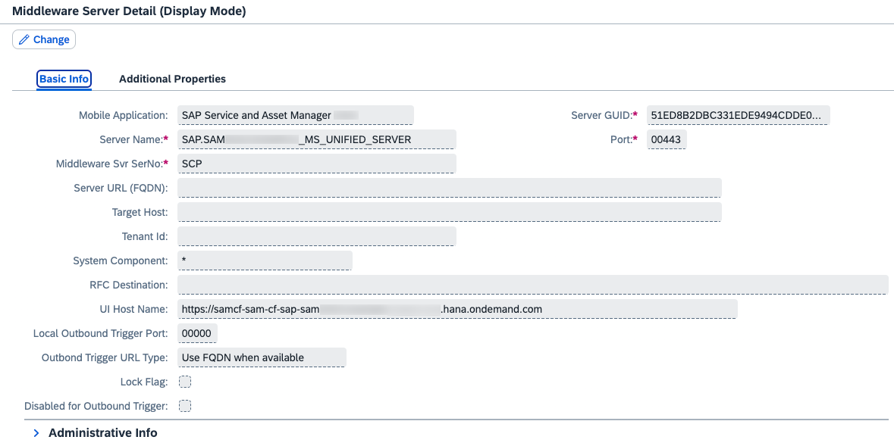

    | Field Name             | Value                                              |
    | :--------------------- | -------------------------------------------------- |
    | Mobile Application     | **`<mobile_app>`**                                 |
    | Server Name            | **`<ms_app_id>_MS_UNIFIED_SERVER`**                |
    | `Middleware Svr SerNo` | **`SCP`**                                          |
    | Server GUID            | **`<autogenerated_guid>`**                         |
    | Port                   | **`00443`**                                        |
    | UI Host Name           | **`https://example.cfapps.sap.hana.ondemand.com`** |

    **Additional Properties**

    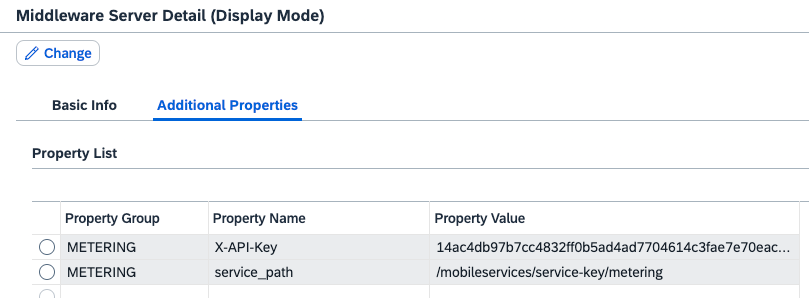

    | Property Group | Property Name      | Property Value                             |
    | :------------- | :----------------- | :----------------------------------------- |
    | **`METERING`** | **`X-API-Key`**    | **`<autogenerated_key>`**                  |
    | **`METERING`** | **`service_path`** | **`/mobileservices/service-key/metering`** |

9.  To verify that the Usage Metering Background Job is scheduled, please execute transaction **SM37** from the SAP GUI and search for the job name noted in Step 2.4. If the background job is missing, then please see Step 9.

    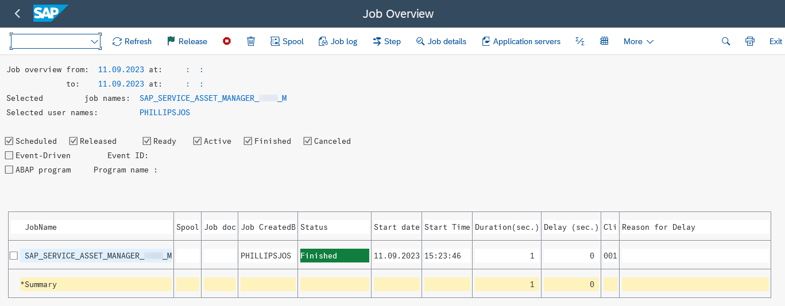

### Optional Feature 1 - Use an RFC Destination (Middleware Server)

1. Execute transaction **SM59** from the SAP GUI. Then click the create icon.

2. Provide the destination name **`Z_MS_ADMIN_API`** and set **Connection Type** to **`G HTTP Connection to External Server`**.

3. Provide the Target System Settings. The **Target Host** and **Path Prefix** are derived from the **Admin API** retrieved in Step 1.1. Please ensure you append **`/app`** to the Path Prefix as in the example below.

    

    **Admin API:** `https://mobile-service-cockpit-example.sap.hana.ondemand.com/cockpit/v1/org/ExampleOrg/space/ExampleSpace`

    | Field Name        | Value                                                      |
    | :---------------- | :--------------------------------------------------------- |
    | Target Host       | **`mobile-service-cockpit-example.sap.hana.ondemand.com`** |
    | Service No.(Port) | **`443`**                                                  |
    | Path Prefix       | **`/cockpit/v1/org/ExampleOrg/space/ExampleSpace/app`**    |

    >**HTTP Proxy Options** are available in the RFC Destination Technical Settings if required.
 
4. In the **Logon & Security** tab, within the **Security Options** > **Status of Secure Protocol** section, of your RFC destination please set the **SSL** radio button to **Active**.
 
    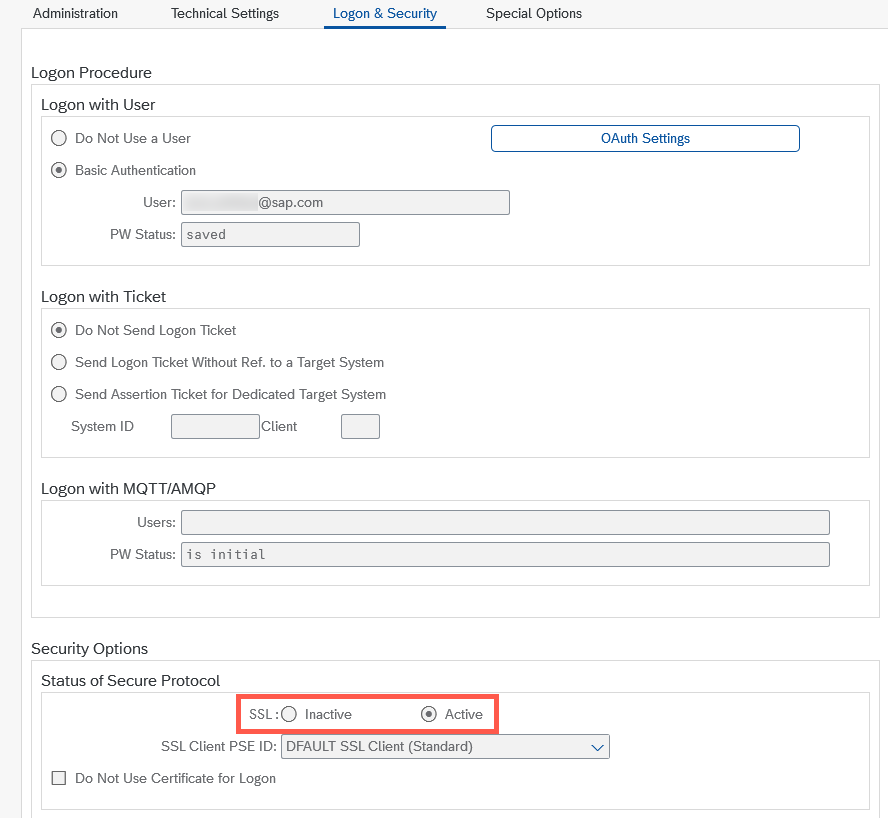

    >Enabling **Basic Authentication** is optional. Using **Basic Authentication** will skip the sign-in prompt in Step 2.3. If you choose to enable **Basic Authentication**, then please provide your SAP BTP credentials as the **User** and **Password**.

5. Save the RFC Destination.

6. We will now create the Middleware Server with the RFC Destination created. To create the Middleware Server, execute transaction **/SYCLO/ADMIN** from the SAP GUI to open up the MAIF Admin Panel.

7. Navigate to the **Administration** > **Server Management** section. 

8. Click **Create** to create a new Middleware Server.
 
9. Please fill out the **Basic Info** below and click **Save**.

    **Basic Info**

    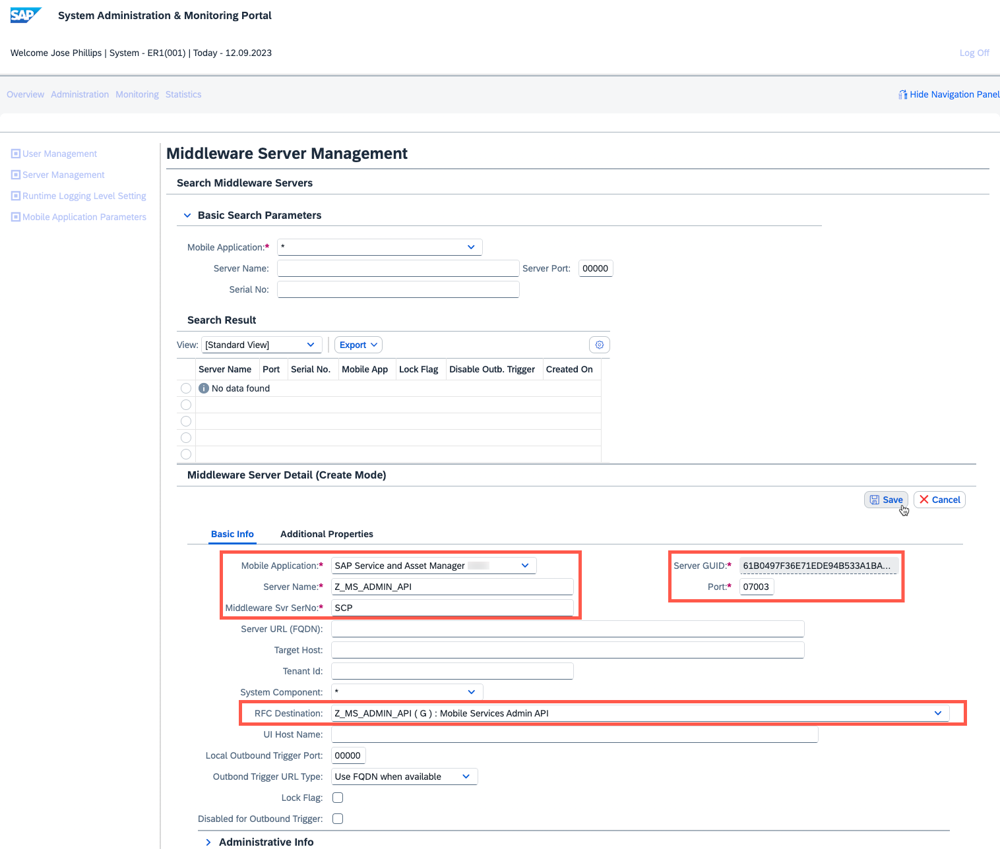

    | Field Name             | Value                      |
    | :--------------------- | :------------------------- |
    | Mobile Application     | **`<mobile_app>`**         |
    | Server Name            | **`Z_MS_ADMIN_API`**       |
    | Server GUID            | **`<autogenerated_guid>`** |
    | Port                   | **`07003`**                |
    | `Middleware Svr SerNo` | **`SCP`**                  |
    | RFC Destination        | **`Z_MS_ADMIN_API`**       |

10. You may now use the generated **Server GUID** instead of the **Admin API** in Step 2.2 . You may use F4 Help on the **Admin API or Middleware Server GUID** field of the MS App Create transaction to search for the created Middleware Server.

    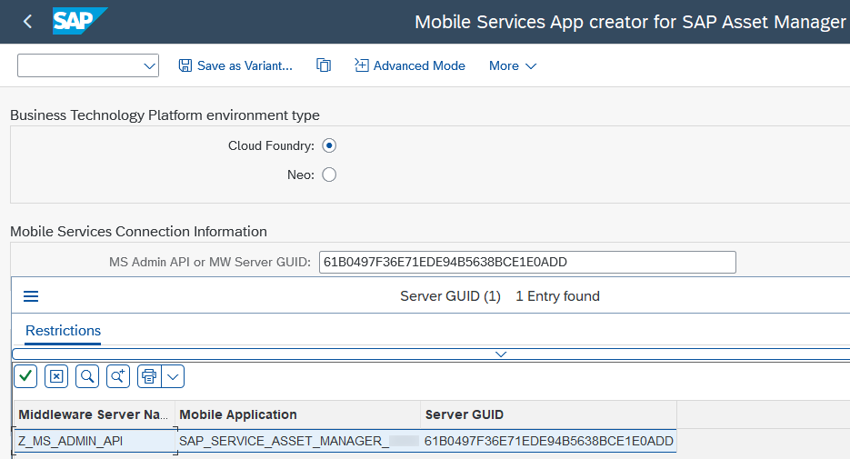

### Optional Feature 2 - Add sap-client header to the Mobile Destinations
    
1. Follow Step 2.1 and 2.2 then return to this Step before executing. Then click **Advanced Mode**.

2. Under the **Mobile Services Connection Configuration** section, provide the JSON payload below in the **Destination Headers** field of the offline and online destinations (substituting `<client>` with the desired client).

    ```JSON
    {"name": "sap-client", "value": "<client>", "overwrite": false}
    ```

    

3. If your app already exists and you are updating your app, select the **Mobile Connectivity** feature when prompted.

### Troubleshoot 1 - Prompted to sign-in after selecting the Launch in Browser icon

1. This can occur when the `sap-client` header is not specified on the Mobile Destinations. Follow Optional Feature 2 to add the `sap-client` header.

2. Alternately, you may edit the Mobile Destinations directly in the SAP Mobile Services **Mobile Connectivity** feature of your app. For each destination, click the pencil icon and navigate to the **Custom Headers** section. Add a custom header with the following values:

    

    | Header Name  | Header Value                  |
    | :----------- | :---------------------------- |
    | `sap-client` | Your client (i.e., **`800`**) |

### Troubleshoot 2 - Missing Offline Configuration

1. Follow Step 2.5 and select the **Mobile Offline Access** feature when prompted. The offline configuration will be regenerated and sent to SAP Mobile Services. If the offline configuration is still missing in Mobile Services, you may try the next steps.

2. Alternately, you may generate the offline configuration using the offline configuration program **`/MERP/CORE_OFFLINE_CONFIG_PROG`**. The generated file can then be uploaded in the SAP Mobile Services **Mobile Offline Access** feature of your app.

3. Execute the program **`/MERP/CORE_OFFLINE_CONFIG_PROG`** in transaction **SE38** from the SAP GUI, then select your desired variant. Then execute the transaction.

    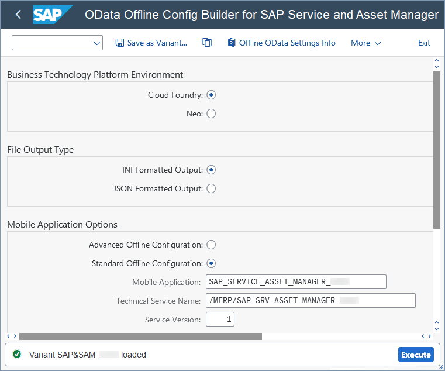

    >**WARNING:** Any change that may affect the offline configuration (e.g., the **Defer Batch Response** setting is changed for the **OData Service Technical Name** provided when generating the offline configuration, or a new entity type is added to your mobile app configuration) will require you to update the offline configuration in Mobile Services and reset your mobile app. See Step 2.5 to update.

4. Please ensure to save the generated file with a `.ini` file extension.

5. Import the file in the **Mobile Offline Access** feature of your app.

    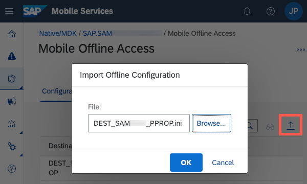

### Troubleshoot 3 - Usage Metering Middleware Server Missing and/or Properties Missing

1. Follow Step 2.5 and select **Usage Metering** feature when prompted. If the Usage Metering Middleware Server and/or properties are still missing, you may try the next steps.

2. Alternately, you may create the Usage Metering Middleware Server manually. Execute transaction **/SYCLO/ADMIN** from the SAP GUI to open up the MAIF Admin Panel. 

3. Navigate to the **Administration** > **Server Management** section.

4. Click **Create** to create a new Middleware Server.
 
5. Please fill out the **Basic Info**  and **Additional Properties** below and click **Save**.

    **Basic Info**
    
    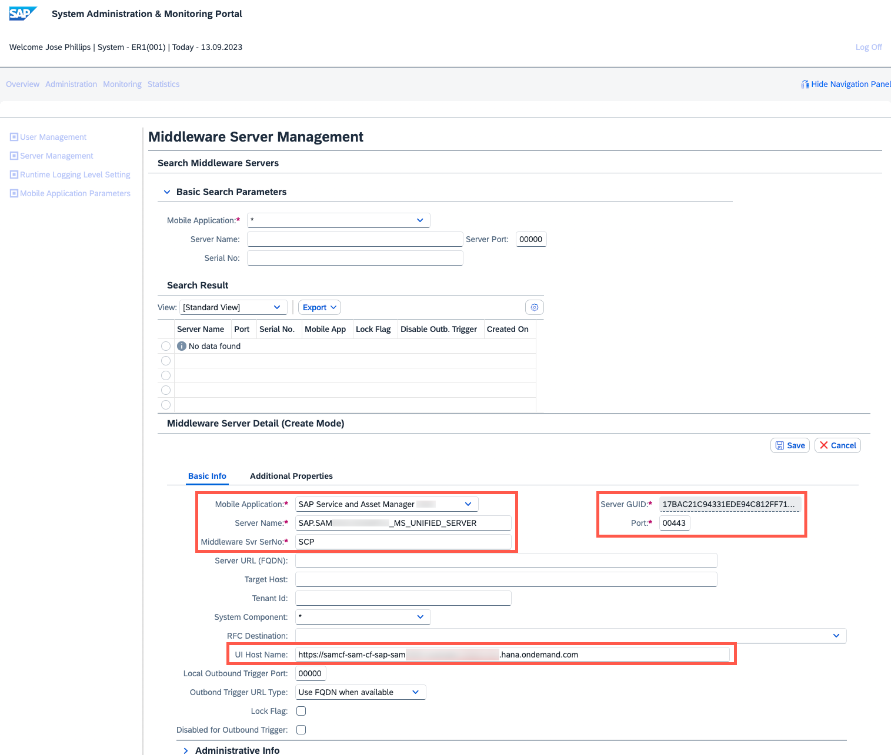

    | Field Name             | Value                                              |
    | :--------------------- | -------------------------------------------------- |
    | Mobile Application     | **`<mobile_app>`**                                 |
    | Server Name            | **`<ms_app_id>_MS_UNIFIED_SERVER`**                |
    | `Middleware Svr SerNo` | **`SCP`**                                          |
    | Server GUID            | **`<autogenerated_guid>`**                         |
    | Port                   | **`00443`**                                        |
    | UI Host Name           | **`https://example.cfapps.sap.hana.ondemand.com`** |

    >The **UI Host Name** can be found in the **APIs** tab of your Mobile Services app. Copy the **URL** of the **Server API**.
    >
    >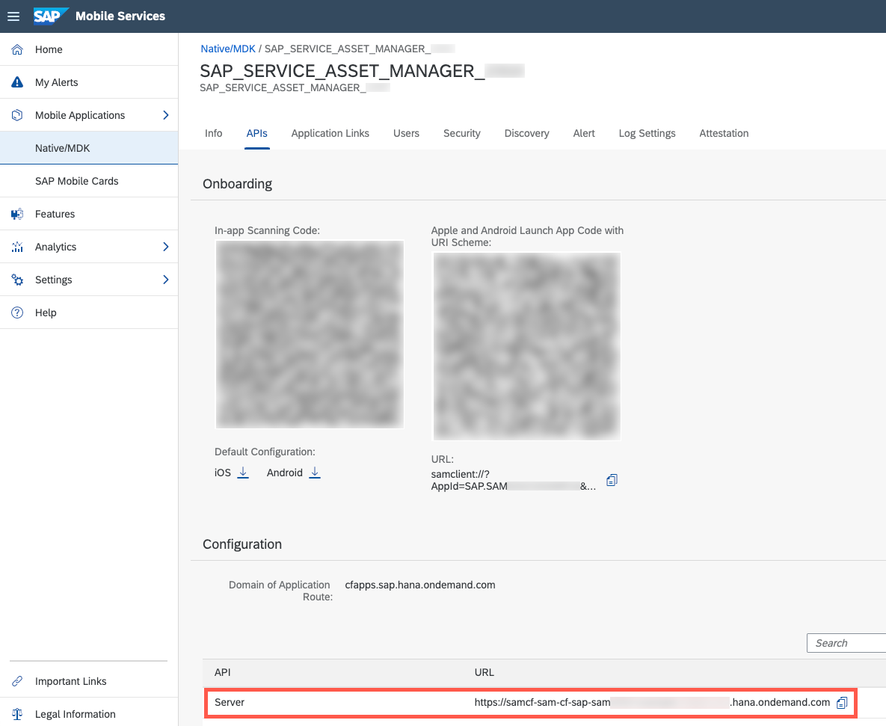<div>&nbsp;</div>

    **Additional Properties** (case sensitive)

    
    
    | Property Group | Property Name      | Property Value                             |
    | :------------- | :----------------- | :----------------------------------------- |
    | **`METERING`** | **`X-API-Key`**    | **`<autogenerated_key>`**                  |
    | **`METERING`** | **`service_path`** | **`/mobileservices/service-key/metering`** |

    >To generate **X-API-Key** go to the **Mobile Connectivity** feature of your Mobile Services app and select the **Service Keys** tab. Click the add icon "**+**" to add a Service Key with the following values and copy the generated key.
    >
    >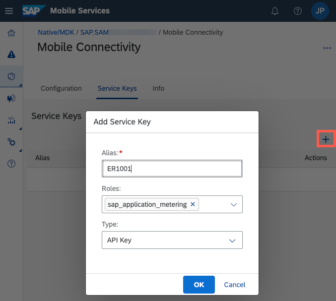
    >
    >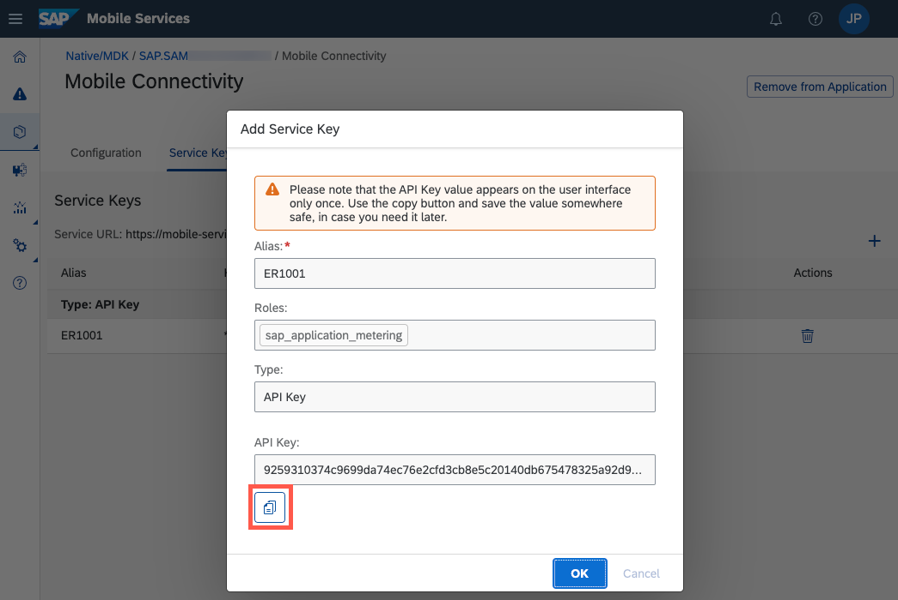<div>&nbsp;</div>
    
    **Service Key Values**

    | Field Name | Value                                  |
    | :--------- | :------------------------------------- |
    | Alias      | Any Alias is okay (i.e., **`PR1001`**) |
    | Roles      | **`sap_application_metering`**         |
    | Type       | **`API Key`**                          |

### Troubleshoot 4 - Usage Metering Background Job Missing.

1. Follow Step 2.5 and select **Usage Metering** feature when prompted. If the background job is still missing, you may try the next steps.

2. Execute the program **`/MFND/CORE_CLOUD_METRICS_PROG`** in transaction **SE38** from the SAP GUI.

3. In the selection screen provide the Mobile Application. 

4. Press **F9** or select menu option **Program** > **Execute in Background**. 

5. Click **Date/Time**.

6. Provide the **Schedule Start Date** and **Time**.

7. Set the **Period Values** to **Daily**, then click **Save**.

    
