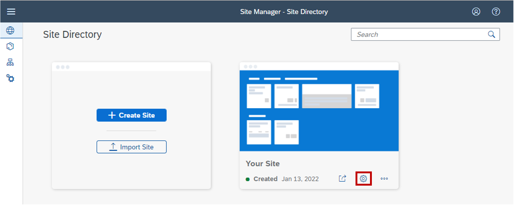
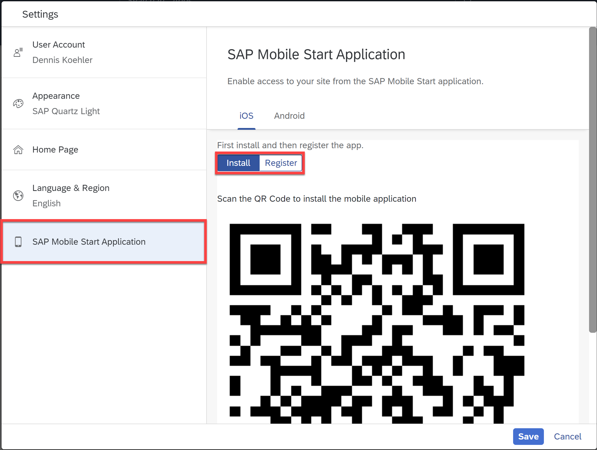
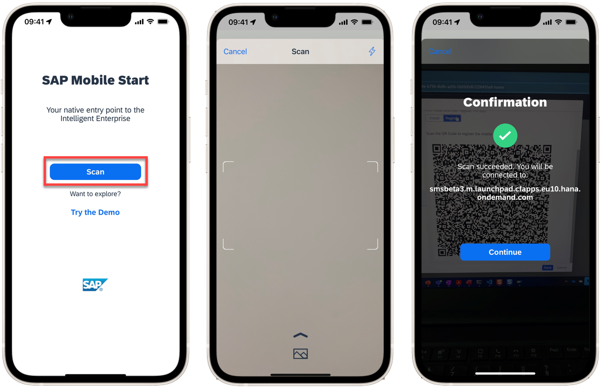
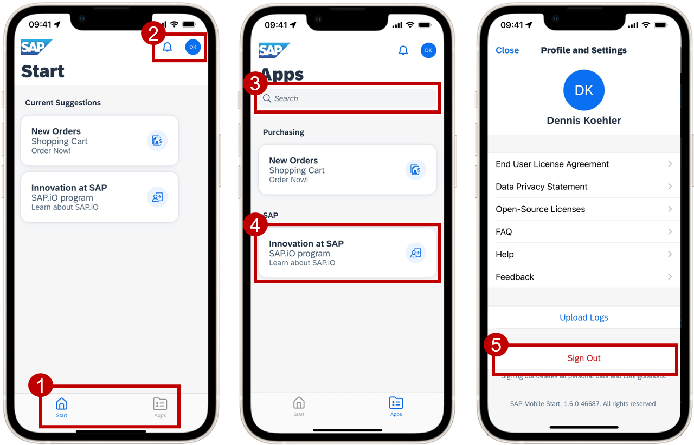

## Prerequisites
  - You already created a site & added some apps to it. 

# Access Your Launchpad Site with SAP Mobile Start
<!-- description --> Access your SAP Build Work Zone, standard edition Site from your mobile device with the native SAP Mobile Start app.

## You will learn
  - How to connect the SAP Mobile Start native app with your SAP Launchpad service site

### Enable SAP Mobile Start in Site Settings

1.  In the Site Manager - Site Directory click the settings icon on your Site's tile to open the Site Settings.

    

2.  Within the Site Settings click the **Edit** button on the top right & make sure the toggle for SAP Mobile Start is enabled.

    

3.  Click **Save** & get back to Site Directory

### Access QR-Codes in the User Settings

1.  Open your Site via the **Go to site** icon on your Site's tile.

2.  On the site, open the user menu via the user icon on the top right. Then choose **Settings**.

    

3.  In the Settings screen, choose the **SAP Mobile Start Application** tab.

    (If the option is not available make sure SAP Mobile Start is enabled in the Site Settings (Step 1), also refreshing the site might  be required for your changes to become active)

    In this screen you can select your device type (iOS or Android) and switch between the two QR Codes via the toggle button:

      1. **Install**:
      This QR-Code can be used to install the SAP Mobile Start app on your device. It's a direct link to the Apple app store page.

      2. **Register**:
      This QR-Code is used later within the SAP Mobile Start app to register it to your site.

    

    (**NOTE**: For the deployment to end-users it's possible to make use of Mobile Device Management (MDM). Administrators can deploy a managed app configuration via the MDM that contains site information. With that end-users can onboard without the need to scan a QR code. See the [documentation](https://help.sap.com/docs/SAP_MOBILE_START/386859cc981742f3b6bb31f7e0d8a168/952cb9e5188f44158f7bb995af272ce8.html) for further information.)

### Install SAP Mobile Start on your mobile device

Use the Install QR-Code from Step 2 to install SAP Mobile Start on your Mobile Device. Alternatively, you can search for SAP Mobile Start in the respective App Stores.

### Onboard SAP Mobile Start

1.	Open the SAP Mobile Start app on your mobile device, press the **Scan** button and make sure to allow camera access.

    (Below the scan button you will find the option to enter the demo mode. This will demonstrate how a fully configured site with the addition of SAP Task Center looks like.)

2.	Next, use your device camera to scan the **Register QR-Code** in the launchpad user settings from Step 2. If the scan succeeded, you can continue with the onboarding process.

    

3.  Follow the guided onboarding process within the app:

  - Log in with your user

  - Accept the End User License Agreement and Data Privacy Statement

  -	Depending on your setup you might need to create a passcode / allow biometric authentication.

    After completing the onboarding process, you will be directed to the initial **Start** screen.

### Try the App

  

1.	You can use the navigation icons on the bottom the move between the Start and the Apps screen. The Start screen offers an overview for quick access to your most used apps. The Apps screen lists all the Groups and Apps available.

2.  Both screens the Start & Apps screen have the notification icon and the user (settings) icon. Use them to access the notification section or the Profile and Settings page.

3.  Within the Application screen you can use the search bar to find specific applications.

4.  You can click on app tiles to open your application of choice.

5.	From the profile and settings you can choose **Sign Out** to return to the initial onboarding screen, in case you want to connect to a different site.

6.  If you want to learn more about SAP Mobile Start & it's setup you can visit the [community page](https://community.sap.com/topics/mobile-experience/start).

---
