# Learn how to modernize RFC Receiver Communications into API-Based protocols in Cloud Integration.
<!-- description --> This tutorial describes the different possibilities regarding generating SOAP Web Services or ODATA APIs using the existing RFC Function Module for a ABAP backend system (e.g., SAP S/4HANA, ECC) inbound communication. 
Besides leveraging more modern monitoring capabilities, it allows you an easier migration of your scenarios from SAP Process Orchestration to SAP Integration Suite.

In this tutorial, we will simulate the process of replacing RFC Receiver communication **after** an interface migration from SAP Process Orchestration to Cloud Integration. For more information refer to the [Modernization Recommendations](https://help.sap.com/docs/help/90c8ad90cb684ee5979856093efe7462/d337a6f0d324405f9ef0c410fd0d3739.html) on the [Migration Guide for SAP Process Orchestration](https://help.sap.com/docs/help/90c8ad90cb684ee5979856093efe7462/c344b1c395144095834a961699293889.html).

## Prerequisites
- ABAP backend system access with developer permissions 
- Package to include the generated Web Service objects
- Integration flow with the migrated SAP Process Orchestration RFC interface.

## You will learn
- Generate SOAP Web Services from RFC Function Modules
- Test your Consumer Proxy internally in ABAP backend system.

On this Tutorial, we **won't** cover:

  - The development of the integration flow on SAP Cloud Integration.

  - ABAP techniques and best practices.

---

### Generate Service Provider from RFC Function Module

A Service Provider is created when your requirement is to expose a Web Service implementation from a source system to ABAP backend system. In this tutorial example, it is when you have an RFC **Receiver** integration via SAP Process Orchestration, and after the migration to Cloud Integration, you want to switch this RFC Receiver communication to the SOAP Receiver protocol.

1.  Access the transaction SE80 and create an `Enterprise Service` object.
   
    

2.  Select object type `Service Provider` select `Continue` to proceed.
   
    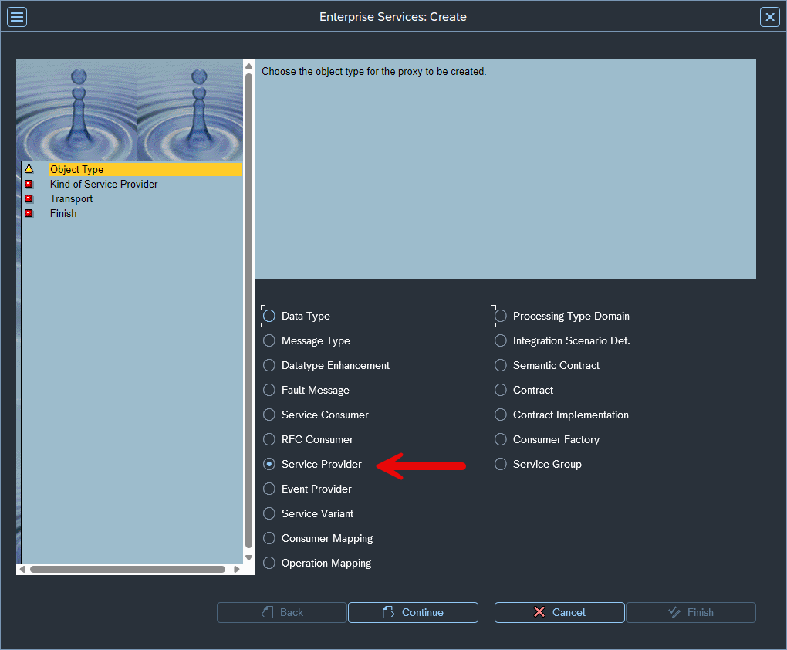

3.  There are different ways of generating the Service Provider. In this tutorial, we will use the option `Existing ABAP Object (Inside Out)` which allow us to refer directly the Function Module.
   
    
    
4.  Give a name and description to your Service Definition and select `Continue` to proceed.
   
    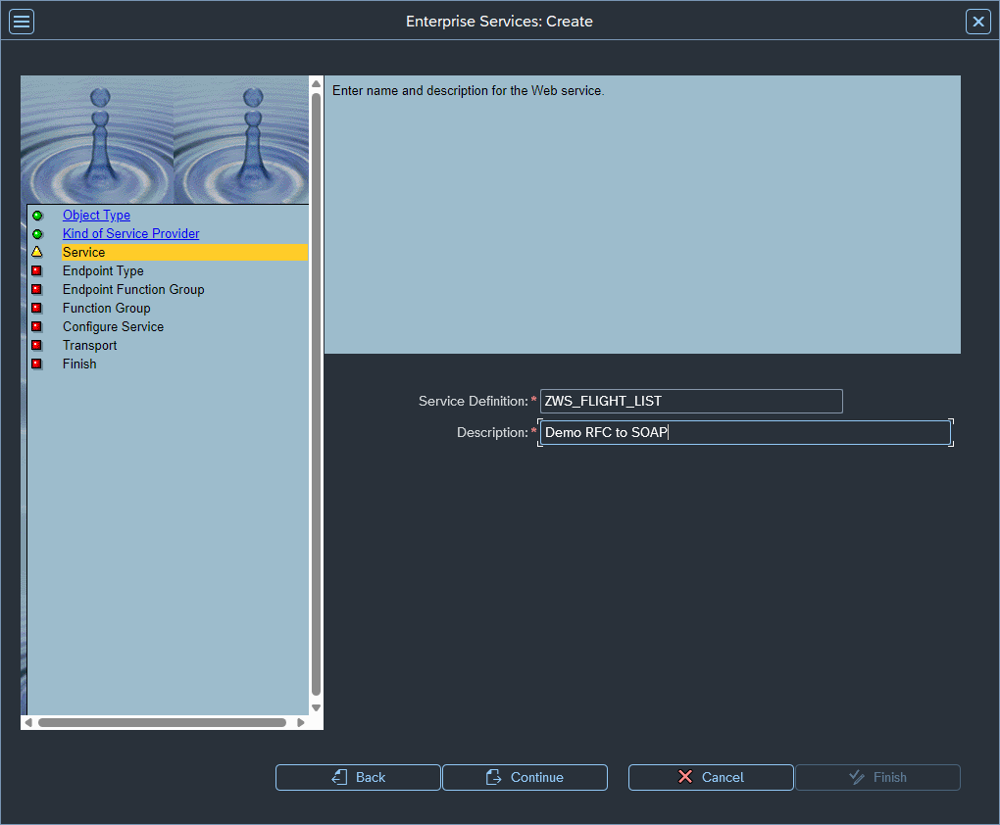

5.  Select the option Function Module and select `Continue` to proceed.
   
    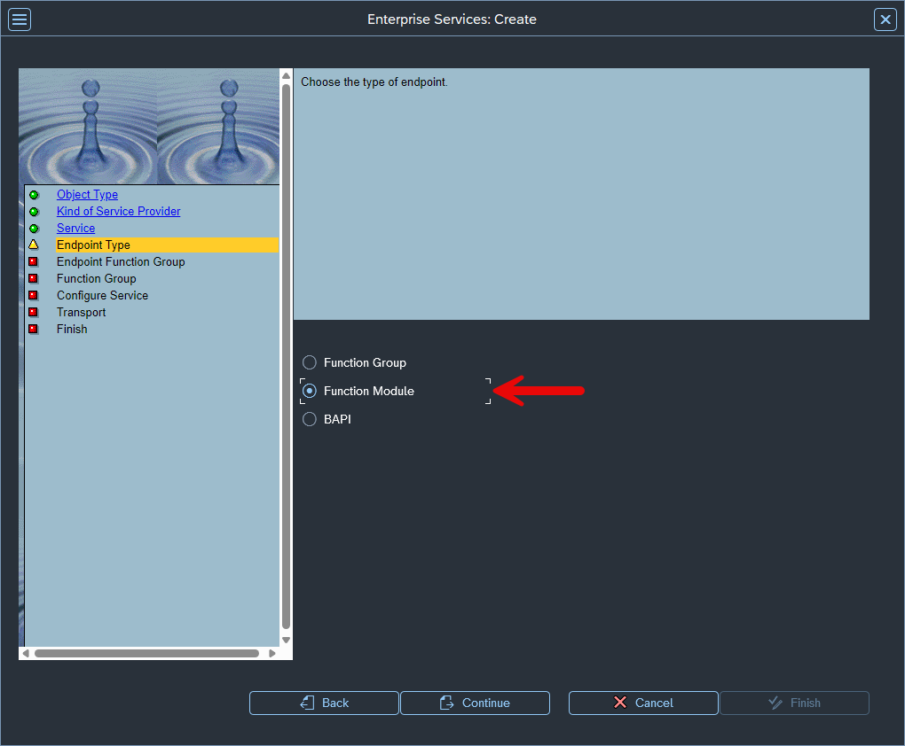

6.  Put the name of the Function Module and check the option `Map Name`. In this tutorial, we will use the Function Module `FLIGHT_LIST`.
   
    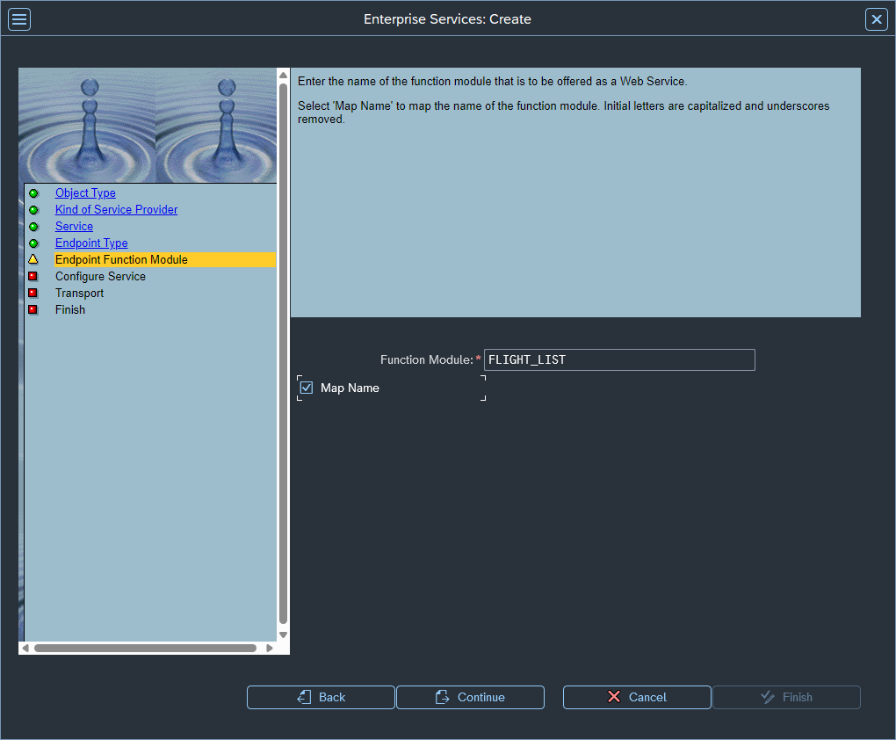

7.  Select the security profile as per your requirements. In this tutorial, we will use basic authentication.
   
    

8.  Select the Package, Request/Task, and Prefix. Please create a Request/task if this is not created yet.
   
    

9.  Select `Complete` to proceed.

    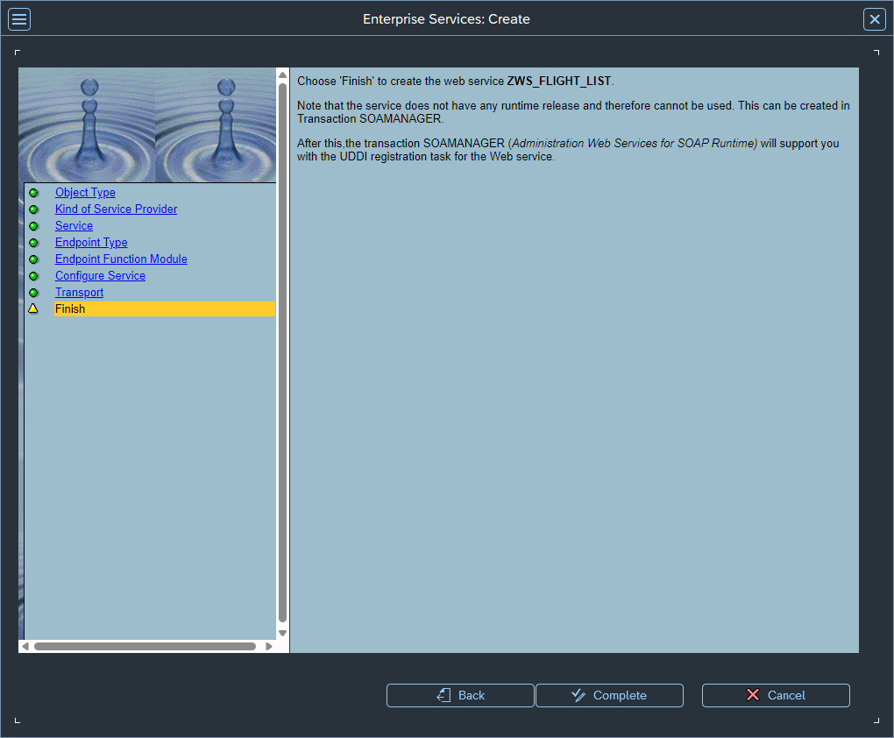

10. Activate the created object.
   
    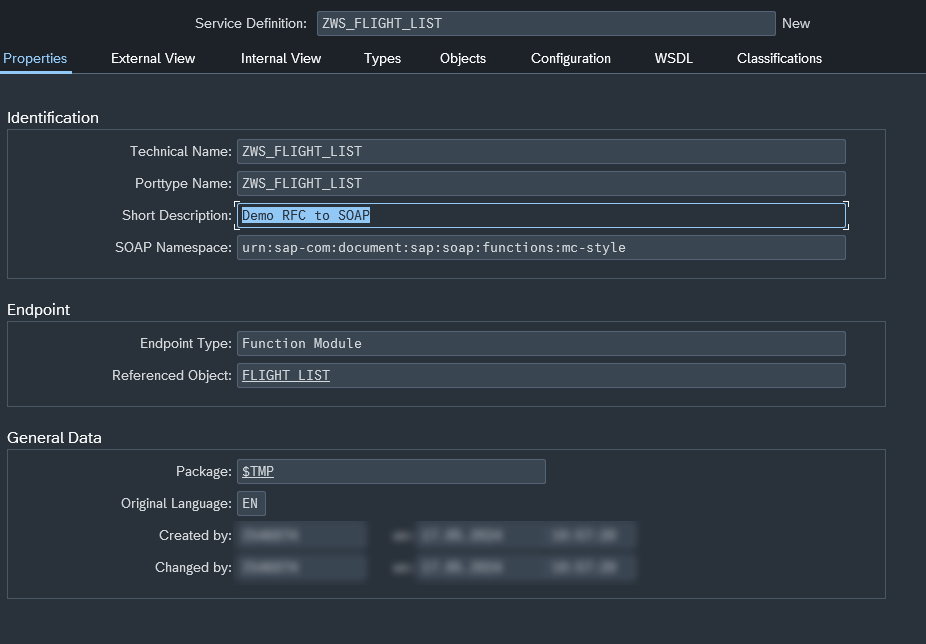

    > Please note that by doing this, you don't have to re-implement your code on the new service or similar. The new Web Service will wrap the existing Function Module code.

---

### Configure Service Binding in SOAMANAGER

1.  To use the newly created Service Provider as a SOAP Receiver message to be consumed afterwards by Cloud Integration, for instance, proceed to the transaction SOAMANAGER. 
   
    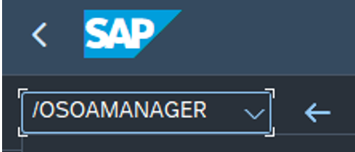

2.  Go to the `Simplified Web Service Configuration` Page. 
   
    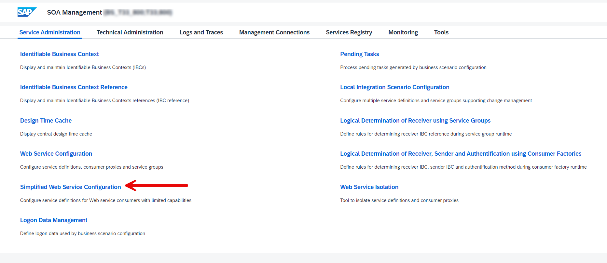

3.  Search by the Service Provider created, mark the option `User Name/Password (Basic)` and click on `Save`. 
   
    

4.  Click on the display button to get the details of the access endpoint. 
   
    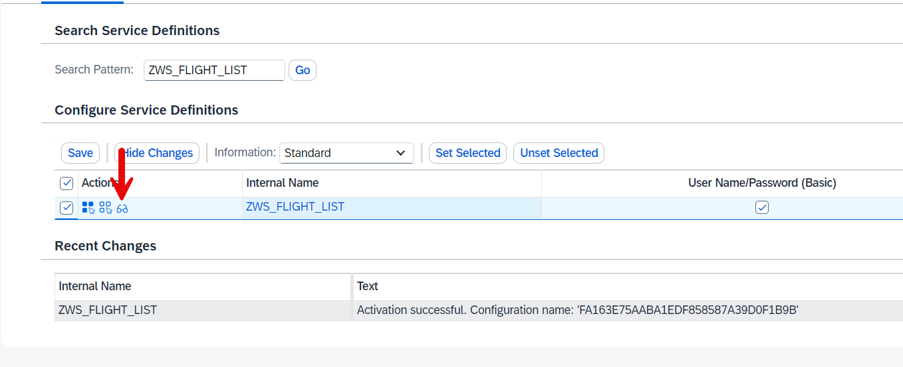

5.  The Access URL is the endpoint that you want to use on your Cloud Integration when configuring the SOAP Receiver adapter. 
   
    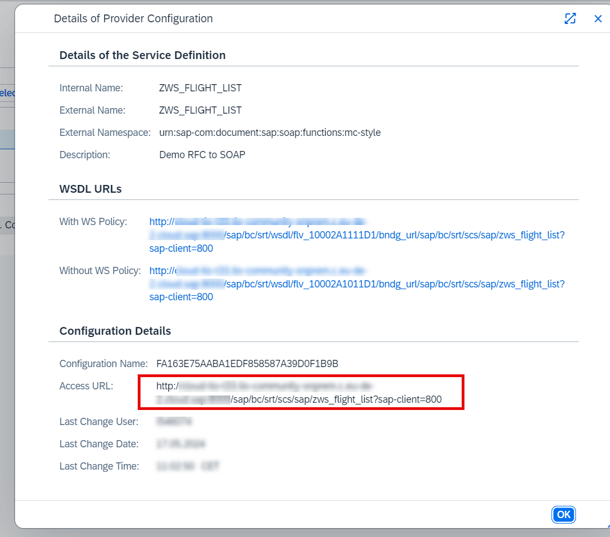

6.  Additionally, click on the following endpoint to access the WSDL file. Save the file in your local PC. You need to import it later on your integration flow.

    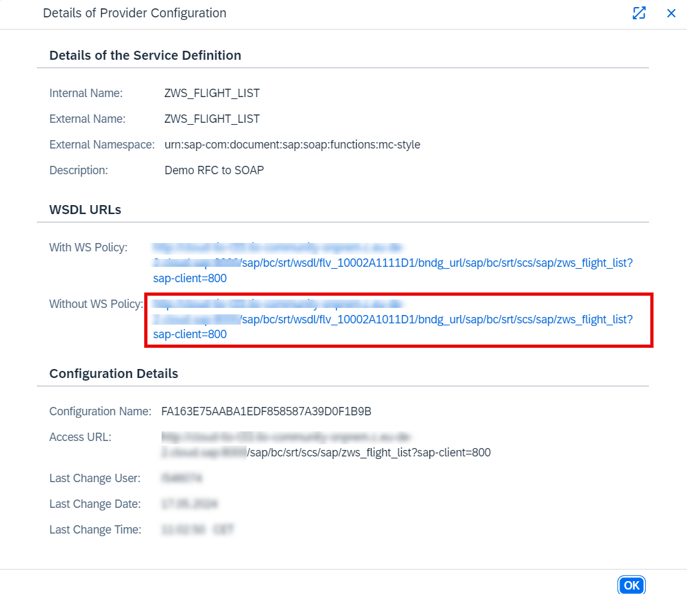

    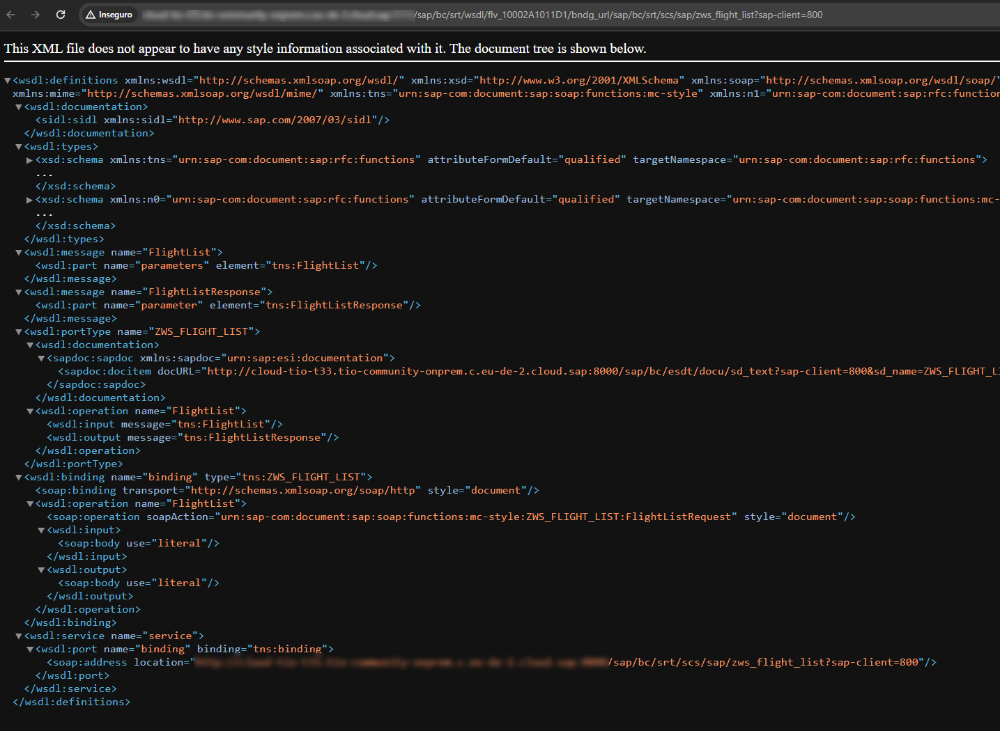

---

### Test the Service Provider

1.  With the service binding created, go back to the created object, and navigate to `Proxy > Test` menu. 
   
    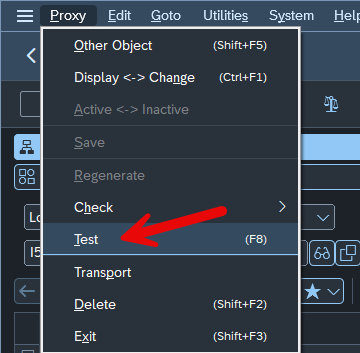

2.  Click on `execute`to proceed.
   
    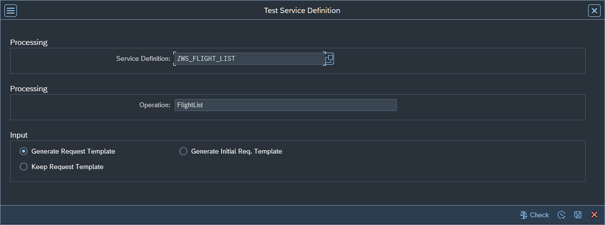

3.  On the next screen, you can edit the test request payload, and after executing the interface, you should get the response message as below. 

    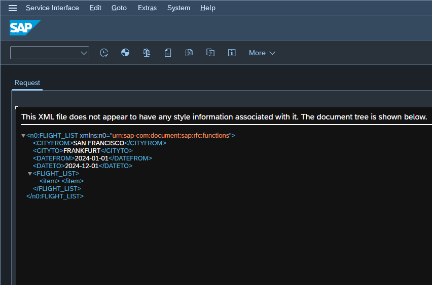

    

---

### Setting up SOAP Receiver Adapter on Cloud Integration 

1.  With the WSDL file from your service binding, you should import it into your integration flow. 

    To do this, download the WSDL file using the URL previously used to generate the Service Consumer (i.e., `http://demosystem.sap:8000/sap/bc/soap/wsdl11?services=FLIGHT_LIST`) and import the WSDL into the resources tab.

    

2.  Select the WSDL as described below.
 
    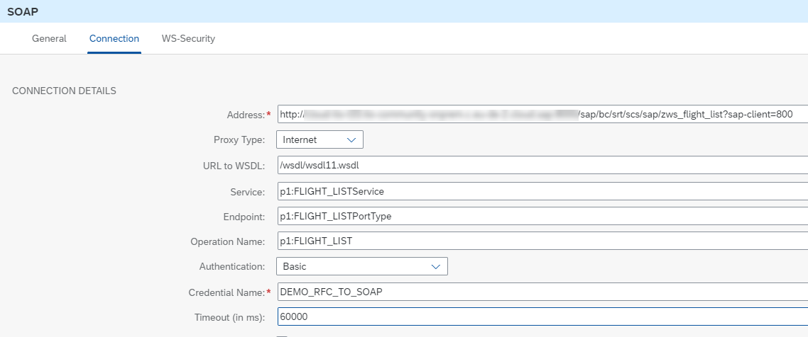

---

### [OPTIONAL] Re-Generate Service Provider

If you need to update the structures of your Web Service, proceed as described below.
   
1.  Update your Function Module structures as your requirement.
    
2.  Navigate to the Service Provider object in edit mode, and navigate to `Service Definition > Check > Syntax` menu.
   
    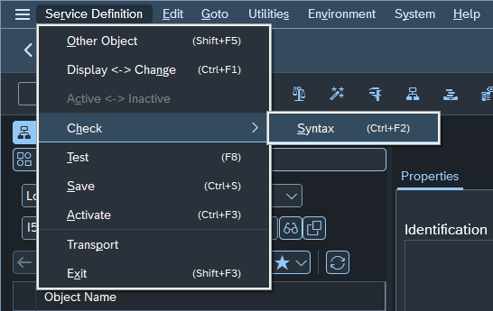

3.  Confirm the operation and activate the object.
   
    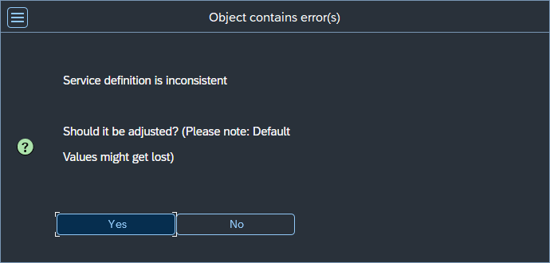

---

### Test yourself 

---
