# Learn How to Modernize RFC Sender Communications into API-Based protocols in Cloud Integration
<!-- description --> This tutorial describes the different possibilities regarding generating SOAP Web Services using the existing RFC Function Module for a ABAP backend system (e.g., SAP S/4HANA, ECC) outbound communication. 
Besides leveraging more modern monitoring capabilities, it allows you an easier migration of your scenarios from SAP Process Orchestration to SAP Integration Suite.

In this tutorial, we will simulate the process of replacing RFC Sender communication **after** an interface migration from SAP Process Orchestration to Cloud Integration. For more information refer to the [Modernization Recommendations](https://help.sap.com/docs/help/90c8ad90cb684ee5979856093efe7462/d337a6f0d324405f9ef0c410fd0d3739.html) on the [Migration Guide for SAP Process Orchestration](https://help.sap.com/docs/help/90c8ad90cb684ee5979856093efe7462/c344b1c395144095834a961699293889.html).

## Prerequisites
- ABAP backend system access with developer permissions 
- Package to include the generated Web Service objects
- Integration flow with the migrated SAP Process Orchestration RFC interface.

## You will learn
- Generate SOAP Web Services from RFC Function Modules
- Test your Consumer Proxy internally in ABAP backend system.

On this Tutorial, we **won't** cover:

  - The development of the integration flow on SAP Cloud Integration.

  - ABAP techniques and best practices.


### Generate Service Consumer from RFC Function Module

A Service Consumer is created when your requirement is to communicate from an ABAP backend system to a target system. In this tutorial example, it is when you have an RFC **Sender** integration via SAP Process Orchestration, and after the migration to Cloud Integration, you want to switch this RFC Sender communication to the SOAP Sender protocol.  

1. Access the transaction SE80 and create an `Enterprise Service` object.
   
    

2.  Select the object type `Service Consumer` and select `Continue` to proceed.
 
    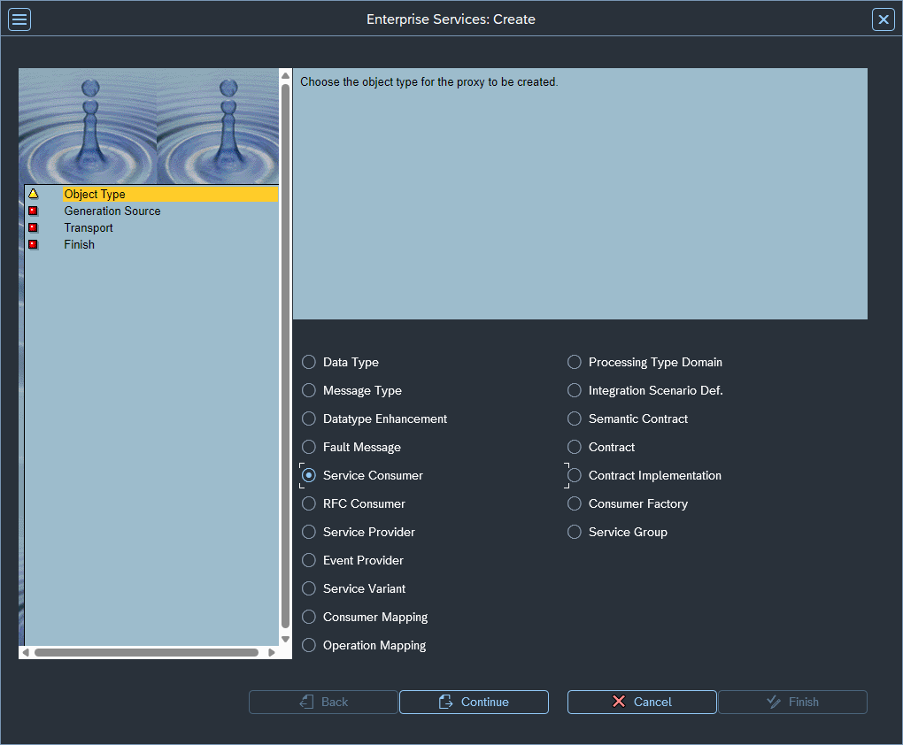

3.  Select the option `External WSDL/Schema` and select `Continue` to proceed.

    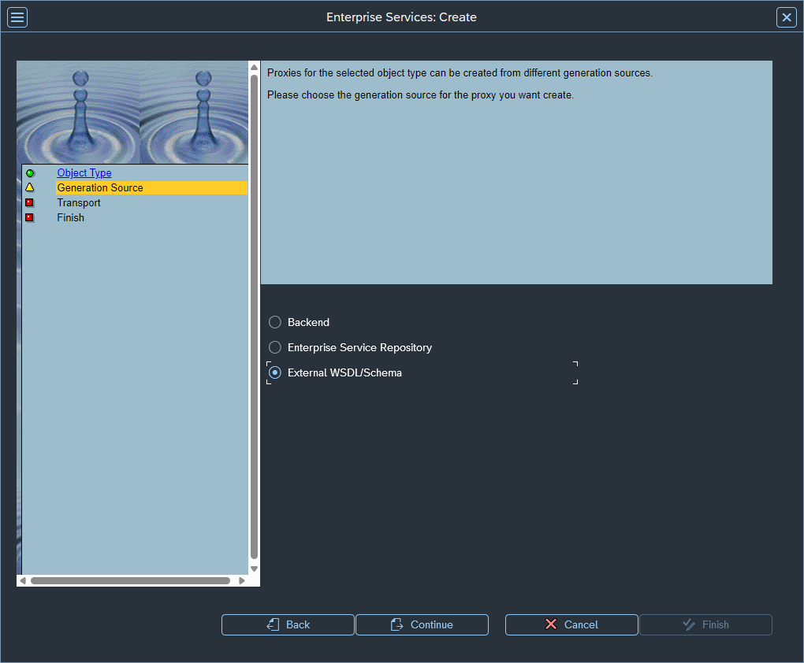

4.  Select the data source `URL` and select `Continue` to proceed.

    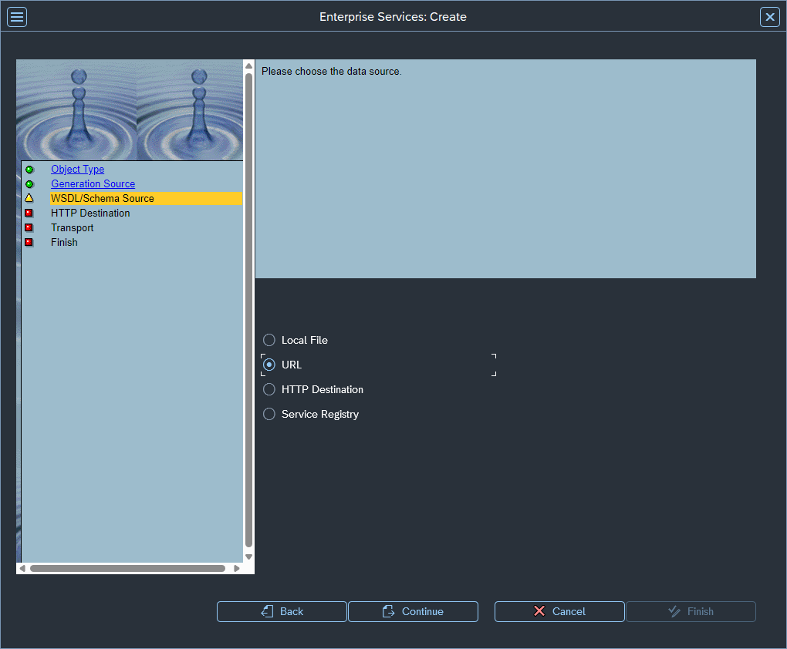

    > Please note that you can download the WSDL to your local PC using the next step and upload it using the `Local File` data source. 

5.  Now you need to combine the Function Module name with the URL in this format:
   
    > `http://<Host>:<Port>/sap/bc/soap/wsdl11?services=<Function Module Name>`. In my case, it would be `http://demosystem.sap:8000/sap/bc/soap/wsdl11?services=FLIGHT_LIST`. 
    
    This endpoint will serve us as a dynamic generator of WSDL based on RFCs.

    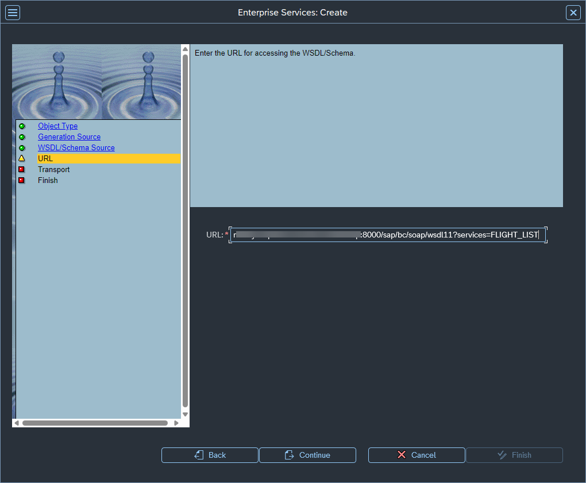

    > You can find the host and port information in transaction `SMICM` under the `Goto > Services` menu, or alternatively, test any service in the `SICF` transaction.

6.  You'll be asked for the SAP User and Password.

    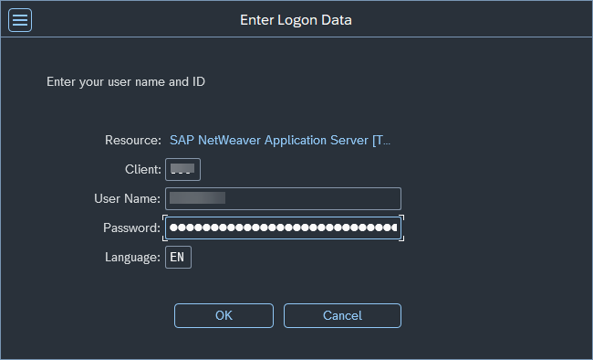

7.  Select the Package, Request/Task, and Prefix. Please create a Request/task if this is not created yet.

    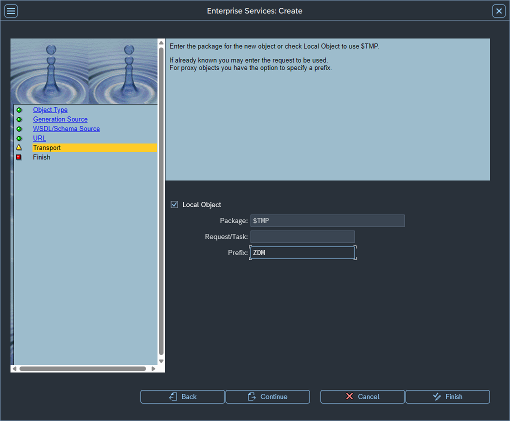

8.  Select `Complete` to proceed.

    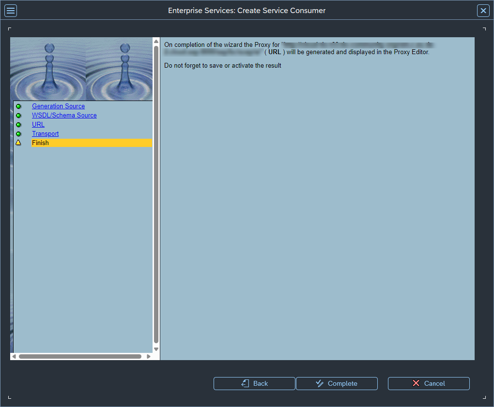

9.  By doing that, you will conclude the Service Consumer generation. You should be able to edit the `ABAP Name` and activate the object.

    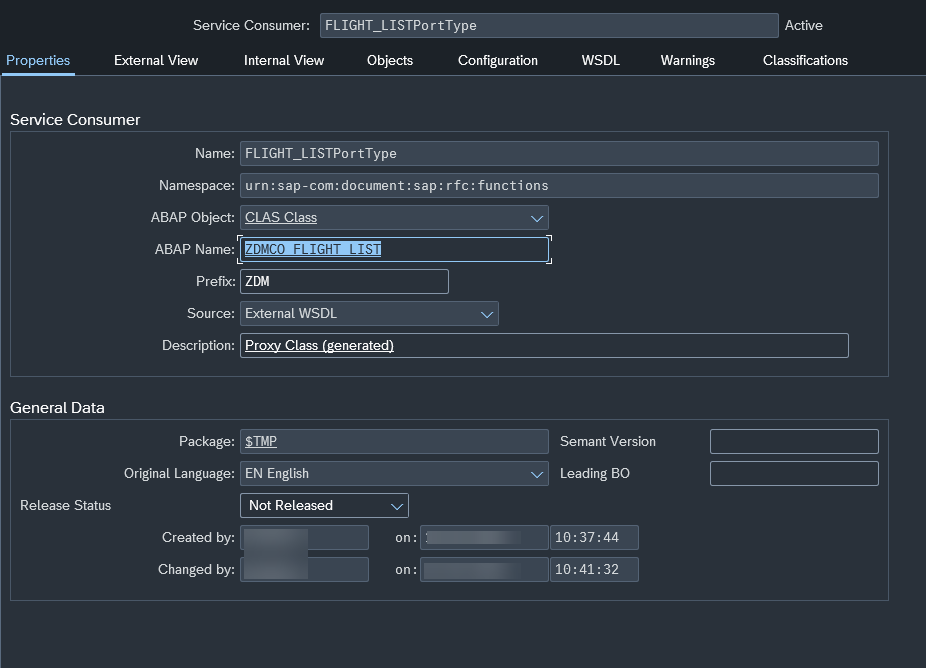


### Setting up SOAP Sender Adapter on Cloud Integration 

1.  With the WSDL file from your RFC Function Module, you need to import it into your integration flow. 

    To do this, download the WSDL file using the URL previously used to generate the Service Consumer (i.e., `http://demosystem.sap:8000/sap/bc/soap/wsdl11?services=FLIGHT_LIST`) and import the WSDL into the resources tab.

    

2.  Select the imported WSDL on the SOAP Sender Adapter as below.
   
    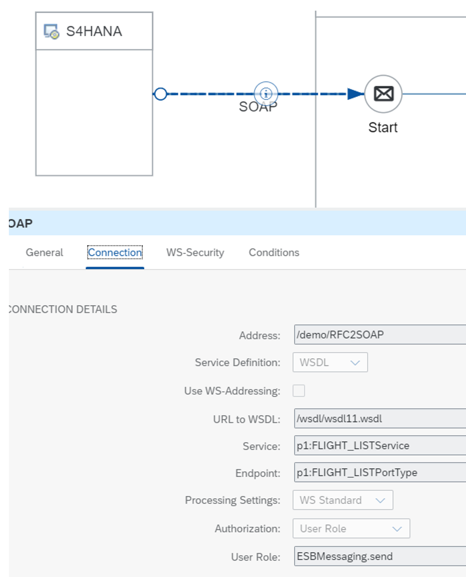

3.  After replacing your RFC Sender adapter, you can `save` and `deploy` your integration flow. Go to the `Manage Integration Content` and copy the endpoint to be used afterwards on the tutorial.
 
    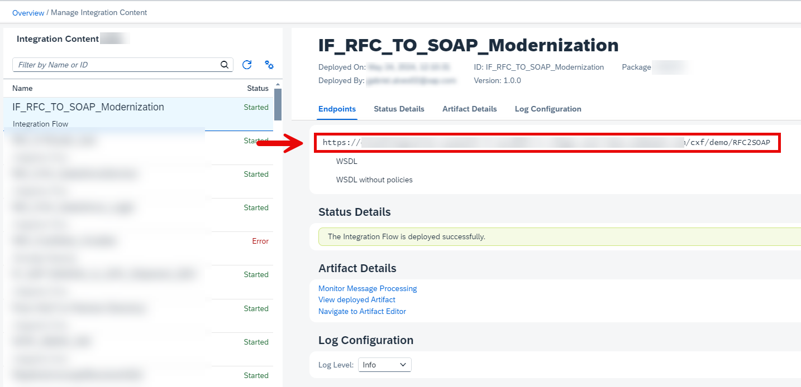


### Configure a Logical Port in SOAMANAGER

1. To use the newly created Service Consumer as a SOAP Sender message to be consumed afterward by Cloud Integration, proceed to the transaction `SOAMANAGER`. This will open a window in your browser.
   
    
 
2.  Go to the `Web Service Configuration` Page. 
   
    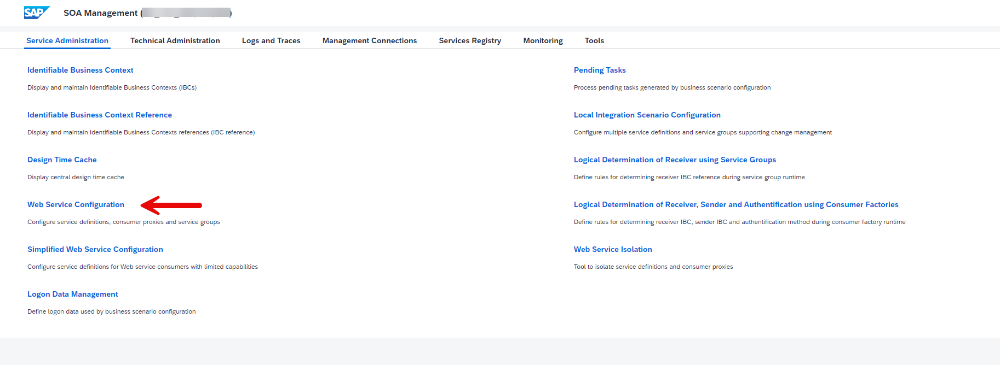

3.  Search by the new Service Consumer. You can find it under the `ABAP Name` from the created object. Click on the object to proceed to the next page.
   
    

4.  There are different approaches to set up the logical port. In this tutorial, we will continue with `Manual Configuration`. Select the option to proceed to the next page.
   
    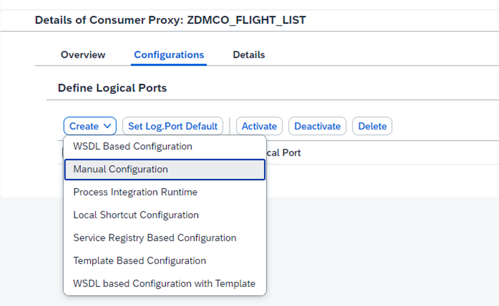

5.  Enter the name of your choice and check the option `Logical Port is Default`. After it, select `Next` to proceed.
   
    

6.  Enter the `Authentication Settings` according to your requirements. In this tutorial, we will continue with `User ID / Password`. In this case, it would be the Client ID and Client Secret of my `Process Integration Runtime` from Cloud Integration. Select `Next` to proceed.

    For more information refer to the [Creating Service Instance and Service Key for Inbound Authentication](https://help.sap.com/docs/cloud-integration/sap-cloud-integration/creating-service-instance-and-service-key-for-inbound-authentication?locale=en-US) documentation.
   
    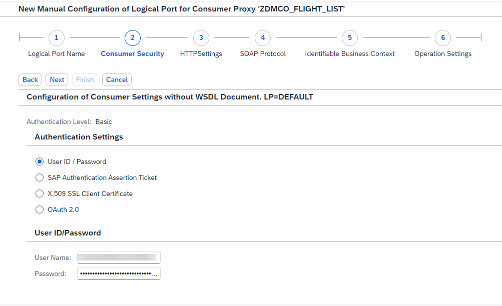

7. Enter the endpoint of your new migrated integration flow. Select `Next` to proceed.
   
    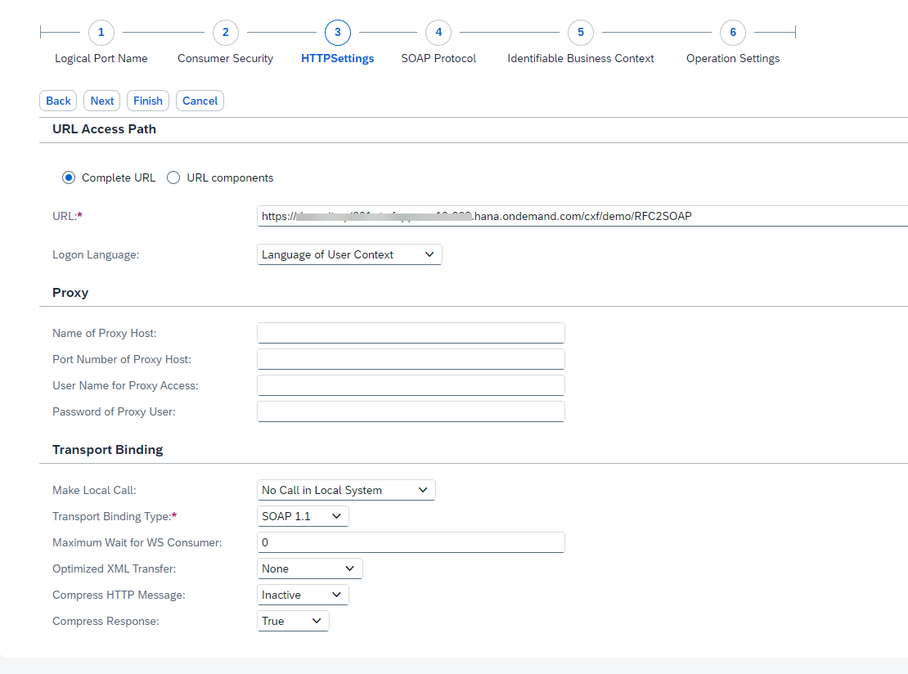
 
8. Set the Message ID Protocol as `Suppress ID Transfer`.  Select `Finish` to conclude the wizard.
   
    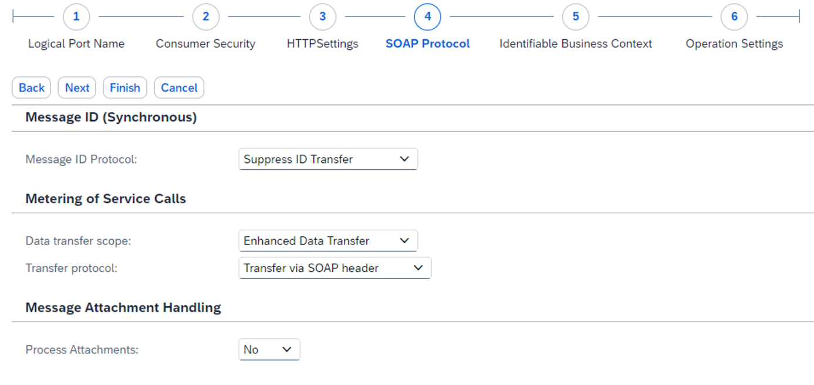

9. You will see your logical port created as following.  
   
    


### Update your ABAP source code

In this use case, assume the following ABAP code in a **test report** created on `SE38` transaction to call the RFC via SAP Process Orchestration:

```ABAP
  DATA: v_cityfrom TYPE spfli-cityfrom,
        v_cityto   TYPE spfli-cityto,
        v_datefrom TYPE sflight-fldate,
        v_dateto   TYPE sflight-fldate,
        t_flights  TYPE STANDARD TABLE OF wdr_flights.

  v_cityfrom  = 'FRANKFURT'.
  v_cityto    = 'SAN FRANCISCO'.
  v_datefrom  = '20240101'.
  v_dateto    = '20241231'.

  CALL FUNCTION 'FLIGHT_LIST'
    DESTINATION 'SAP_PO_RFC_DESTINATION'
    EXPORTING
      cityfrom    = v_cityfrom
      cityto      = v_cityto
      datefrom    = v_datefrom
      dateto      = v_dateto
    TABLES
      flight_list = t_flights.
```  

The code above can be replaced with the following ABAP code in order to invoke the new consumer service instead:

```ABAP
  DATA: s_input  TYPE zdmflight_listinput,
        s_output TYPE zdmflight_listoutput.

  DATA(o_flight) = NEW zdmco_flight_list( ).

  s_input-cityfrom  = 'FRANKFURT'.
  s_input-cityto    = 'SAN FRANCISCO'.
  s_input-datefrom  = '20240101'.
  s_input-dateto    = '20241231'.

  o_flight->flight_list(
    EXPORTING
      input = s_input
    IMPORTING
      output = s_output ).
```  

After proceeding with the changes on your ABAP code, don't forget to `Save` and `Activate` your code.


### Test the Service Consumer

1.  With the logical port created, go back to the created object, and navigate to `Proxy > Test` menu. 
   
    

2.  Select the logical port created in the previous step in SOAMANAGER. In this tutorial, it is `DEFAULT`. Click on execute. 
   
    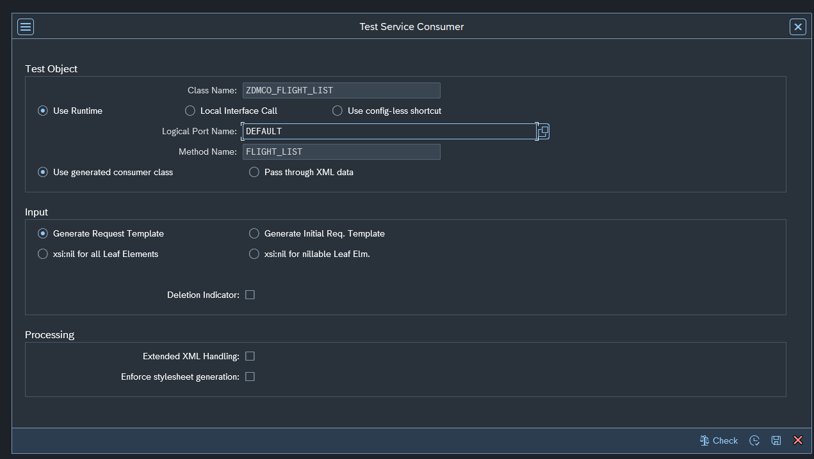

3.  On the next screen, you can edit the test request payload, and after executing the interface, you should get the response message as below. 

    

    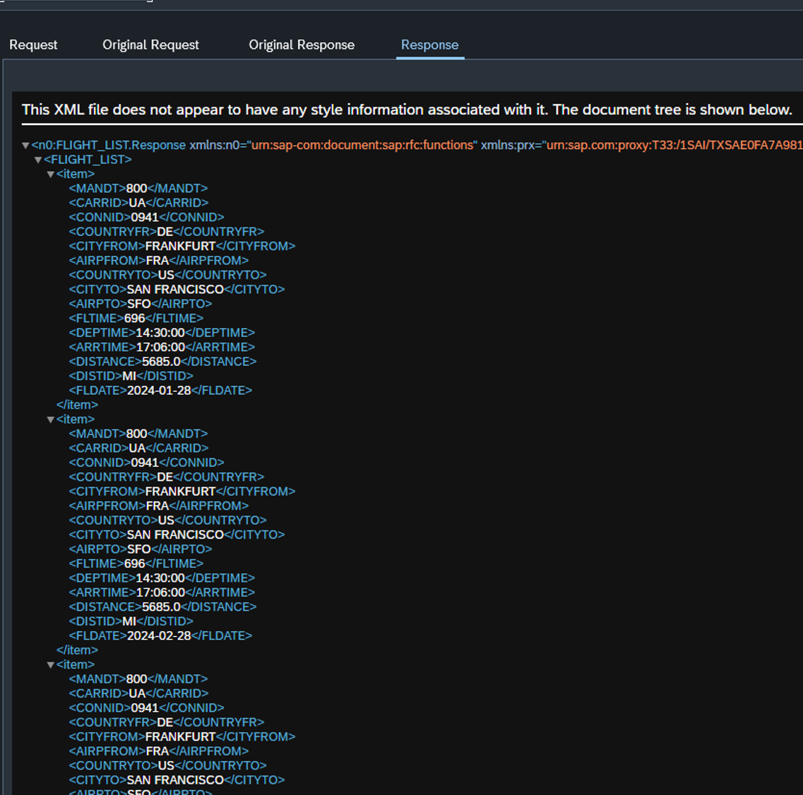


### [OPTIONAL] Re-Generate Service Consumer

If you need to update the structures of your Web Service, you have two options:

  - With the generated WSDL (from the previous steps), you can edit it on the editor of your choice.
  
  - Update the RFC Function Module structures directly and get the new WSDL generated out of it.
 
1.  With the WSDL or RFC Function Module updated, go to the Web Service object and click on the `Regenerate` button. 
    
    The wizard will be the same as on the creation, so you have the option of import the WSDL from PC or via URL again.
    
    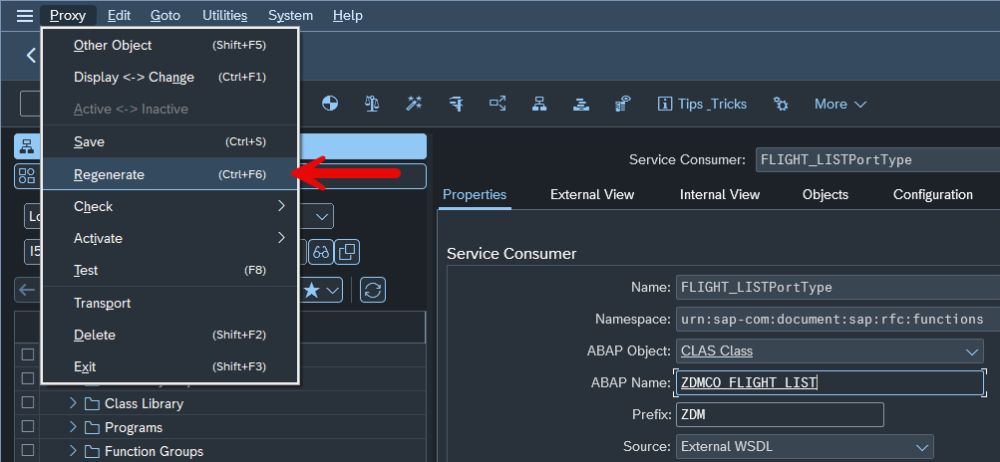


### Test yourself 


